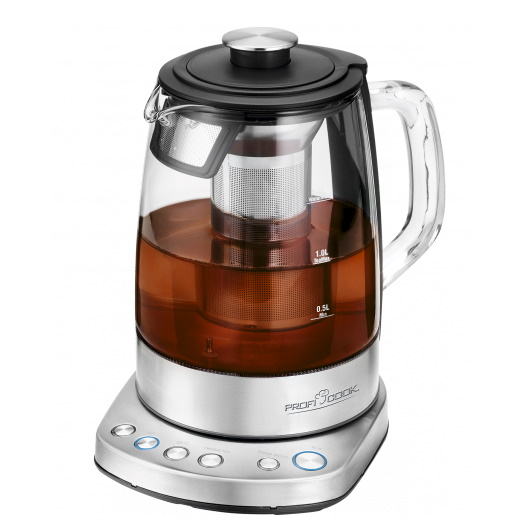

## GPIO Pinout

| Pin    | Function                              |
| ------ | ------------------------------------- |
| GPIO01 | Tuya RX                               |
| GPIO03 | Tuya TX                               |

Pinout from [ProfiCook PC-WKS Template for Tasmota](https://templates.blakadder.com/proficook_PC-WKS_1167.html)

## Tuya Datapoints (all credits to templates.blakadder.com)

### Functions

MCU Product ID: {“p”:”h6MjwrnldNTu4kX3”,”v”:”1.0.0”,”m”:1}

dpID 101 controls kettle modes (corresponds to device buttons)

- 0 - heat to 45°C then maintain temperature for 2 hours
- 1 - heat to 60°C then maintain temperature for 2 hours
- 2 - heat to 85°C then maintain temperature for 2 hours
- 3 - heat to 100°C then maintain temperature for 3 minutes
- 4 - heat to 100°C (power button flashing when active)
- 5 - heat to preset temperature (70°C by default, can be changed using dpID 102) then maintain temperature for 2 hours (keep warm button)
- 6 - reset any running program and enter standby mode (pulsating power button)

dpID 102 sets water temperature for mode 5 (keep warm button), recommended 35 - 100 range

dpID 104 error notification:

- 0x00 - no error
- 0x01 - kettle empty
- 0x04 - kettle overheated due to too much or too little water

dpID 105 reports current water temperature

dpID 106 reports kettle status:

- 1 - kettle removed from base
- 2 - standby mode
- 3 - heating to programmed target temperature
- 4 - cooling down to programmed target temperature
- 5 - maintaining programmed target temperature

dpID 107 reports approximate time until programmed target temperature is reached or remaining time for maintaining programmed target temperature when in mode 5. Cannot be changed!

dpID 108 is still unknown, it is always reporting 5 and doesn’t respond to any of the TuyaSend commands.

## Basic Configuration

```yaml
esphome:
  name: smart_kettle
  platform: ESP8266
  board: esp8285

wifi:
  ssid: !secret wifi_ssid
  password: !secret wifi_password
  fast_connect: true

logger:
  baud_rate: 0

api:
  encryption:
    key: !secret api_encryption_key

ota:
  password: !secret ota_password
# Device Specific Config
uart:
  rx_pin: GPIO3
  tx_pin: GPIO1
  baud_rate: 9600

# Register the Tuya MCU connection
tuya:

text_sensor:
  - platform: template
    name: Kettle State
    icon: mdi:kettle
    id: text_state
  - platform: template
    name: Kettle Error
    icon: mdi:alert-circle-outline
    id: text_error

select:
  - platform: template
    name: "Kettle mode"
    id: kettle_control
    options:
      - 45°
      - 60°
      - 85°
      - 100°
      - 100° and off
      - Custom
      - "Off"
    optimistic: true
    set_action:
      - lambda: |-
          if (strcmp(x.c_str(), "45°") == 0) {
            tuya_tuya_id->set_enum_datapoint_value(101, 0);
          } else if (strcmp(x.c_str(), "60°") == 0) {
            tuya_tuya_id->set_enum_datapoint_value(101, 1);
          } else if (strcmp(x.c_str(), "85°") == 0) {
            tuya_tuya_id->set_enum_datapoint_value(101, 2);
          } else if (strcmp(x.c_str(), "100°") == 0) {
            tuya_tuya_id->set_enum_datapoint_value(101, 3);
          } else if (strcmp(x.c_str(), "100° and off") == 0) {
            tuya_tuya_id->set_enum_datapoint_value(101, 4);
          } else if (strcmp(x.c_str(), "Custom") == 0) {
            tuya_tuya_id->set_enum_datapoint_value(101, 5);
          } else {
            tuya_tuya_id->set_enum_datapoint_value(101, 6);
          }
number:
  - platform: "tuya"
    name: "Kettle Custom Temperature"
    number_datapoint: 102
    icon: mdi:oil-temperature
    min_value: 35
    max_value: 100
    step: 1

sensor:
  - platform: template
    name: Kettle Temperature
    id: kettle_temp
    unit_of_measurement: "°C"
    accuracy_decimals: 0

  - platform: tuya
    id: tuya_105
    sensor_datapoint: 105
    on_value:
      then:
        - if:
            condition:
              lambda: |-
                return static_cast<int>(id(tuya_106).state) == 1;
            then:
              - sensor.template.publish:
                  id: kettle_temp
                  state: !lambda |-
                    return 0;
            else:
              - sensor.template.publish:
                  id: kettle_temp
                  state: !lambda |-
                    return id(tuya_105).state;

  - platform: tuya
    id: kettle_remaining
    name: Kettle Remaining Time
    icon: mdi:clock-time-five-outline
    sensor_datapoint: 107
    unit_of_measurement: "min"
    accuracy_decimals: 0

  - platform: tuya
    id: tuya_101
    sensor_datapoint: 101
    on_value:
      then:
        - select.set_index:
            id: kettle_control
            index: !lambda |-
              return id(tuya_101).state;

  - platform: tuya
    id: tuya_106
    sensor_datapoint: 106
    on_value:
      then:
        - text_sensor.template.publish:
            id: text_state
            state: !lambda |-
              switch(static_cast<int>(id(tuya_106).state)) {
                case 1: return {"Lifted"};
                case 2: return {"Standby"};
                case 3: return {"Heating"};
                case 4: return {"Cooling"};
                case 5: return {"Maintaining Temp"};
                default: return {""};
              }
  - platform: tuya
    id: tuya_104
    sensor_datapoint: 104
    on_value:
      then:
        - if:
            condition:
              lambda: |-
                return id(kettle_temp).raw_state == 0;
            else:
              - text_sensor.template.publish:
                  id: text_error
                  state: !lambda |-
                    switch(static_cast<int>(id(tuya_104).state)) {
                      case 0: return {"OK"};
                      case 1: return {"Empty"};
                      case 4: return {"Overheated"};
                      default: return {"other error"};
                    }

```
