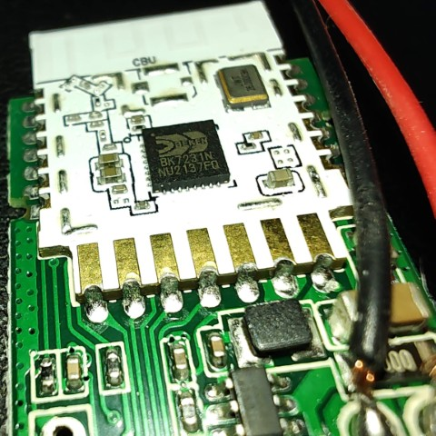
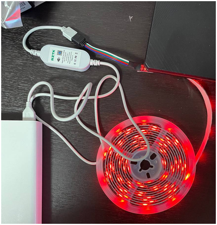

## Info

Selling in Ukraine under the name: `RZTK Smart LED 3 USB RGB`
Device name in Home Assistance or Tuya App after pairing: `SCW-WB-CB003 (dpkr4f1gvgawkmwy)`

### Hardware

The chip is: `BK7231N`

[Full info at libretiny:](https://docs.libretiny.eu/boards/cbu/)

Macro:

1. 

Device view:

1. 

#### Flash

Same as usual for such kind of chip: [beken-72xx](https://docs.libretiny.eu/docs/platform/beken-72xx/)
Note:  `...you need to bridge CEN pin to GND with a wire.`

YAML:

```yaml
# Basic Config
substitutions:
  name: "SCW-WB-CB003"
  friendly_name: "Led Strip CBU"

esphome:
  name: led-strip
  friendly_name: led-strip

# https://docs.libretiny.eu/boards/cbu/
# https://developer.tuya.com/en/docs/iot/cbu-module-datasheet?id=Ka07pykl5dk4u
bk72xx:
  board: cbu

# Enable logging
logger:

# Enable Home Assistant API
api:
  encryption:
    key: "KEY"
ota:
  - platform: esphome

wifi:
  ssid: !secret wifi_ssid
  password: !secret wifi_password

  # Enable fallback hotspot (captive portal) in case wifi connection fails
  ap:
    ssid: "Led-Strip Fallback Hotspot"
    password: "PASWD"

captive_portal:

button:
- platform: restart
  name: Restart

debug:
  update_interval: 30s

# Pin specs from: https://docs.libretiny.eu/boards/cbu/
# P6 = Blue
# P24 = Green
# P26 = Red
output:
  # Tests
- platform: libretiny_pwm
  frequency: 1000 Hz
  id: output_a
  pin: P8
  # Colours
- platform: libretiny_pwm
  frequency: 1000 Hz
  id: output_blue
  pin: P6
- platform: libretiny_pwm
  frequency: 1000 Hz
  id: output_green
  pin: P24
- platform: libretiny_pwm
  frequency: 1000 Hz
  id: output_red
  pin: P26

text_sensor:
- platform: debug
  reset_reason:
    name: Reset Reason
- platform: libretiny
  version:
    name: LibreTiny Version

sensor:
  - platform: wifi_signal
    name: ${friendly_name} Wifi Signal Strength
    update_interval: 60s
  - platform: uptime
    name: ${friendly_name} Uptime
  - platform: uptime
    name: Uptime

light:
  - platform: rgb
    name: "rgb_strip_01"
    default_transition_length: 1s
    id: rgb_lightstrip1
    red: output_red
    green: output_green
    blue: output_blue
    effects:
      # FLicker: https://esphome.io/components/light/index.html#flicker-effect
      - flicker:
      - flicker:
          name: Flicker Effect With Custom Values
          alpha: 95%
          intensity: 1.5%
      # Random: https://esphome.io/components/light/index.html#random-effect
      - random:
      - random:
          name: "My Slow Random Effect"
          transition_length: 30s
          update_interval: 30s
      - random:
          name: "My Fast Random Effect"
          transition_length: 4s
          update_interval: 5s
      # Pulse: https://esphome.io/components/light/index.html#pulse-effect
      - pulse:
      - pulse:
          name: "Fast Pulse"
          transition_length: 0.5s
          update_interval: 0.5s
          min_brightness: 0%
          max_brightness: 100%
      - pulse:
          name: "Slow Pulse"
          transition_length: 500ms
          update_interval: 2s
      - pulse:
          name: "Asymmetrical Pulse"
          transition_length:
            on_length: 1s
            off_length: 500ms
          update_interval: 1.5s
      # Strobe: https://esphome.io/components/light/index.html#strobe-effect
      - strobe:
      - strobe:
          name: Strobe Effect With Custom Values
          colors:
            - state: true
              brightness: 100%
              red: 100%
              green: 90%
              blue: 0%
              duration: 500ms
            - state: false
              duration: 250ms
            - state: true
              brightness: 100%
              red: 0%
              green: 100%
              blue: 0%
              duration: 500ms
    # Ensure the light turns on by default if the physical switch is actuated.
    restore_mode: ALWAYS_OFF
```
