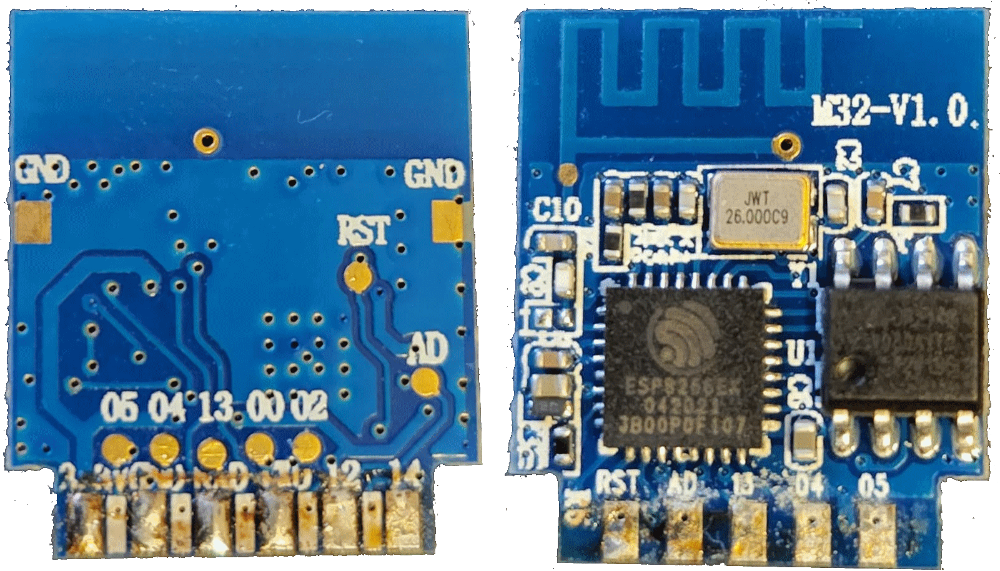

## Connection
Take care there's high voltage on the board when it is connected to the AC power, the best is to power with another 3.3v power suply, do not connect the board to AC power.
## Pinout

|  Pin   | Function    |
| ---    | ------------|
| GPIO04 | Push Button |
| GPIO05 | Relay       |
| GPIO13 | Led         |

## Basic Configuration for esp8266
Base on https://devices.esphome.io/devices/Tuya-WiFi-Smart-Switch-SB2S
```yaml
esphome:
  name: "relay"
  friendly_name: Relay

esp8266:
  board: esp01_1m

# Enable logging
logger:

# Enable Home Assistant API
api:
  encryption:
    key: "your key"

ota:
  - platform: esphome
    password: "ota password"

wifi:
  ssid: !secret wifi_ssid
  password: !secret wifi_password

  # Enable fallback hotspot (captive portal) in case wifi connection fails
  ap:
    ssid: "Relay Fallback Hotspot"
    password: !secret ap_password

captive_portal:
# Enable Web server
web_server:
  port: 80

# Sync time with Home Assistant
time:
  - platform: homeassistant
    id: homeassistant_time
    
# Text sensors with general information
text_sensor:
  # Expose ESPHome version as sensor
  - platform: version
    name: Relay
  # Expose WiFi information as sensors
  - platform: wifi_info
    ip_address:
      name: Relay IP
    ssid:
      name: Relay SSID
    bssid:
      name: Relay BSSID    

# Sensors with general information
sensor:
  # Uptime sensor.
  - platform: uptime
    name: Relay Uptime

  # WiFi Signal sensor
  - platform: wifi_signal
    name: Relay WiFi Signal
    update_interval: 60s

# Exposed switches.
switch:
  # Switch to restart the ESP
  - platform: restart
    name: Relay Restart

  # Relay
  - platform: output
    name: "${device_friendly_name} Relay"
    icon: ${device_icon}
    output: relayoutput
    id: relay
    on_turn_on:
      - light.turn_on: led
    on_turn_off:
      - light.turn_off: led
    restore_mode: ALWAYS_OFF

# Substitution Variables

substitutions:
  device_friendly_name:   Relay
  device_icon: "mdi:power"

# Status LED If there is an error in ESPhome, the LED will flash. If everything is OK, the indicator can be controlled from HA

light:
  - platform: status_led
    name: "Switch state"
    id: led
    pin:
      number: 13
      inverted: true
# Binary Sensors

binary_sensor:
# Button 
  - platform: gpio
    id: button
    pin:
      number: 4
      inverted: true
      mode: INPUT_PULLUP
    on_press:
      then:
        - switch.toggle: relay
    filters:
      - delayed_on_off: 50ms

# Relays

output:
  # Relay
  - platform: gpio
    id: relayoutput
    pin: 5
#    inverted: true
```
