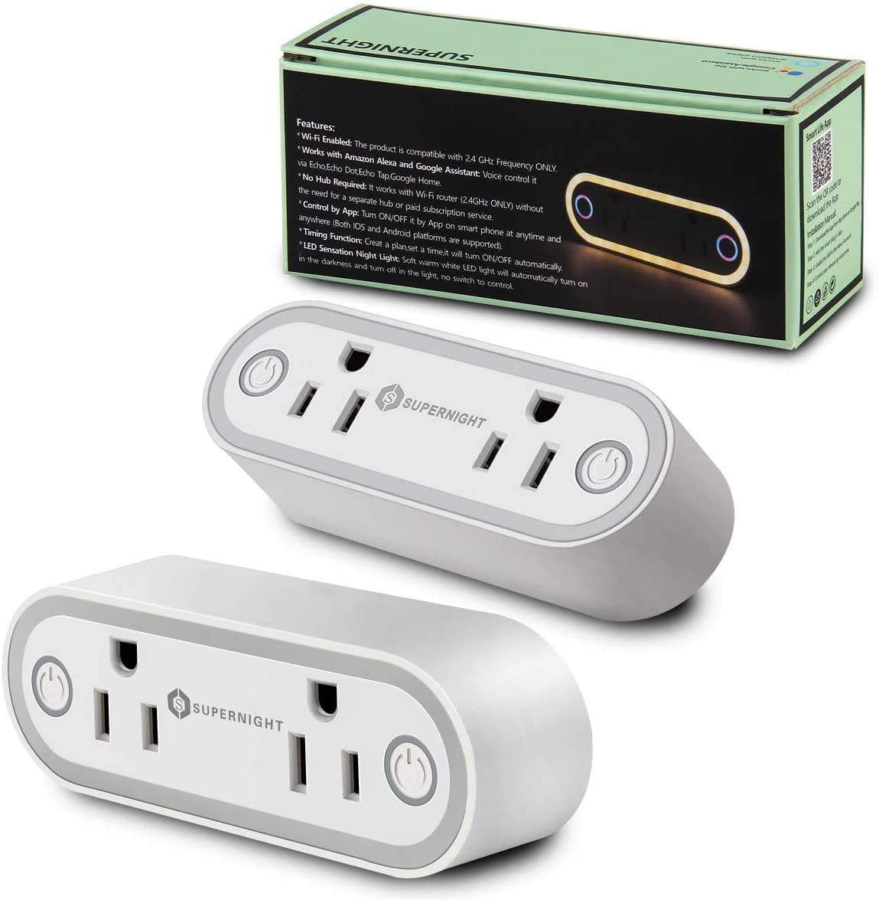

## Flashing

As of 2022-04-12, this device can be flashed with Tuya Convert OTA (over-the-air) out of the box with no adjustments needed.  Put the device in flash mode by long-holding either button until it starts fast-flashing.  This device likely cannot be opened without destruction.

## GPIO Pinout

| Pin    | Function                               |
| ------ | -------------------------------------- |
| GPIO1  | Left Outlet Button (Inverted: true)    |
| GPIO3  | Left Outlet Relay                      |
| GPIO4  | HLW8012 CF1 pin                        |
| GPIO5  | HLW8012 CF pin                         |
| GPIO12  | Right Outlet Relay                    |
| GPIO13 | HLW8012 SEL pin (Inverted: true)       |
| GPIO14 | Dual red status LED (Inverted: true    |
| A0 | Right Button (ADC Analog)                  |

## General Notes

These devices appear to be individually calibrated for voltage, current, and power.  As a result, you will need to measure with a multimeter and adjust the voltage divider, current resistor, and power draw accordingly.  The observed range so far for voltage divider is 747-865, so the base configuration has been adjusted to be the average of range at 806 for likely best default settings.  The observed range so far for the current resistor is 0.00113-0.0013, so the base configuration is set to 0.001215.  You can adjust the voltage divider, current resistor and power line curve in the substitutions section if needed.  You need to adjust the voltage divider and current resistor before making power adjustments.

There is an oddity with restoring the value of the right relay because of the analog switch and its values during boot up.  Because of this, the default configuration won't allow the right button to be pressed until the device is fully booted up, otherwise it will randomly change the state of the right outlet at startup.  The measured time of unavailablity of the right button is about 8 seconds as a result.

The nightlight feature cannot be controlled by the ESP IO, and cannot be disabled without physical changes.

## Basic Configuration

```yaml
# Basic Config
esphome:
  name: double-outlet-plug
  platform: esp8266
  board: esp8285
  esp8266_restore_from_flash: true
  # Because the right button is analog, its value will change to unpredictable
  # values during the boot process.  We must wait until the boot process has
  # loaded all sensors.
  on_boot:
    # 600 did not work, 250 works, and values inbetween also did not work. As a
    # result, there is a delay between when you insert the plug into the wall
    # and when you can use the button for the right outlet.  This is the safest
    # option to restore the correct value at a minor inconvenience.
    # This appears to make the right button unavailable for the first 8 seconds.
    priority: 250.0
    then:
      globals.set:
        id: allow_analog_button_input
        value: 'true'

# These values may need to be calibrated per device to correct displayed values
# for amperage, voltage, and power.
substitutions:
  # You must get current and voltage correct before calibrating power.
  # Observered current resistor values from 2 units: 0.00113-0.0013
  current_resistor: '0.001215'
  # Observed voltage divider values from 2 units: 747-865
  voltage_divider: '806'
  # The value 'Power' shows by default is incorrect, to add a linear correction
  # place a known entity and set the calibration data here.
  calibration_pre_cal_power_value: '129.1'
  calibration_expected_correct_value: '60.0'

logger:
api:
ota:
web_server:
time:
  - platform: sntp
    id: the_time
wifi:
  ssid: !secret wifi_ssid
  password: !secret wifi_password
  ap:
    ssid: "Supernight Fallback Hotspot"
    password: !secret wifi_ap_password
captive_portal:

# We don't want to allow analog input until bootup is complete.
globals:
   - id: allow_analog_button_input
     type: bool
     restore_value: no
     initial_value: 'false'

# GPIO14 is the red LED for both the left and right buttons together.
# They cannot be controlled individually.
# The blue LEDs turn on automatically with each respective relay and cannot be
# controlled manually.
# The nightlight is attached to a physical light sensor and is not controlled
# by any IO and cannot be disabled by configuration.
status_led:
  pin:
    number: GPIO14
    inverted: true

binary_sensor:
  - platform: gpio
    pin:
      number: GPIO1
      mode: INPUT_PULLUP
      inverted: true
    id: left_outlet_button
    on_press:
      - switch.toggle: relay_left_outlet

switch:
  - platform: gpio
    name: "Left Outlet"
    pin: GPIO3
    id: relay_left_outlet
    restore_mode: RESTORE_DEFAULT_OFF
  - platform: gpio
    name: "Right Outlet"
    pin: GPIO12
    id: relay_right_outlet
    # I'm unsure why, but the preference randomly saved incorrectly, and should
    # not be considered safe/reliable for the right outlet.
    restore_mode: RESTORE_DEFAULT_OFF

sensor:
  - platform: wifi_signal
    name: "wifi_signal"
  - platform: hlw8012
    sel_pin:
      number: GPIO13
      inverted: true
    cf_pin: GPIO5
    cf1_pin: GPIO4
    current_resistor: ${current_resistor}
    voltage_divider: ${voltage_divider}
    current:
      name: "Current"
    voltage:
      name: "Voltage"
    power:
      name: "Power"
      unit_of_measurement: W
      id: wattage
      filters:
        - calibrate_linear:
            # Map 0.0 (from sensor) to 0.0 (true value)
            - 0.0 -> 0.0 # No load
            - ${calibration_pre_cal_power_value} -> ${calibration_expected_correct_value}
    energy:
      name: "Energy"
      unit_of_measurement: "kWh"
      accuracy_decimals: 3
      filters:
        - multiply: 0.001
    update_interval: 60s
  # The right button is analog, and has a value of 4 when pressed and 1024
  # when not pressed.
  - platform: adc
    pin: A0
    id: analog_button
    raw: true
    # This needs to be short enough for the buttons to appear responsive.
    # 100ms was chosen because it seems sufficient for momentary detection.
    update_interval: 100ms
    # There is no real unit of measurement for this, and default V is confusing.
    unit_of_measurement: ""
    # Only trigger when the change is larger than the delta of 50.
    filters:
      - delta: 50
    on_value:
      lambda: !lambda |-
        if (id(allow_analog_button_input) && id(analog_button).state < 50)
        {
          // Right outlet button is being pushed.
          id(relay_right_outlet).toggle();
        }
```
