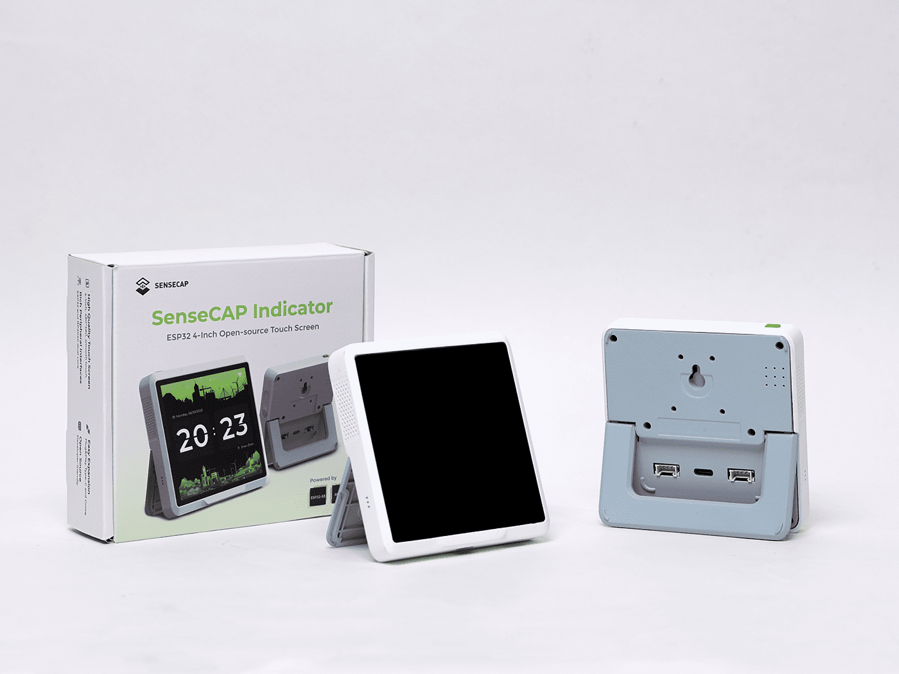

[SeeedStudio Documentation](https://wiki.seeedstudio.com/Sensor/SenseCAP/SenseCAP_Indicator/Get_started_with_SenseCAP_Indicator/)

## Introduction

The various models of the Seeed SenseCap Indicator contain optional hardware on
a core system consisting of two processors (ESP32-S3 and RP2040), with a touch
screen display with backlight, an SDCard slot, two Grove connectors exposing an
I2C bus and Analog-to-Digital inputs and a user button.

The ESP32-S3 is used as the primary microprocessor, controlling the display,
touch-screen and communication (Wifi, BLE and LoRa if installed). The RP2040
looks after the various sensors, buzzer control and the SDCard, as well as any
additional sensors attached to the Grove connectors.

Communication between the two processors is via a dedicated UART serial link. As
supplied, this link uses [COBS](https://en.wikipedia.org/wiki/Consistent_Overhead_Byte_Stuffing)
format for passing packet data.

Both processors can be programmed using ESPHome YAML code over USB, but the
RP2040 also supports mounting its flash as a USB storage device, and can also be
programmed that way for recovery purposes. (Poke a paperclip into the Internal
Button whole before applying USB power.)

## Models

- D1: Display
- D1S: Display with Sensors
- D1L: Display with LoRa Radio
- D1Pro: Display with Sensors, LoRa Radio

## Hardware

- Processor: ESP32-S3, RP2040
- Display: ST7701S
- Touchscreen: FT5X06
- IO Expander: PCA9535PW
- VOC Sensor: SGP40 (Model D1S, D1Pro)
- CO2 Sensor: SCD41 (Model D1S, D1Pro)
- LoRa Radio: SX1262 (Model D1L, D1Pro)

## ESP32-S3 - Pin Allocation

### SPI Bus

| Pin    | Function        |
| ------ | --------------- |
| GPIO41 | SPI CLK         |
| GPIO48 | SPI MOSI        |
| GPIO47 | SPI MISO        |

Note: The MISO pin is not required for output (Display), and is only used for
input from the LoRa radio (SX1262). The LoRa chip will not be able to be
configured without it (the HW Version of the LoRa radio will not be able to be
read).

Example

``` yaml
spi:
  - id: lcd_spi
    clk_pin: GPIO41
    mosi_pin: GPIO48
    miso_pin: GPIO47
```

### I2C Bus

| Pin    | Function        |
| ------ | --------------- |
| GPIO39 | I2C SDA         |
| GPIO40 | I2C SCL         |

Example

```yaml
i2c:
  - id: bus_a
    sda: GPIO39
    scl: GPIO40
    scan: false
```

### IO Expander, 16 bits (I2C)

I2C Address: 0x20

| Pin    | Function        |
| ------ | --------------- |
| GPIO39 | I2C SDA         |
| GPIO40 | I2C SCL         |
| GPIO42 | IO_INT (unused) |

Note: The IO_INT pin is connected to the ESP32-S3 but is not directly used.

Example

```yaml
pca9554:
  - id: pca9554a_device
    address: 0x20
    pin_count: 16
```

### LCD Display, RGB8565 (I2C + SPI + PCA9535)

The 'mipi_rgb' platform for the display is the newest method to configure the
RGB display. It is pre-configured with the hardware details of the Seeed
Indicator which simplifies the required configuration to the example below.

Example

```yaml
display:
  - platform: mipi_rgb
    model: SEEED-INDICATOR-D1
    id: sensecap_display
```

If you want to configure any of the other display parameters, you may need to use
the older 'st7701s' platform. Use only one of these platforms.

Hardware Details

| Pin                                       | Function  |
| ----------------------------------------- | --------- |
| GPIO41                                    | SPI CLOCK |
| GPIO48                                    | SPI MOSI  |
| Expander/4                                | SPI CS    |
| Expander/5                                | SPI RESET |
| GPIO16                                    | H-Sync    |
| GPIO17                                    | V-Sync    |
| GPIO18                                    | DE        |
| GPIO21                                    | PCLK      |
| GPIO4, GPIO3, GPIO2, GPIO1, GPIO0         | Red       |
| GPIO10, GPIO9, GPIO8, GPIO7, GPIO6, GPIO5 | Green     |
| GPIO15, GPIO14, GPIO13, GPIO12, GPIO11    | Blue      |

Example, using older platform (st7701s):

```yaml
display:
  - platform: st7701s
    id: sensecap_display
    auto_clear_enabled: false
    data_rate: 4MHz
    update_interval: never
    spi_mode: MODE3
    color_order: RGB
    dimensions:
      width: 480
      height: 480
    invert_colors: true
    transform:
      mirror_x: true
      mirror_y: true
    cs_pin:
      pca9554: pca9554a_device
      number: 4
    reset_pin:
      pca9554: pca9554a_device
      number: 5
    de_pin: GPIO18
    hsync_pin: GPIO16
    vsync_pin: GPIO17
    pclk_pin: GPIO21
    init_sequence:
      - 1 # select canned init sequence number 1
      - delay 5ms
      - [ 0xE0, 0x1F ]  # Set sunlight readable enhancement
    data_pins:
      red:
        - GPIO4         #r1
        - GPIO3         #r2
        - GPIO2         #r3
        - GPIO1         #r4
        - GPIO0         #r5
      green:
        - GPIO10        #g0
        - GPIO9         #g1
        - GPIO8         #g2
        - GPIO7         #g3
        - GPIO6         #g4
        - GPIO5         #g5
      blue:
        - GPIO15        #b1
        - GPIO14        #b2
        - GPIO13        #b3
        - GPIO12        #b4
        - GPIO11        #b5

```

### Touch Panel (I2C)

I2C Address: Implied

| Pin         | Function         |
| ----------- | ---------------- |
| GPIO39      | I2C SDA          |
| GPIO40      | I2C SCL          |
| Expander/6  | TP_INT (unused)  |
| Expander/7  | TP_REST (unused) |

Example

```yaml
touchscreen:
  platform: ft5x06
  id: sensecap_touchscreen
  transform:
    mirror_x: true
    mirror_y: true
  on_release:
    then:
      ...
```

### Backlight

| Pin    | Function      |
| ------ | ------------- |
| GPIO45 | Backlight PWM |

Example

```yaml
output:
  - platform: ledc
    pin:
      number: GPIO45
      ignore_strapping_warning: true
    id: ledc_gpio45
    frequency: 100Hz
```

### Button

| Pin    | Function               |
| ------ | ---------------------- |
| GPIO38 | Button - Normally High |

Example

```yaml
binary_sensor:
  - platform: gpio
    pin:
      number: GPIO38
      inverted: true
    name: "User Button"
```

### UART to RP2040

| Pin    | Function      |
| ------ | ------------- |
| GPIO20 | RX RP_16      |
| GPIO19 | TX RP_17      |

### External Flash, W25Q64JVSSIQ (SPI)

- Mode: Octal
- Speed: 80MHz
- Size: 8MB

This is set in the main example below.

### LoRa Radio, SX1262IMLTRT (SPI + I2C) - Models D1L, D1Pro

| Pin        | Function       |
| ---------- | -------------- |
| GPIO41     | SPI LoRa CLock |
| GPIO47     | SPI LoRa MISO  |
| GPIO48     | SPI LoRa MOSI  |
| Expander/0 | SPI LoRa CS    |
| Expander/1 | SPI LoRa RESET |
| Expander/2 | LoRa BUSY      |
| Expander/3 | LoRa DIO1      |

Example, requires I2C,SPI and PCA9554 (IO Expander).

```yaml
sx126x:
  id: sx126x_id
  cs_pin:
    pca9554: pca9554a_device
    number: 0
  rst_pin:
    pca9554: pca9554a_device
    number: 1
  busy_pin:
    pca9554: pca9554a_device
    number: 2
  dio1_pin:
    pca9554: pca9554a_device
    number: 3
  pa_power:   3
  bandwidth:  125_0kHz
  crc_enable: true
  frequency:  915000000
  modulation: LORA
  rx_start:   true
  rf_switch:  true
  hw_version: sx1262
  sync_value: [0x14, 0x24]
  preamble_size:    8
  spreading_factor: 7
  coding_rate:      CR_4_5
  tcxo_voltage:     NONE    # v1, V2_4 for v2 boards.
  tcxo_delay:       5ms
  on_packet:
    then:
      - lambda: |-
          ESP_LOGD("lora", "rx packet:%s rssi:%.2f snr:%.2f",
                             format_hex(x).c_str(),
                             rssi,
                             snr);
```

## RP2040 - Pin Allocation

### UART from ESP32-S3

| Pin    | Function      |
| ------ | ------------- |
| GPIO16 | TX ESP_20     |
| GPIO17 | RX ESP_19     |

### Grove 1 (I2C)

| Pin    | Function                  |
| ------ | ------------------------- |
| GPIO18 | Power Switch, Active High |
| GPIO20 | SDA                       |
| GPIO21 | SCL                       |

### Grove 2 (ADC)

| Pin    | Function      |
| ------ | ------------- |
| GPIO26 | ADC0          |
| GPIO27 | ADC1          |

### SD Card (SPI1)

| Pin    | Function |
| ------ | -------- |
| GPIO7  | SD_DET   |
| GPIO10 | SD_SCK   |
| GPIO11 | SD_MOSI  |
| GPIO12 | SD_MISO  |
| GPIO13 | SD_CS    |

### Flash Memory, W25Q16JVUXIQ - (QSPI)

| Pin         | Function                   |
| ----------- | -------------------------- |
| Boot Button | Set Flash as USB Mountable |

### Buzzer

| Pin    | Function      |
| ------ | ------------- |
| GPIO19 | Buzzer PWM    |

### VOC Sensor, SGP40 (I2C) - Models D1S, D1Pro

(I2C Address: 0x59)

See: [sgp4x](https://esphome.io/components/sensor/sgp4x/) component

### CO2 Sensor, SCD41 (I2C) - Models D1S, D1Pro

(I2C Address: 0x62)

See: [scd4x](https://esphome.io/components/sensor/scd4x) component

## Example Configuration

### Configuration for Model D1, for ESP32-S3

```yaml
esphome:
  name: seeed-sensecap
  friendly_name: Seeed SenseCAP

esp32:
  variant: esp32s3
  flash_size: 8MB
  framework:
    type: esp-idf
    sdkconfig_options:
      CONFIG_ESPTOOLPY_FLASHSIZE_8MB: y
      CONFIG_ESP32S3_DEFAULT_CPU_FREQ_240: y
      CONFIG_ESP32S3_DATA_CACHE_64KB: y
      CONFIG_SPIRAM_FETCH_INSTRUCTIONS: y
      CONFIG_SPIRAM_RODATA: y

psram:
  mode: octal
  speed: 80MHz

logger:
  hardware_uart: UART0
  level: DEBUG

output:
  - platform: ledc
    pin:
      number: GPIO45
      ignore_strapping_warning: true
    id: ledc_gpio45
    frequency: 100Hz

binary_sensor:
  - platform: gpio
    pin:
      number: GPIO38
      inverted: true
    name: "User Button"

i2c:
  - id: bus_a
    sda: GPIO39
    scl: GPIO40
    scan: false

spi:
  - id: lcd_spi
    clk_pin: GPIO41
    mosi_pin: GPIO48
    miso_pin: GPIO47

pca9554:
  - id: pca9554a_device
    address: 0x20
    pin_count: 16

display:
  - platform: mipi_rgb
    model: SEEED-INDICATOR-D1
    id: sensecap_display

light:
  - platform: monochromatic
    name: "Backlight"
    id: backlight
    output: ledc_gpio45
    restore_mode: ALWAYS_ON

touchscreen:
  platform: ft5x06
  id: sensecap_touchscreen
  transform:
    mirror_x: true
    mirror_y: true
  on_release:
    - if:
        condition: lvgl.is_paused
        then:
          - lvgl.resume:
          - lvgl.widget.redraw:
          - light.turn_on: backlight

image:
  - file: https://esphome.io/favicon-512x512.png
    id: boot_logo
    resize: 200x200
    type: RGB565
    transparency: alpha_channel

lvgl:
  on_idle:
    timeout: !lambda "return 10000;"
    then:
      - light.turn_off: backlight
      - lvgl.pause:

  top_layer:
    widgets:
      - obj:
          id: boot_screen
          x: 0
          y: 0
          width: 100%
          height: 100%
          bg_color: 0xffffff
          bg_opa: COVER
          radius: 0
          pad_all: 0
          border_width: 0
          widgets:
            - image:
                align: CENTER
                src: boot_logo
                y: -40
            - spinner:
                align: CENTER
                y: 95
                height: 50
                width: 50
                spin_time: 1s
                arc_length: 60deg
                arc_width: 8
                indicator:
                  arc_color: 0x18bcf2
                  arc_width: 8
```

### Configuration for model D1L, for ESP32-S3

Add the following to the configuration above to enable the LoRa SX1262 chip.
Received data packets will be shown in the log.

Note: Other boards with LoRa SX126X radio (eg. Wio-SX1262 LoRa Module) require
setting "tcxo_voltage: 2_4V" as they have a Temperature Controlled Crystal
Oscillator (TCXO). The LoRa Radio on the Seeed Indicator will not operate if
this is set, other than NONE.

SeeedStudio have two versions of LoRa boards - v1 (eg. Seeed Indicator D1) do not
need this setting, and v2 (eg. Wio-SX1262 LoRa Module) which do.

```yaml
sx126x:
  id: sx126x_id
  cs_pin:
    pca9554: pca9554a_device
    number: 0
  rst_pin:
    pca9554: pca9554a_device
    number: 1
  busy_pin:
    pca9554: pca9554a_device
    number: 2
  dio1_pin:
    pca9554: pca9554a_device
    number: 3
  pa_power:   3
  bandwidth:  125_0kHz
  crc_enable: true
  frequency:  915000000
  modulation: LORA
  rx_start:   true
  rf_switch:  true
  hw_version: sx1262
  sync_value: [0x14, 0x24]
  preamble_size:    8
  spreading_factor: 7
  coding_rate:      CR_4_5
  tcxo_voltage:     NONE    # v1, V2_4 for v2 boards.
  tcxo_delay:       5ms
  on_packet:
    then:
      - lambda: |-
          ESP_LOGD("lora", "rx packet:%s rssi:%.2f snr:%.2f",
                             format_hex(x).c_str(),
                             rssi,
                             snr);
```
