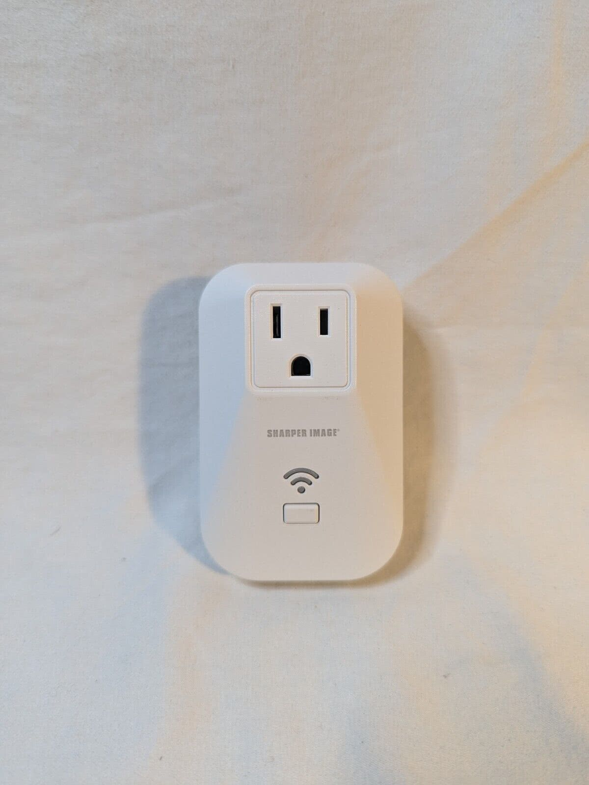
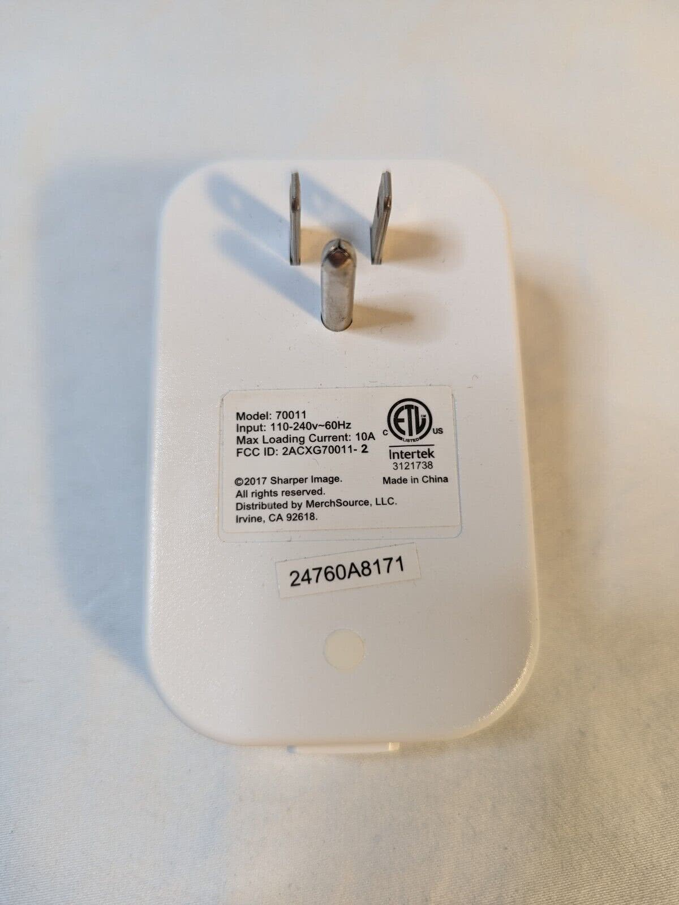
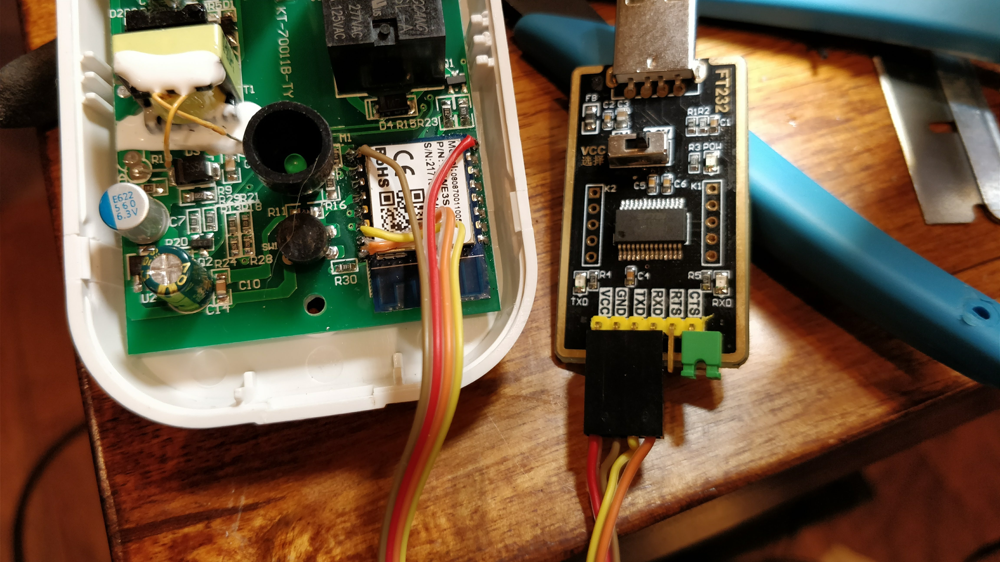

| Front                                      | Back                                     |
| ------------------------------------------ | ---------------------------------------- |
|  |  |

The Sharper Image 70011 Smart Wall Plug was sold at various retailers such as Target and Amazon. It is a rebranded KMC 70011 smart plug without the HLW8012 energy monitoring chip.

They can be flashed with soldering or without soldering by using jumpers. The board is a standard ESP-12f variant of the ESP8266.

## GPIO Pinout

| Pin    | Function                  |
| ------ | ------------------------- |
| GPIO14 | Relay                     |
| GPIO13 | Green LED (Inverted: true)|
| GPIO0  | Button                    |

## Getting it up and running

### Serial Flashing



In order to program the Smart Plug, it's necessary to solder leads or place jumpers onto the esp8266 carrierboard as shown below. ESP devices should always be flashed in 3.3V mode.

If unclear from the picture, use the following pinouts:

TXD0 (left, bottom-most pin when viewed as above, orange)
RXD0 (directly above TXD0, yellow)
GND (left, top-most pin, brown)
Vcc (right, top-most pin, red)

It is required to hold the device's button down to boot into flashing mode until the device starts to erase the stock firmware.

## Basic Configuration

```yaml
# Change the below substitutions to something you prefer, and update the number for each new device you create
substitutions:
  name: si-smartplug-model-70011
  friendly_name: si-smartplug-model-70011

```

```yaml
# BELOW IS COMMON CODE
esphome:
  name: si-smartplug-model-70011
  friendly_name: si-smartplug-model-70011

esp8266:
  board: d1_mini
  early_pin_init: false  # Prevent the physical relay flipping on reboot.
    
# OTA flashing
ota:
  - platform: esphome

wifi: # Your Wifi network details
  
# Enable fallback hotspot in case wifi connection fails  
  ap:

# Enabling the logging component
logger:

# Enable Home Assistant API
api:

# Enable the captive portal
captive_portal:

binary_sensor:
  - platform: gpio
    pin:
      number: GPIO0
      mode: INPUT_PULLUP
      inverted: True
    name: Button
    on_press:
      - switch.toggle: relay

switch:
  - platform: gpio
    name: Relay
    pin: GPIO14
    id: relay
    restore_mode: ALWAYS_ON

status_led:
  pin:
    number: GPIO13
    inverted: True
```
