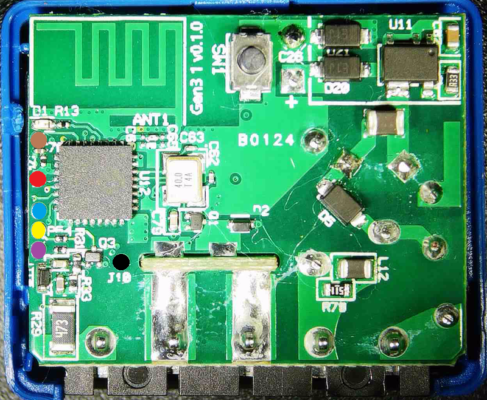

Generation 3 of Shelly Mini. With Relay, but no Powermeter.

## GPIO Pinout

| Pin   | Function |
| ----- | -------- |
| GPI00 | LED      |
| GPI01 | Button   |
| GPI03 | NTC      |
| GPI07 | Relay    |
| GPI10 | Switch   |

## Serial Pinout

The UART Pinout is the same as other Shelly Mini.

| Pin     | Colour |
| ------- | ------ |
| Reset   | Brown  |
| 3v3     | Red    |
| RX      | Blue   |
| TX      | Yellow |
| BootSEL | Purple |
| GND     | Black  |



## Basic Configuration

```yaml
esphome:
  name: "shelly-1-mini-gen3"
  friendly_name: "Shelly 1 Mini Gen3"

esp32:
  board: esp32-c3-devkitm-1
  flash_size: 8MB
  framework:
    type: esp-idf
    version: recommended
    sdkconfig_options:
      COMPILER_OPTIMIZATION_SIZE: y

wifi:
  ap:

logger:

api:

ota:

time:
  - platform: homeassistant

captive_portal:

sensor:
  - platform: ntc
    sensor: temp_resistance_reading
    name: "Temperature"
    unit_of_measurement: "°C"
    accuracy_decimals: 1
    icon: "mdi:thermometer"
    calibration:
      b_constant: 3350
      reference_resistance: 10kOhm
      reference_temperature: 298.15K
  - platform: resistance
    id: temp_resistance_reading
    sensor: temp_analog_reading
    configuration: DOWNSTREAM
    resistor: 10kOhm
  - platform: adc
    id: temp_analog_reading
    pin: GPIO3
    attenuation: 12db

output:
  - platform: gpio
    id: "relay_output"
    pin: 7

switch:
  - platform: output
    id: "relay"
    name: "Relay"
    output: "relay_output"

binary_sensor:
  - platform: gpio
    name: "Switch"
    pin: 10
    on_press:
      then:
        - switch.toggle: "relay"
    filters:
      - delayed_on_off: 50ms

  - platform: gpio
    name: "Button"
    pin:
      number: 1
      inverted: yes
      mode:
        input: true
        pullup: true

status_led:
  pin:
    number: 0
    inverted: true
```
