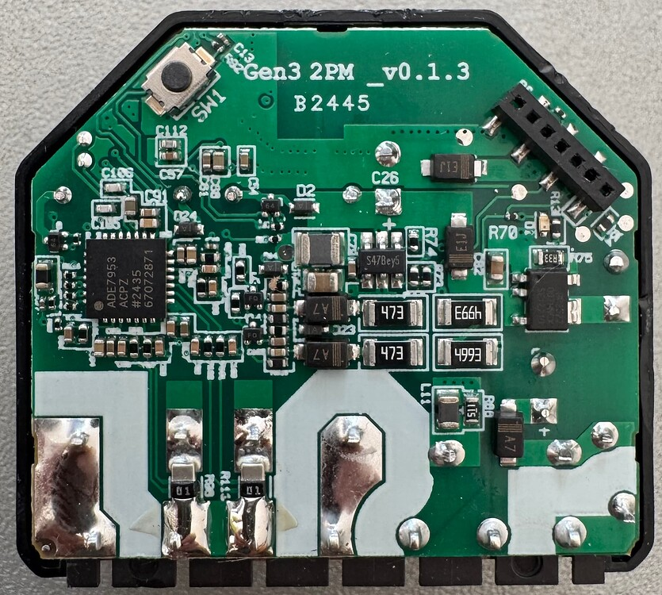

Generation 3 of Shelly 2. With Powermeter. \
Generation 3 configurations are not compatible with earlier Shelly 2 generation hardware. \
General hardware info, including serial pinout is on the [Shelly Knowledgebase](https://kb.shelly.cloud/knowledge-base/shelly-plus-2pm).

## GPIO Pinout

| Pin    | Function     |
| ------ | ------------ |
| GPIO0  | ASE7953 RST  |
| GPIO1  | ADE7953 IRQ  |
| GPIO2  | LedLink_i    |
| GPIO3  | Relay 1      |
| GPIO4  | ADC Temp     |
| GPIO5  | Relay 2      |
| GPIO6  | I2C SDA      |
| GPIO7  | I2C SCL      |
| GPIO10 | Switch 1     |
| GPIO18 | Switch 2     |
| GPIO19 | Reset Button |



These configurations may be flashable from the Shelly stock firmware OTA using mgos32-to-tasmota32, but was only tested via direct serial flash. OTA changes and upgrades after initial flash via ESPHome Web seem to work fine.

## Basic Configuration

This will appear in Home Assistant as two relays linked to the switch inputs. This includes power and temperature monitoring of the I2C interfaces.

Most of this configuration was taken from [this Home Assistant Community thread](https://community.home-assistant.io/t/do-you-have-a-working-esphome-config-for-shelly-3gen-2pm/833575/3), and the work to figure out the GPIO pins is thanks to [the Tasmota community.](https://github.com/arendst/Tasmota/discussions/22526#discussioncomment-11407244)

```yaml
substitutions:
  device_name: shelly-2-pm-gen3
  friendly_name: Shelly 2 PM Gen3
  # Friendly name for each switch
  channel_1_name: Switch 1
  channel_2_name: Switch 2
  max_power: "2000.0" # watt
  max_temp: "70.0" # °C
  restore_mode: RESTORE_DEFAULT_OFF

esphome:
  name: ${device_name}
  name_add_mac_suffix: false
  friendly_name: ${friendly_name}

esp32:
  board: esp32-c3-devkitm-1
  flash_size: 8MB
  framework:
    type: esp-idf
    version: recommended
    sdkconfig_options:
      COMPILER_OPTIMIZATION_SIZE: y

# Enable logging
logger:

# Enable Home Assistant API
api:
  encryption:
    key: !secret api_enc

ota:
  - platform: esphome
    password: !secret ota_pwd

wifi:
  ssid: !secret wifi_ssid
  password: !secret wifi_password
  ap:
    ssid: "${friendly_name}"
    password: !secret ap_pwd

captive_portal:

i2c:
  sda: GPIO6
  scl: GPIO7

sensor:
  - platform: ade7953_i2c
    irq_pin: GPIO1
    voltage:
      name: "Voltage"
      id: voltage
      icon: mdi:alpha-v-circle-outline
      device_class: voltage
    frequency:
      name: "Frequency"
      id: frequency
      accuracy_decimals: 2
      icon: mdi:cosine-wave
      device_class: frequency
    current_a:
      name: ${channel_1_name} Current
      id: channel_1_current
      icon: mdi:alpha-a-circle-outline
      device_class: current
    current_b:
      name: ${channel_2_name} Current
      id: chanenl_2_current
      icon: mdi:alpha-a-circle-outline
      device_class: current
    active_power_a:
      name: ${channel_1_name} Power
      id: channel_1_power
      icon: mdi:power
      device_class: power
      filters:
        - multiply: -1
    active_power_b:
      name: ${channel_2_name} Power
      id: channel_2_power
      icon: mdi:power
      device_class: power
      filters:
        - multiply: -1
    update_interval: 5s

  # NTC Temperature
  - platform: ntc
    sensor: temp_resistance_reading
    name: "Temperature"
    id: temperature
    icon: "mdi:thermometer"
    calibration:
      b_constant: 3350
      reference_resistance: 10kOhm
      reference_temperature: 298.15K
    on_value:
      then:
        - if:
            condition:
              - sensor.in_range:
                  id: temperature
                  above: ${max_temp}
            then:
              - switch.turn_off:
                  id: shelly_relay_1
              - switch.turn_off:
                  id: shelly_relay_2
              - logger.log: "Switch turned off because temperature exceeded ${max_temp}°C"
              - homeassistant.service:
                  service: persistent_notification.create
                  data:
                    title: Message from ${device_name}
                  data_template:
                    message: Switch turned off because temperature exceeded ${max_temp}°C

    on_value_range:
      - above: ${max_temp}
        then:
          - logger.log: "Temperature exceeded ${max_temp}°C"

  - platform: resistance
    id: temp_resistance_reading
    sensor: temp_analog_reading
    configuration: DOWNSTREAM
    resistor: 32kOhm

  - platform: adc
    id: temp_analog_reading
    pin: 4

status_led:
  pin:
    number: 2
    inverted: true
    ignore_strapping_warning: true

switch:
  - platform: gpio
    id: shelly_relay_1
    name: ${channel_1_name} relay
    pin:
      number: 5
      mode:
        output: true
    icon: "mdi:electric-switch"
    restore_mode: ${restore_mode}

  - platform: gpio
    id: shelly_relay_2
    name: ${channel_2_name} relay
    pin:
      number: 3
      mode:
        output: true
    icon: "mdi:electric-switch"
    restore_mode: ${restore_mode}

binary_sensor:
  - platform: gpio
    pin:
      number: GPIO18
    name: ${channel_1_name} input
    id: channel1_input
    # small delay to prevent bouncing
    filters:
      - delayed_on_off: 50ms
    on_state:
      then:
        - logger.log: ${device_name} Switch State Changed.
        - if:
            condition:
              binary_sensor.is_on: channel1_input
            then:
              - switch.turn_on: shelly_relay_1
            else:
              - switch.turn_off: shelly_relay_1

  - platform: gpio
    pin:
      number: GPIO10
    name: ${channel_2_name} input
    id: channel2_input
    # small delay to prevent bouncing
    filters:
      - delayed_on_off: 50ms
    on_state:
      then:
        - logger.log: ${device_name} Switch State Changed.
        - if:
            condition:
              binary_sensor.is_on: channel2_input
            then:
              - switch.turn_on: shelly_relay_2
            else:
              - switch.turn_off: shelly_relay_2

  - platform: gpio
    name: "Reset Button"
    pin:
      number: 19
      inverted: yes
      mode:
        input: true
        pullup: true
```
