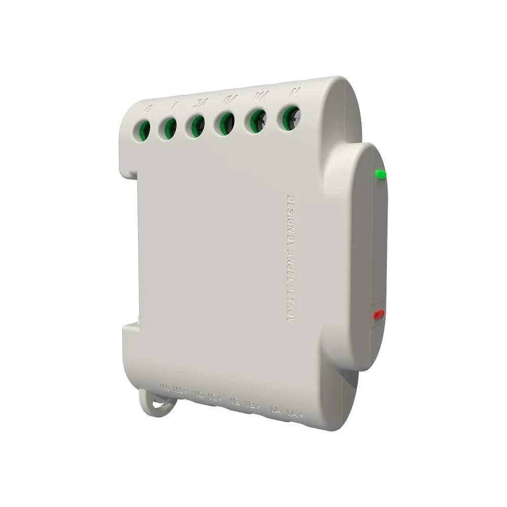

NOTE: In order to power up device it's enough to connect `VA` and `N` terminal.
NOTE: In order to retrieve proper data all live (`VA`/`VB`/`VC`) terminals needs to be connected to live wire, in other case this integration will report invalid voltage (like `0.12130 V`). Check single phase connection diagram in the official device manual for more details.

## GPIO Pinout

| Pin    | Function           |
| ------ | ------------------ |
| GPIO02 | LED (lower)        |
| GPIO04 | button (lower LED) |
| GPIO05 | ADE7880 IRQ1       |
| GPIO12 | I2C SDA            |
| GPIO13 | ADE7880 IRQ0       |
| GPIO14 | I2C SCL            |
| GPIO15 | Contactor Control  |
| GPIO16 | ADE7880 RESET      |

Note: The upper LED is not connected to a GPIO (it is connected to the
ADE7880) so it cannot be used as a normal ESPHome output.

## Calibration Data

It is critically important to retrieve the calbration data from the
3EM device before installing ESPHome onto it; without that data, it
will not be possible to get accurate sensor readings. You will need to
power up the device and let it connect to your network using the
preloaded Shelly firmware in order to retrieve this data. If you've
already converted the device to Tasmota and want to switch to ESPHome,
you'll have the calibration data and can skip steps 1-2 of the
instructions below.

1. Ensure that you are able to access the device's web interface
   (http://ip.address.of.device).

1. Download the calibration data file from
   http://ip.address.of.device/calib.dat. The file will look similar
   to this:

```json
{
  "state": 0,
  "rms": {
    "current_a": 3149413,
    "current_b": 3155641,
    "current_c": 3177848,
    "current_n": -1377304018,
    "current_s": 1804948,
    "voltage_a": -746938,
    "voltage_b": -735960,
    "voltage_c": -753583
  },
  "angles": {
    "angle0": 168,
    "angle1": 184,
    "angle2": 176
  },
  "powers": {
    "totactive": {
      "a": -1346104,
      "b": -1347476,
      "c": -1352863
    },
    "apparent": {
      "a": 220798,
      "b": 220791,
      "c": 220791
    }
  },
  "energies": {
    "totactive": {
      "a": 8986,
      "b": 8985,
      "c": 8985
    },
    "apparent": {
      "a": 41655,
      "b": 41660,
      "c": 41676
    }
  }
}
```

1. The `current_X` values from the `rms` section will go into the
   `calibration -> current_gain` entries in your configuration. Use the
   `current_s` value for the `neutral` phase, if you are enabling that
   phase's current sensor.

1. The `voltage_X` values from the `rms` section will go into the
   `calibration -> voltage_gain` entries in your configuration.

1. The `totactive` values from the `powers` section will go into the
   `calibration -> power_gain` entries in your configuration.

1. The `angleN` values from the `angles` section will go into the
   `calibration -> phase_angle` entries in your configuration.
   `angle0` is for `phase A`, `angle1` is for `phase B`, and `angle2`
   is for `phase C`.

## Example Configuration

```yaml
esphome:
  name: shelly-3em

esp8266:
  board: esp01_1m

# Enable logging
logger:

# Enable HA API
api:
  encryption:
    key: !secret api_key

# Enable OTAs
ota:
  password: !secret api_password

# Sync RTC with HA
time:
  - platform: homeassistant
    timezone: America/Chicago

# Wi-Fi Setup
wifi:
  ssid: !secret wifi_ssid
  password: !secret wifi_password

  power_save_mode: LIGHT

  # Enable fallback hotspot (captive portal) in case Wi-Fi connection fails
  ap:
    ssid: shelly-3em AP
    password: !secret ap_password

captive_portal:

i2c:
  sda: GPIO12
  scl: GPIO14
  frequency: 200kHz

status_led:
  pin:
    number: GPIO2

switch:
  - id: relay
    name: Shelly 3EM Relay
    platform: gpio
    pin:
      number: GPIO15

binary_sensor:
  - id: button
    name: Shelly 3EM Button
    platform: gpio
    pin:
      number: GPIO4
      mode: INPUT_PULLUP
      inverted: true

sensor:
  - id: ade7880_device
    platform: ade7880
    irq0_pin:
      number: GPIO13
    irq1_pin:
      number: GPIO5
    reset_pin:
      number: GPIO16
    frequency: 60Hz
    phase_a:
      name: Phase A
      voltage: Voltage
      current: Current
      active_power
        id: phase_a_active_power
        name: Active Power
      power_factor: Power Factor
      forward_active_energy
        id: phase_a_forward_active_energy
        name: Forward Active Energy
      reverse_active_energy: Reverse Active Energy
      calibration:
        current_gain: 3116628
        voltage_gain: -757178
        power_gain: -1344457
        phase_angle: 188
    phase_b:
      name: Phase B
      voltage: Voltage
      current: Current
      active_power:
        name: Active Power
        id: phase_b_active_power
      power_factor: Power Factor
      forward_active_energy:
        name: Forward Active Energy
        id: phase_b_forward_active_energy
      reverse_active_energy: Reverse Active Energy
      calibration:
        current_gain: 3133655
        voltage_gain: -755235
        power_gain: -1345638
        phase_angle: 188
    phase_c:
      name: Phase C
      voltage: Voltage
      current: Current
      active_power:
        name: Active Power
        id: phase_c_active_power
      power_factor: Power Factor
      forward_active_energy:
        name: Forward Active Energy
        id: phase_c_forward_active_energy
      reverse_active_energy: Reverse Active Energy
      calibration:
        current_gain: 3111158
        voltage_gain: -743813
        power_gain: -1351437
        phase_angle: 180
    neutral:
      name: Neutral
      current: Current
      calibration:
        current_gain: 311123
  - platform: combination
    type: sum
    name: "Sum Active Power"
    id: sum_active_power
    sources:
      - source: phase_a_active_power
      - source: phase_b_active_power
      - source: phase_c_active_power
  - platform: combination
    type: sum
    name: "Sum Forward Active Energy"
    state_class: total_increasing
    sources:
      - source: phase_a_forward_active_energy
      - source: phase_b_forward_active_energy
      - source: phase_c_forward_active_energy
  - platform: total_daily_energy
    name: 'Total Daily Energy'
    power_id: sum_active_power
    unit_of_measurement: 'kWh'
    state_class: total_increasing
    device_class: energy
    accuracy_decimals: 3
    filters:
      # Multiplication factor from W to kW is 0.001
      - multiply: 0.001
```
