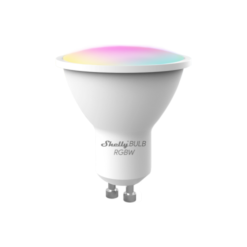

This template was made using the Tasmota template found [here](https://github.com/arendst/mgos-to-tasmota) with the [GPIO conversion in the Tasmota docs](https://tasmota.github.io/docs/GPIO-Conversion/#gpio-conversion).

## GPIO Pinout

| Pin    | Function  |
| ------ | --------- |
| GPIO5  | PWM 4 (W) |
| GPIO12 | PWM 2 (G) |
| GPIO13 | PWM 1 (R) |
| GPIO14 | PWM 2 (B) |

## Configuration for RGBW

```yaml
substitutions:
  device_name: "shelly-bulb-duo-rgbw"
  friendly_name: "Shelly Bulb Duo RGBW"

esphome:
  name: ${device_name}
  comment: ${friendly_name}

esp8266:
  board: esp01_1m
    
# OTA flashing
ota:
  - platform: esphome

wifi: # Your Wifi network details
  
# Enable fallback hotspot in case wifi connection fails  
  ap:

# Enabling the logging component
logger:

# Enable Home Assistant API
api:

# Enable the captive portal
captive_portal:

light:
  - platform: rgbw
    name: ${friendly_name}
    red: pwm_r
    green: pwm_g
    blue: pwm_b
    white: pwm_w
    effects:
      - random:
      - strobe:
      - flicker:

output:
  - platform: esp8266_pwm
    pin: GPIO13
    frequency: 1000 Hz
    id: pwm_r

  - platform: esp8266_pwm
    pin: GPIO12
    frequency: 1000 Hz
    id: pwm_g

  - platform: esp8266_pwm
    pin: GPIO14
    frequency: 1000 Hz
    id: pwm_b

  - platform: esp8266_pwm
    pin: GPIO5
    frequency: 1000 Hz
    id: pwm_w
```
