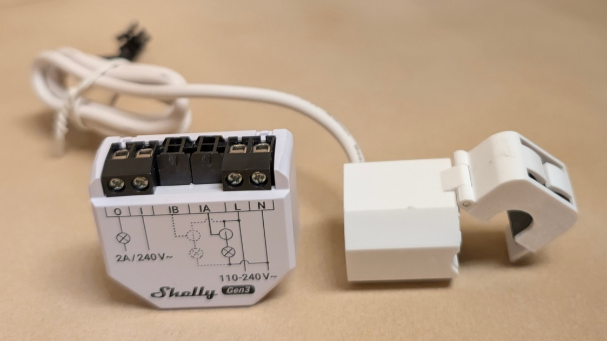

## GPIO Pinout

| Pin    | Function                         |
| ------ | -------------------------------- |
| GPIO0  | Relay                            |
| GPIO1  | Button                           |
| GPIO3  | ADC for NTC temperature sensor   |
| GPIO4  | ADE7953 IRQ pin (active low)     |
| GPIO5  | ADE7953 RESET pin (active low)   |
| GPIO6  | I2C SCL                          |
| GPIO7  | I2C SDA                          |
| GPIO9  | Status LED                       |
| GPIO18 | Pin 1 of 7-pin header            |
| GPIO20 | UART receive (U0RXD)             |
| GPIO21 | UART transmit (U0TXD)            |

## I2C Devices

| Address | Function                                            |
| ------- | --------------------------------------------------- |
|    0x38 | ADE7953 power sensor                                |
|    0x51 | AiP8563 RTC (not currently supported by ESPHome)    |

## Quick start / Example config

Note that you should set AP & OTA passwords before using any ESPHome device in production.

### Minimal (hardware definitions only)

```yaml
# Shelly EM Gen3 - Minimal (Hardware definitions only)
# Model number: S3EM-002CXCEU50
# PCB markings: "EM Gen3_v0.1.3", "B2519"
# SoC: ESP-Shelly-C38F (similar to ESP32-C3)
# CPU: ESP32-C3 (QFN32) (revision v0.4)
# Features: Wi-Fi, BT 5 (LE), Single Core, 160MHz, Embedded Flash 8MB (GD)
# Crystal frequency:  40MHz
# References:
# - https://devices.esphome.io/devices/shelly-em-gen3/
# - https://community.home-assistant.io/t/shelly-em-gen3-solved/944171
# - https://kb.shelly.cloud/knowledge-base/shelly-em-gen3
#
# GPIOs:
#   GPIO0 - Dry-contact relay (normally open)
#   GPIO1 - Pushbutton
#   GPIO3 - ADC for NTC temperature sensor
#   GPIO4 - ADE7953 IRQ pin (active low)
#   GPIO5 - ADE7953 RESET pin (active low)
#   GPIO6 - I2C SCL
#   GPIO7 - I2C SDA
#   GPIO9 - Status LED (active low)
#   GPIO18 - Pin 1 of 7-pin header
#   GPIO20 - UART receive (U0RXD)
#   GPIO21 - UART transmit (U0TXD)
#
# I2C devices:
#  0x38 - ADE7953 Power Sensor
#  0x51 - AiP8563 Battery-backed real-time clock (not currently supported by ESPHome)

substitutions:
  # How often to update the power meter.
  update_interval: 20s

  # Calibrated on US-style 120V power with 50A current transformers.
  # You may need to calibrate this yourself if the numbers are inaccurate.
  calibration_voltage_gain: 0x32c78f
  calibration_current_gain_a: 0x490bb5
  calibration_current_gain_b: 0x498c15

esphome:
  name: "shelly-em-gen3"
  friendly_name: "Shelly EM Gen3"
  comment: "Shelly EM Gen3 - Smart wifi and bluetooth energy meter with dual current transformers"
  name_add_mac_suffix: true
  min_version: 2025.11.3    # for ade7953 bugfix #12180

esp32:
  variant: esp32c3
  flash_size: 8MB
  framework:
    type: esp-idf

# Enable logging
logger:
  level: DEBUG
  hardware_uart: uart0

# debug:

# Enable Home Assistant API with dynamic key
api:
  encryption:

ota:
  - platform: esphome
    id: ota_id
    # password: !secret ota_password

wifi:
  ssid: !secret wifi_ssid
  password: !secret wifi_password

i2c:
  scl: GPIO6
  sda: GPIO7
  scan: true

light:
  - platform: status_led
    name: "Status LED"
    id: status_led_id
    disabled_by_default: true
    entity_category: diagnostic
    pin:
      number: GPIO9
      inverted: true
      ignore_strapping_warning: true

switch:
  # Dry-contact relay - normally open
  - platform: gpio
    name: Relay
    id: relay_id
    pin: GPIO0

sensor:
  - platform: ntc
    id: ntc_temperature
    name: "NTC Temperature"
    entity_category: diagnostic
    unit_of_measurement: "°C"
    accuracy_decimals: 1
    icon: "mdi:thermometer"
    sensor: temp_resistance_reading
    calibration:
      b_constant: 3350
      reference_resistance: 10kOhm
      reference_temperature: 298.15K
  - platform: resistance
    id: temp_resistance_reading
    sensor: temp_analog_reading
    configuration: DOWNSTREAM
    resistor: 10kOhm
  - platform: adc
    id: temp_analog_reading
    pin: GPIO3
    attenuation: 12db

  # Note that on the Shelly EM Gen3, channels "A" and "B" are swapped between the chipset and the labels on the device.
  # The nIRQ pin of the ade7953 device seems to be connected to pin 9 (GPIO4)
  # of the ESP-Shelly-C38F.
  - platform: ade7953_i2c
    id: ade7953_id
    irq_pin: GPIO4
    update_interval: ${update_interval}
    use_accumulated_energy_registers: true

    voltage_gain: ${calibration_voltage_gain}
    current_gain_a: ${calibration_current_gain_a}
    current_gain_b: ${calibration_current_gain_b}

    voltage:
      id: line_voltage
      name: Voltage
    frequency:
      id: line_frequency
      name: Frequency
    current_b:
      id: current_a
      name: "Current A"
      accuracy_decimals: 3
    current_a:
      id: current_b
      name: Current B
      accuracy_decimals: 3
    power_factor_b:
      id: power_factor_a
      name: "Power Factor A"
      filters:
        - multiply: -1
    power_factor_a:
      id: power_factor_b
      name: "Power Factor B"
      filters:
        - multiply: -1
    apparent_power_b:
      id: apparent_power_a
      name: "Apparent Power A"
    apparent_power_a:
      id: apparent_power_b
      name: "Apparent Power B"
    active_power_b:
      id: active_power_a
      name: "Power A"
    active_power_a:
      id: active_power_b
      name: "Power B"
    reactive_power_b:
      id: reactive_power_a
      name: "Reactive Power A"
      filters:
        - multiply: -1
    reactive_power_a:
      id: reactive_power_b
      name: "Reactive Power B"
      filters:
        - multiply: -1

binary_sensor:
  - platform: gpio
    id: shelly_button_id
    name: "Button"
    entity_category: diagnostic
    pin:
      number: GPIO1
      inverted: true
      mode:
        input: true
        pullup: true
    filters:
      - settle: 10ms

  - platform: gpio
    id: binary_sensor_header_gpio_id
    name: "Header GPIO"
    entity_category: diagnostic
    disabled_by_default: true
    pin:
      number: GPIO18
      inverted: true
      mode:
        input: true
        pullup: true
```

### Full example (includes energy monitoring)

```yaml
# Shelly EM Gen3
# Model number: S3EM-002CXCEU50
# PCB markings: "EM Gen3_v0.1.3", "B2519"
# SoC: ESP-Shelly-C38F (similar to ESP32-C3)
# CPU: ESP32-C3 (QFN32) (revision v0.4)
# Features: Wi-Fi, BT 5 (LE), Single Core, 160MHz, Embedded Flash 8MB (GD)
# Crystal frequency:  40MHz
# References:
# - https://devices.esphome.io/devices/shelly-em-gen3/
# - https://community.home-assistant.io/t/shelly-em-gen3-solved/944171
# - https://kb.shelly.cloud/knowledge-base/shelly-em-gen3
#
# GPIOs:
#   GPIO0 - Dry-contact relay (normally open)
#   GPIO1 - Pushbutton
#   GPIO3 - ADC for NTC temperature sensor
#   GPIO4 - ADE7953 IRQ pin (active low)
#   GPIO5 - ADE7953 RESET pin (active low)
#   GPIO6 - I2C SCL
#   GPIO7 - I2C SDA
#   GPIO9 - Status LED (active low)
#   GPIO18 - Pin 1 of 7-pin header
#   GPIO20 - UART receive (U0RXD)
#   GPIO21 - UART transmit (U0TXD)
#
# I2C devices:
#  0x38 - ADE7953 Power Sensor
#  0x51 - AiP8563 Battery-backed real-time clock (not currently supported by ESPHome)

substitutions:
  # Set dual_sensors to false to remove the "B" and "Total" sensors
  dual_sensors: true

  # How often to update the power meter.
  update_interval: 20s

  # Calibrated on US-style 120V power with 50A current transformers.
  # You may need to calibrate this yourself if the numbers are inaccurate.
  calibration_voltage_gain: 0x32c78f
  calibration_current_gain_a: 0x490bb5
  calibration_current_gain_b: 0x498c15

esphome:
  name: "shelly-em-gen3"
  friendly_name: "Shelly EM Gen3"
  comment: "Shelly EM Gen3 - Smart wifi and bluetooth energy meter with dual current transformers"
  name_add_mac_suffix: true
  min_version: 2025.11.3    # for ade7953 bugfix #12180

esp32:
  variant: esp32c3
  flash_size: 8MB
  framework:
    type: esp-idf

# Enable logging
logger:
  level: DEBUG
  hardware_uart: uart0

# debug:

# Enable Home Assistant API with dynamic key
api:
  encryption:

ota:
  - platform: esphome
    id: ota_id
    # password: !secret ota_password

wifi:
  ssid: !secret wifi_ssid
  password: !secret wifi_password
  # fast_connect: true
  enable_btm: true
  enable_rrm: true
  min_auth_mode: WPA2

  # Enable fallback hotspot (captive portal) in case wifi connection fails
  ap:
    # password: !secret ap_password

captive_portal:

network:
  enable_ipv6: true

preferences:
  flash_write_interval: 5min

safe_mode:
  reboot_timeout: 10min

factory_reset:
  resets_required: 10
  max_delay: 10s
  on_increment:
    - logger.log:
        format: "(factory_reset) Fast power cycle count now %u, target %u"
        args: [x, target]

time:
  - platform: homeassistant
    id: homeassistant_time

button:
  - platform: factory_reset
    id: button_factory_reset
    name: Factory reset
    disabled_by_default: true

  - platform: restart
    id: button_restart
    name: Restart

  - platform: safe_mode
    id: button_safe_mode
    name: Safe Mode Boot

i2c:
  scl: GPIO6
  sda: GPIO7
  scan: true

esp32_ble_tracker:
  scan_parameters:
    active: false

bluetooth_proxy:
  active: false

light:
  - platform: status_led
    name: "Status LED"
    id: status_led_id
    disabled_by_default: true
    entity_category: diagnostic
    pin:
      number: GPIO9
      inverted: true
      ignore_strapping_warning: true

switch:
  # Dry-contact relay - normally open
  - platform: gpio
    name: Relay
    id: relay_id
    pin: GPIO0

sensor:
  - platform: uptime
    id: uptime_timestamp
    type: timestamp
    name: Last Boot

  - platform: wifi_signal # Reports the WiFi signal strength/RSSI in dB
    name: "WiFi Signal dB"
    id: wifi_signal_db
    update_interval: 60s

  - platform: copy # Reports the WiFi signal strength in %
    id: wifi_signal_percent
    source_id: wifi_signal_db
    name: "WiFi Signal Percent"
    filters:
      - lambda: return min(max(2 * (x + 100.0), 0.0), 100.0);
    unit_of_measurement: "Signal %"
    entity_category: diagnostic
    device_class: ""

  - platform: internal_temperature
    id: cpu_temperature
    name: "CPU Temperature"

  - platform: ntc
    id: ntc_temperature
    name: "NTC Temperature"
    entity_category: diagnostic
    unit_of_measurement: "°C"
    accuracy_decimals: 1
    icon: "mdi:thermometer"
    sensor: temp_resistance_reading
    calibration:
      b_constant: 3350
      reference_resistance: 10kOhm
      reference_temperature: 298.15K
  - platform: resistance
    id: temp_resistance_reading
    sensor: temp_analog_reading
    configuration: DOWNSTREAM
    resistor: 10kOhm
  - platform: adc
    id: temp_analog_reading
    pin: GPIO3
    attenuation: 12db

  # Note that on the Shelly EM Gen3, channels "A" and "B" are swapped between the chipset and the labels on the device.
  # The nIRQ pin of the ade7953 device seems to be connected to pin 9 (GPIO4)
  # of the ESP-Shelly-C38F.
  - platform: ade7953_i2c
    id: ade7953_id
    irq_pin: GPIO4
    update_interval: ${update_interval}
    use_accumulated_energy_registers: true

    voltage_gain: ${calibration_voltage_gain}
    current_gain_a: ${calibration_current_gain_a}
    current_gain_b: ${calibration_current_gain_b}

    voltage:
      id: line_voltage
      name: Voltage
    frequency:
      id: line_frequency
      name: Frequency
    current_b:
      id: current_a
      name: ${ "Current A" if dual_sensors else "Current" }
      accuracy_decimals: 3
    current_a:
      id: current_b
      name: Current B
      accuracy_decimals: 3
    power_factor_b:
      id: power_factor_a
      name: ${ "Power Factor A" if dual_sensors else "Power Factor" }
      filters:
        - multiply: -1
    power_factor_a:
      id: power_factor_b
      name: "Power Factor B"
      filters:
        - multiply: -1
    apparent_power_b:
      id: apparent_power_a
      name: ${ "Apparent Power A" if dual_sensors else "Apparent Power" }
    apparent_power_a:
      id: apparent_power_b
      name: "Apparent Power B"
    active_power_b:
      id: active_power_a
      name: ${ "Power A" if dual_sensors else "Power" }
    active_power_a:
      id: active_power_b
      name: "Power B"
    reactive_power_b:
      id: reactive_power_a
      name: ${ "Reactive Power A" if dual_sensors else "Reactive Power" }
      filters:
        - multiply: -1
    reactive_power_a:
      id: reactive_power_b
      name: "Reactive Power B"
      filters:
        - multiply: -1

  - platform: integration
    id: energy_a
    name: ${ "Energy A" if dual_sensors else "Energy" }
    sensor: active_power_a
    restore: false
    time_unit: h
    icon: mdi:meter-electric
    unit_of_measurement: "kWh"
    state_class: total_increasing
    device_class: energy
    accuracy_decimals: 3
    filters:
      - multiply: 0.001

  - platform: integration
    id: energy_b
    name: 'Energy B'
    sensor: active_power_b
    restore: false
    time_unit: h
    icon: mdi:meter-electric
    unit_of_measurement: "kWh"
    state_class: total_increasing
    device_class: energy
    accuracy_decimals: 3
    filters:
      - multiply: 0.001

  - platform: total_daily_energy
    id: daily_energy_consumed_a
    name: ${ "Daily Energy Consumed A" if dual_sensors else "Daily Energy Consumed" }
    power_id: active_power_a
    icon: "mdi:hours-24"
    unit_of_measurement: "kWh"
    state_class: total_increasing
    device_class: energy
    accuracy_decimals: 3
    filters:
      - multiply: 0.001

  - platform: total_daily_energy
    id: daily_energy_consumed_b
    name: "Daily Energy Consumed B"
    power_id: active_power_b
    icon: "mdi:hours-24"
    unit_of_measurement: "kWh"
    state_class: total_increasing
    device_class: energy
    accuracy_decimals: 3
    filters:
      - multiply: 0.001

  - platform: combination
    id: power_ab
    type: sum
    name: "Power Total"
    sources:
      - source: active_power_a
      - source: active_power_b
    device_class: power
    state_class: measurement

  - platform: combination
    id: energy_ab
    type: sum
    name: "Energy Total"
    sources:
      - source: energy_a
      - source: energy_b
    state_class: total_increasing
    accuracy_decimals: 3

  - platform: combination
    id: daily_energy_consumed_ab
    type: sum
    name: "Daily Energy Consumed Total"
    sources:
      - source: daily_energy_consumed_a
      - source: daily_energy_consumed_b
    state_class: total_increasing
    accuracy_decimals: 3

  - id: !remove ${ "active_power_b" if not dual_sensors else "" }
  - id: !remove ${ "apparent_power_b" if not dual_sensors else "" }
  - id: !remove ${ "current_b" if not dual_sensors else "" }
  - id: !remove ${ "daily_energy_consumed_b" if not dual_sensors else "" }
  - id: !remove ${ "daily_energy_consumed_ab" if not dual_sensors else "" }
  - id: !remove ${ "energy_ab" if not dual_sensors else "" }
  - id: !remove ${ "energy_b" if not dual_sensors else "" }
  - id: !remove ${ "power_ab" if not dual_sensors else "" }
  - id: !remove ${ "power_factor_b" if not dual_sensors else "" }
  - id: !remove ${ "reactive_power_b" if not dual_sensors else "" }

binary_sensor:
  - platform: gpio
    id: shelly_button_id
    name: "Button"
    entity_category: diagnostic
    pin:
      number: GPIO1
      inverted: true
      mode:
        input: true
        pullup: true
    filters:
      - settle: 10ms
    on_multi_click:
      - timing:
          - ON for at least 5s
        then:
          - logger.log: "Button held for 5s - Release for safe mode"
      - timing:
          - ON for at least 10s
        then:
          - logger.log: "Button held for 10s - Release for factory reset"
      - timing:
          - ON for 5s to 10s
          - OFF for at least 100ms
        then:
          - button.press: button_safe_mode
      - timing:
          - ON for at least 10s
          - OFF for at least 100ms
        then:
          - button.press: button_factory_reset

  - platform: gpio
    id: binary_sensor_header_gpio_id
    name: "Header GPIO"
    entity_category: diagnostic
    disabled_by_default: true
    pin:
      number: GPIO18
      inverted: true
      mode:
        input: true
        pullup: true
```

## 7-pin programming header

[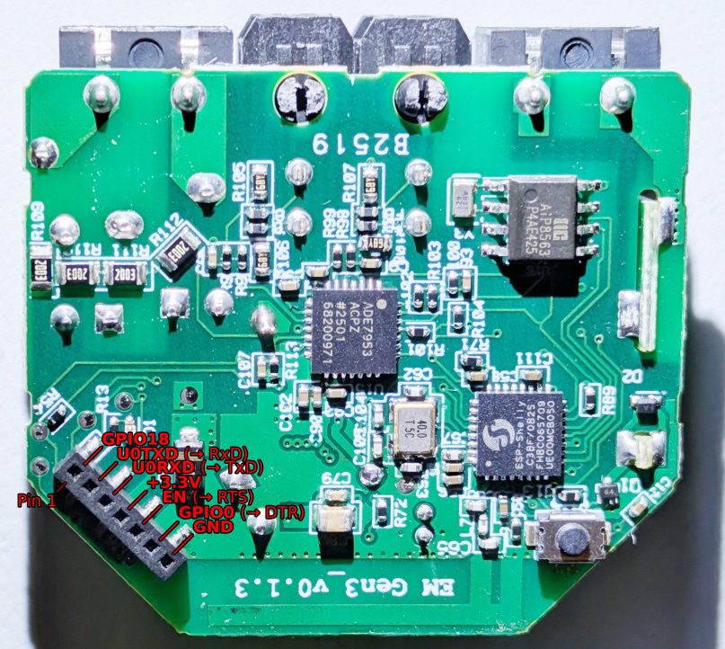](./pcb_pinout_diagram.jpg)

| Pin     | Label           | Description                   | GPIO      |
| ------- | --------------- | ----------------------------- | --------- |
|   1     | ESP_DBG_UART    |                               | GPIO18    |
|   2     | U0TXD           | connect to serial RxD pin     | GPIO21    |
|   3     | U0RXD           | connect to serial TxD pin     | GPIO20    |
|   4     | +3.3_ESP        | connect to 3.3V power supply  |           |
|   5     | EN              | connect to serial RTS pin     |           |
|   6     | GPIO0           | connect to serial DTR pin     | GPIO0     |
|   7     | U0RXD           | connect to serial GND pin     |           |

Programming voltage: 0 to 3.3V

## CT connector

[](./ct1.jpg)
[](./ct2.jpg)
[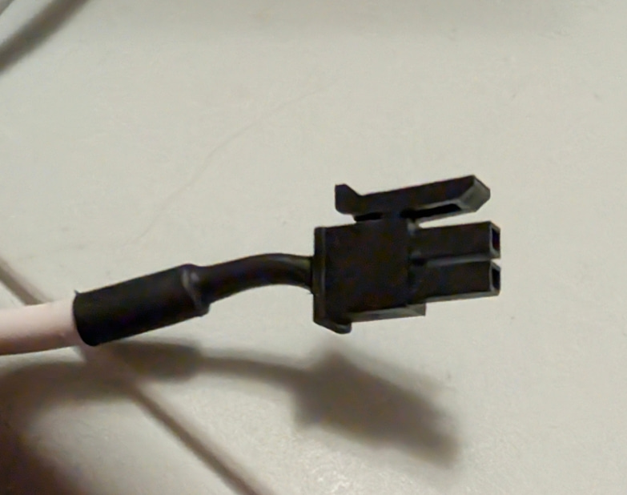](./ct3.jpg)

| Type                  | Description           |
| --------------------- | --------------------- |
| Manufacturer          | Molex                 |
| Series                | Micro-Fit 3.0 214755  |
| Pitch                 | 3.0 mm                |
| Number of Positions   | 2                     |
| Number of Rows        | 2                     |

## Photos

### Package photos


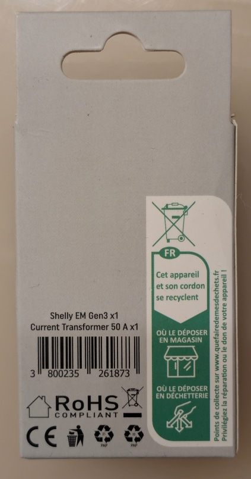

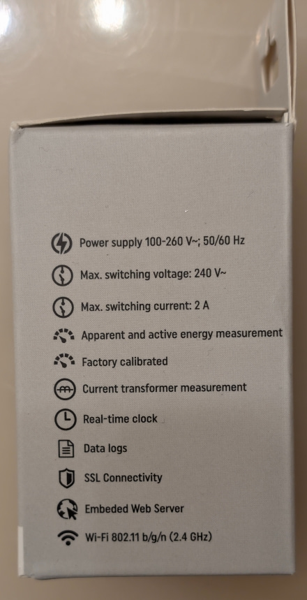

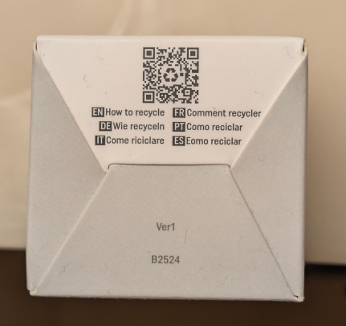

### Device photos


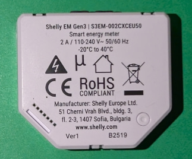
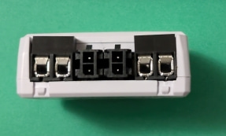

### PCB photos

[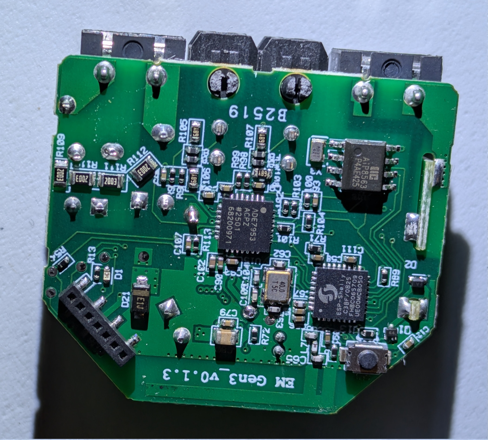](./pcb_bottom.jpg)

[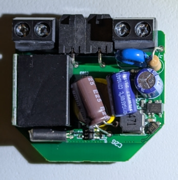](./pcb_top.jpg)
[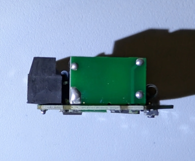](./pcb_left.jpg)
[](./pcb_front.jpg)
[](./pcb_right.jpg)
[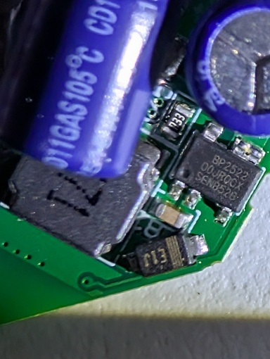](./pcb_top_regulator.jpg)

## Resources

* [Shelly Knowledge Base page](https://kb.shelly.cloud/knowledge-base/shelly-em-gen3)
* [Shelly EU store page](https://www.shelly.com/products/shelly-em-gen3)
* [Shelly USA store page](https://us.shelly.com/products/shelly-em-gen3-50a)
* [ADE7953 datasheet](https://www.analog.com/media/en/technical-documentation/data-sheets/ade7953.pdf)
* [AiP8563 RTC datasheet](https://dfsimg3.hqewimg.com/group5/M00/0F/C7/wKhk3WToPnaAbpAtAA10M9o8two933.pdf)
* [ESP32-C3 datasheet](https://documentation.espressif.com/esp32-c3_datasheet_en.pdf)
* [DLitz's personal config for this device](https://github.com/dlitz/esphome-configs-dlitz/blob/main/shelly-em-gen3.yaml)
* [Earlier HA Community post about this device](https://community.home-assistant.io/t/shelly-em-gen3-solved/944171)
