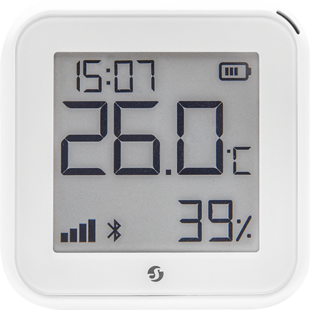
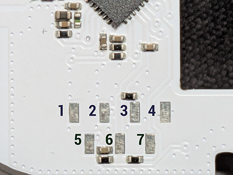

## Shelly H&T Gen3



Battery-powered WiFi temperature/humidity sensor with a segment E-Paper display (UC8119 controller). <br>
Uses an ESP32-C3 with 8MB flash, a Sensirion SHT31 sensor, and a UltraChip UC8119 E-Paper segment display with 91 active segments, 10 digits and 13 icons.

*Requires a custom ESPHome external component for the UC8119 display*

## GPIO Pinout

| GPIO   | Function         | Notes                                       |
|--------|------------------|---------------------------------------------|
| GPIO0  | Button           | XTAL_32K_P, external pull-up   |
| GPIO2 | Power Rail ADC  | Via voltage divider |
| GPIO1  | I2C SDA          | Shared bus (SHT31 + UC8119), external pull-up         |
| GPIO3  | I2C SCL          | 100kHz, external pull-up                              |
| GPIO4 | Battery ADC       | Via voltage divider (4x AA LR6)              |
| GPIO5 | Battery presence | High when Battery are connectred |
| GPIO6  | UC8119 BUSY_N    | LOW=busy, external pull-up             |
| GPIO7  | UC8119 RESET_N   | Active LOW                                   |
| GPIO10 | UC8119 Enable    | Display power gate, HIGH=on                  |
| GPIO18 | Battery power enable  | Enables Power-Path for Battery |


## Serial Pinout (Debug Header)



| Pad | Function |
|-----|----------|
| 1   | NC       |
| 2   | RXD      |
| 3   | CHIP_EN  |
| 4   | GND      |
| 5   | TXD      |
| 6   | VCC 3V3  |
| 7   | BOOT / GPIO9 |

## Flashing

> **Note:** OTA flashing from the original Shelly firmware is **not possible**.
> Shelly Gen4 verifies OTA images with an ECDSA signature using their private key.
> The device must be flashed via UART.

To enter download mode, hold **IO9** low (connect to GND) while powering on the device. Release after boot.

### Backup the original firmware

Always back up the original firmware before flashing:

```bash
esptool.py --chip esp32c3 --port /dev/ttyUSB0 --baud 460800 \
  --before no-reset --after no-reset \
  read_flash 0 0x800000 shelly-ht-gen3-backup.bin
```

### Compile

```bash
esphome compile shelly-ht-gen3.yaml
```

The factory binary is located at:

`.esphome/build/shelly-ht-gen3/.pioenvs/shelly-ht-gen3/firmware-factory.bin`

### Flash

```bash
esptool.py --chip esp32c3 --port /dev/ttyUSB0 --baud 460800 \
  write_flash 0x0 firmware-factory.bin
```

##  Configuration

Requires the `uc8119` and `shelly_ht_display` external components.

### Basic USB Powered Configuration 

```yaml
esphome:
  name: shelly-ht-gen3
  friendly_name: "Shelly H&T Gen3"

esp32:
  board: esp32-c3-devkitm-1
  variant: ESP32C3
  flash_size: 8MB
  framework:
    type: esp-idf
    version: recommended
    sdkconfig_options:
      COMPILER_OPTIMIZATION_SIZE: y
    advanced:
      enable_ota_rollback: false
    

logger:
wifi:
api: 
ota:
  on_begin:
    - lambda: id(display).show_ota_begin();
  on_progress:
    - lambda: id(display).show_ota_progress(x);
  on_end:
    - lambda: id(display).show_ota_end();
  on_error:
    - lambda: id(display).show_ota_error();   

external_components:
  - source: github://oxynatOr/esphome-shelly_ht_gen3
    refresh: 5s
    components: [shelly_ht_display]
  - source: github://oxynatOr/esphome-uc8119
    components: [uc8119]    
    refresh: 5s


i2c:
  sda: GPIO1
  scl: GPIO3
  scan: false
  frequency: 100kHz

sensor:
  - platform: sht3xd
    address: 0x44
    temperature:
      name: "Temperature"
      id: temp_sensor
      accuracy_decimals: 1
    humidity:
      name: "Humidity"
      id: humi_sensor
      accuracy_decimals: 0
    update_interval: 60s

  - platform: wifi_signal
    name: "WiFi Signal"
    id: wifi_rssi
    update_interval: 120s

  - platform: adc
    id: batt_adc
    pin: GPIO4
    attenuation: 12db
    update_interval: never
    internal: true
    samples: 15    

time:
  - platform: homeassistant
    id: ha_time

# Layer 1: Generic UC8119 EPD driver
uc8119:
  id: epd
  address: 0x50
  reset_pin: GPIO7
  busy_pin: GPIO6
  enable_pin: GPIO10
  ghost_clear_interval: 8h
  full_update_every: 360

# Layer 2: Shelly-specific display logic
shelly_ht_display:
  id: display
  display_id: epd
  update_interval: 1sec
  wifi_update_every: 20      
  font: siekoo                
  battery_adc_sensor: batt_adc
  battery_presence_sensor: batt_presence
  battery_power_enable: batt_power_en
  battery_divider: 3
  battery_full_voltage: 6.0
  battery_empty_voltage: 4.0
  battery_update_interval: 15sec
  # Battery output sensors
  battery_voltage:
    name: "Battery Voltage"
  battery_percent:
    name: "Battery Percent"
  external_power:
    name: "External Power"
  # Input sensors
  temperature_sensor: temp_sensor
  humidity_sensor: humi_sensor
  wifi_signal_sensor: wifi_rssi
  time_id: ha_time


output:
  - platform: gpio
    id: batt_power_en
    pin: GPIO18


binary_sensor:
  - platform: gpio
    id: batt_presence
    pin: 
      number: GPIO5
      inverted: true
    internal: true

button:
  - platform: restart
    name: "Restart"
    id: restart_btn
```

### Basic Battery Powered Configuration 

```yaml
esphome:
  name: shelly-ht-gen3
  friendly_name: "Shelly H&T Gen3"
  on_boot:
    priority: -200
    then:
      - if:
          condition:
            binary_sensor.is_off: batt_presence
          then:
            - deep_sleep.prevent: deep_sleep_ctrl
  on_shutdown:
    then:
      - lambda: id(epd).power_off();  

esp32:
  board: esp32-c3-devkitm-1
  variant: ESP32C3
  flash_size: 8MB
  framework:
    type: esp-idf
    version: recommended
    sdkconfig_options:
      COMPILER_OPTIMIZATION_SIZE: y
    advanced:
      enable_ota_rollback: false
    

logger:
wifi:
api: 
ota:
  on_begin:
    - lambda: id(display).show_ota_begin();
  on_progress:
    - lambda: id(display).show_ota_progress(x);
  on_end:
    - lambda: id(display).show_ota_end();
  on_error:
    - lambda: id(display).show_ota_error();   

external_components:
  - source: github://oxynatOr/esphome-shelly_ht_gen3
    refresh: 5s
    components: [shelly_ht_display]
  - source: github://oxynatOr/esphome-uc8119
    components: [uc8119]    
    refresh: 5s

deep_sleep:
  run_duration: 20s
  sleep_duration: 1min
  id: deep_sleep_ctrl
  wakeup_pin:
   - pin:
      number: GPIO0
      mode:
        input: true
        pullup: true
      inverted: true
      allow_other_uses: true  


i2c:
  sda: GPIO1
  scl: GPIO3
  scan: false
  frequency: 100kHz

sensor:
  - platform: sht3xd
    address: 0x44
    temperature:
      name: "Temperature"
      id: temp_sensor
      accuracy_decimals: 1
    humidity:
      name: "Humidity"
      id: humi_sensor
      accuracy_decimals: 0
    update_interval: 10s

  - platform: wifi_signal
    name: "WiFi Signal"
    id: wifi_rssi
    update_interval: 120s

  - platform: adc
    id: batt_adc
    pin: GPIO4
    attenuation: 12db
    update_interval: never
    internal: true
    samples: 15    

time:
  - platform: homeassistant
    id: ha_time

# Layer 1: Generic UC8119 EPD driver
uc8119:
  id: epd
  address: 0x50
  reset_pin: GPIO7
  busy_pin: GPIO6
  enable_pin: GPIO10
  ghost_clear_interval: 8h
  full_update_every: 360

# Layer 2: Shelly-specific display logic
shelly_ht_display:
  id: display
  display_id: epd
  update_interval: 1sec
  wifi_update_every: 20      
  font: siekoo                
  battery_adc_sensor: batt_adc
  battery_presence_sensor: batt_presence
  battery_power_enable: batt_power_en
  battery_divider: 3
  battery_full_voltage: 6.0
  battery_empty_voltage: 4.0
  battery_update_interval: 15sec
  # Battery output sensors
  battery_voltage:
    name: "Battery Voltage"
  battery_percent:
    name: "Battery Percent"
  external_power:
    name: "External Power"
  # Input sensors
  temperature_sensor: temp_sensor
  humidity_sensor: humi_sensor
  wifi_signal_sensor: wifi_rssi
  time_id: ha_time
  # on_ready - fires after non-WiFi display update
  on_ready:
    then:
      - lambda: id(epd).power_off();
      - deep_sleep.enter: deep_sleep_ctrl

output:
  - platform: gpio
    id: batt_power_en
    pin: GPIO18


binary_sensor:
  - platform: gpio
    id: batt_presence
    pin: 
      number: GPIO5
      inverted: true
    internal: true

button:
  - platform: restart
    name: "Restart"
    id: restart_btn
```