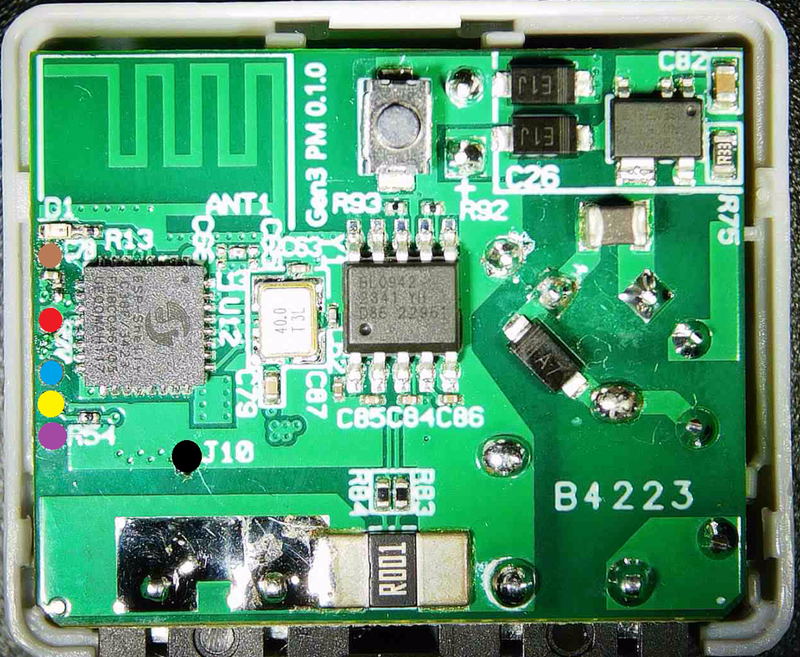

Generation 3 of Shelly Mini. With Powermeter. Flashsize is 8MB.

## Serial Pinout

The UART Pinout is the same as other Shelly Plus Mini.

| Pin     | Colour |
| ------- | ------ |
| Reset   | Brown  |
| 3v3     | Red    |
| RX      | Blue   |
| TX      | Yellow |
| BootSEL | Purple |
| GND     | Black  |



## GPIO Pinout

| Pin   | Function  |
| ----- | --------- |
| GPIO3 | NTC       |
| GPIO6 | BL0942 TX |
| GPIO7 | BL0942 RX |
| GPIO0 | LED       |
| GPIO1 | Button    |

## Basic Configuration

```yaml
esphome:
  name: "pm-mini-gen3"
  friendly_name: "Shelly PM Mini Gen3"
  platformio_options:
    board_build.flash_mode: dio

esp32:
  board: esp32-c3-devkitm-1
  flash_size: 8MB
  framework:
    type: esp-idf
    version: recommended
    sdkconfig_options:
      COMPILER_OPTIMIZATION_SIZE: y

wifi:
  ap:

logger:

api:

ota:

time:
  - platform: homeassistant

captive_portal:

sensor:
  - platform: ntc
    sensor: temp_resistance_reading
    name: "Temperature"
    unit_of_measurement: "°C"
    accuracy_decimals: 1
    icon: "mdi:thermometer"
    calibration:
      b_constant: 3350
      reference_resistance: 10kOhm
      reference_temperature: 298.15K
  - platform: resistance
    id: temp_resistance_reading
    sensor: temp_analog_reading
    configuration: DOWNSTREAM
    resistor: 10kOhm
  - platform: adc
    id: temp_analog_reading
    pin: GPIO3
    attenuation: 12db

  - platform: bl0942
    uart_id: uart_0
    voltage:
      name: "Voltage"
      id: bvoltage
      icon: mdi:alpha-v-circle-outline
      device_class: voltage
    current:
      name: "Current"
      id: bcurrent
      icon: mdi:alpha-a-circle-outline
      device_class: current
    power:
      name: "Power"
      id: bpower
      icon: mdi:transmission-tower
      device_class: power
    energy:
      name: "Energy"
      id: benergy
      icon: mdi:lightning-bolt
      device_class: energy
    frequency:
      name: "Frequency"
      id: bfreq
      accuracy_decimals: 2
      icon: mdi:cosine-wave
      device_class: frequency
    update_interval: 5s

uart:
  id: uart_0
  tx_pin: GPIO6
  rx_pin: GPIO7
  baud_rate: 9600
  stop_bits: 1

status_led:
  pin:
    number: 0
    inverted: true

binary_sensor:
  - platform: gpio
    name: "Button"
    pin:
      number: 1
      inverted: yes
      mode:
        input: true
        pullup: true
```

## Total Daily Energy Sensor

```yaml
sensor:
  - platform: total_daily_energy
    name: "Total Daily Energy"
    power_id: bpower
    icon: mdi:meter-electric
    unit_of_measurement: "kWh"
    state_class: total_increasing
    device_class: energy
    accuracy_decimals: 3
    filters:
      - multiply: 0.001
```
