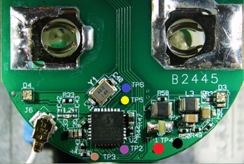
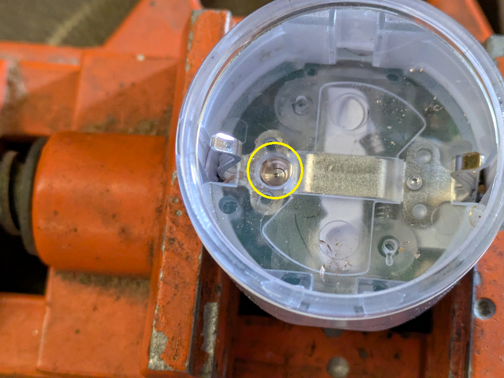
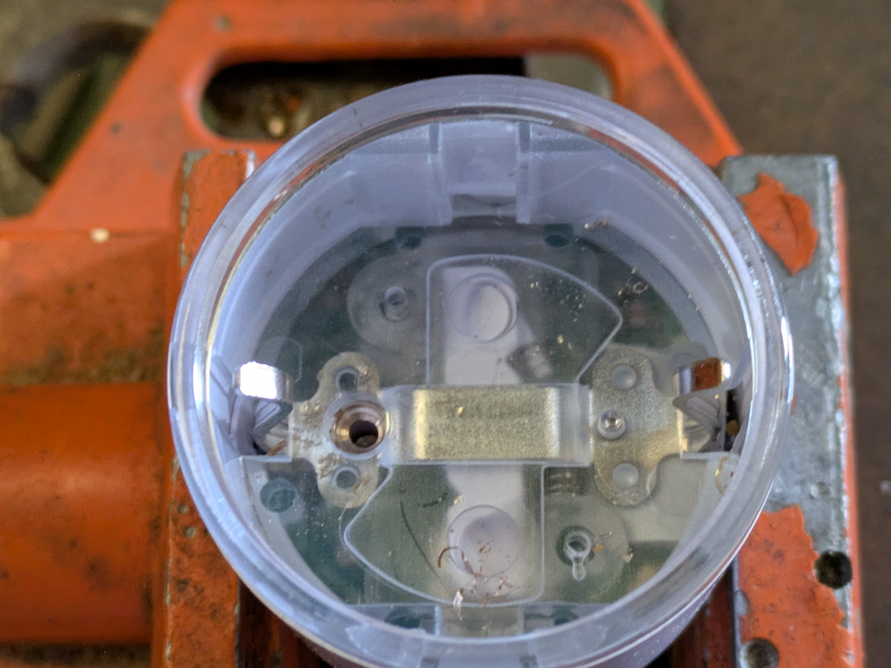
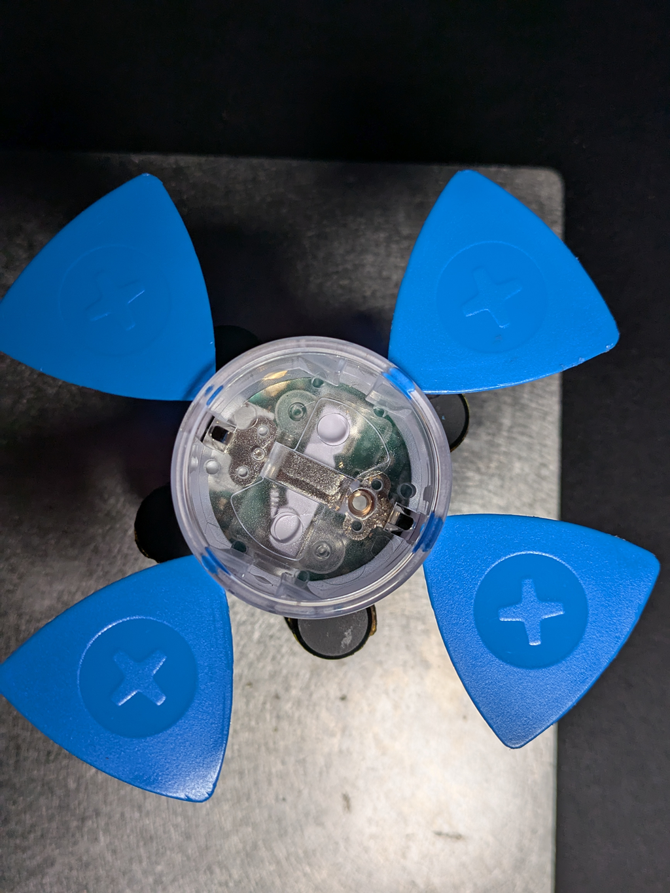
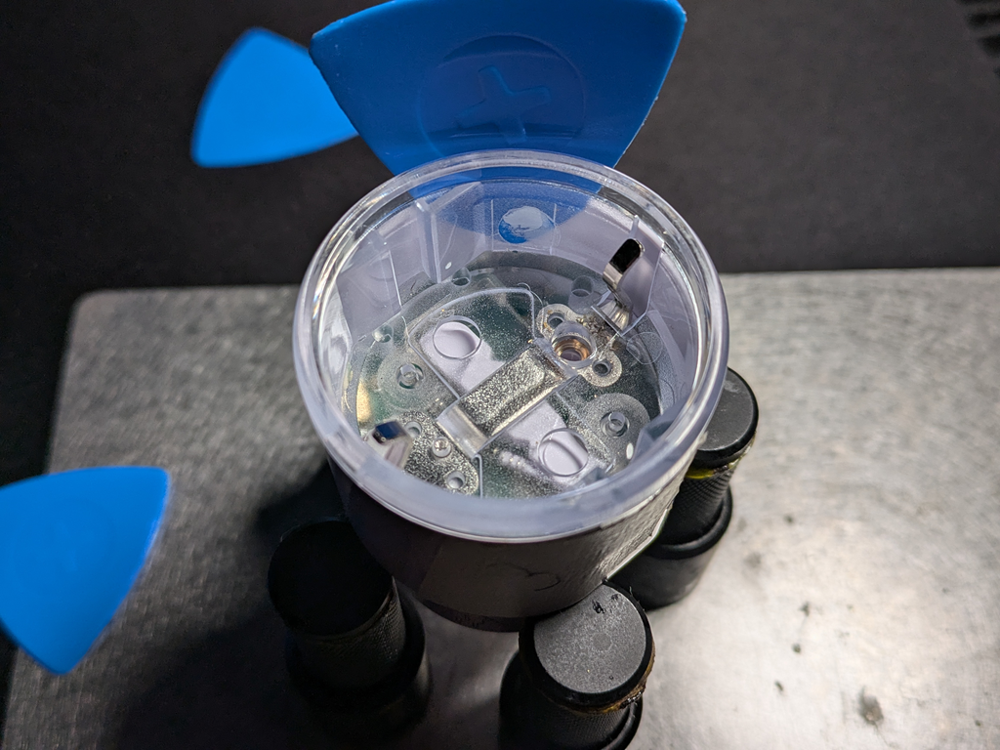

Generation 3 of Shelly Plug-S

At this moment there is NO way to Flash it OTA. You need to open the Plug and use UART!

As always, first take a dump!
```esptool -b 115200 --port COM11 read_flash 0x00000 0x800000 shelly_plug_s_gen3.bin```

## UART Pinout

| Pin      | Colour       |
| -------- | ------------ |
| Reset    | Brown        |
| 3v3      | Red          |
| RX       | Blue         |
| TX       | Yellow       |
| BootSEL  | Purple       |
| GND      | Black        |



## GPIO Pinout

| Pin    | Function                    |
| ------ | --------------------------- |
| GPIO3  | Internal Temperature        |
| GPIO4  | LED WS2812                  |
| GPIO5  | Relay                       |
| GPIO6  | BL0942 TX                   |
| GPIO7  | BL0942 RX                   |
| GPIO18 | Button                      |

```yaml
substitutions:
  device_name: shelly-plug-s-gen3
  friendly_name: "Shelly Plug S Gen3"
  ip_addr: 10.0.x.x
  update_bl0942: 5s

esphome:
  name: ${device_name}
  friendly_name: ${friendly_name}
  comment: "Free Shelly!"
  platformio_options:
    board_build.flash_mode: dio

esp32:
  board: esp32-c3-devkitm-1
  flash_size: 8MB
  framework:
    type: esp-idf
    version: recommended
    sdkconfig_options:
      COMPILER_OPTIMIZATION_SIZE: y

wifi:
  ssid: !secret wifi_ssid
  password: !secret wifi_password
  ap:
    ssid: "FreeShelly Hotspot"
    password: !secret wifi_password

logger:

api:
  encryption:
    key: !secret api_encryption_key

ota:
  - platform: esphome
    password: !secret ota_password

captive_portal:

binary_sensor:
  - platform: gpio
    id: "push_button"
    name: "Button"
    internal: true
    pin:
      number: GPIO18
      inverted: yes
      mode:
        input: true
        pullup: true
    filters:
      - delayed_on_off: 5ms

switch:
  - platform: gpio
    pin: GPIO4
    name: "Relay"

light:
  - platform: esp32_rmt_led_strip
    rgb_order: GRB
    rmt_channel: 0
    chipset:
    pin: GPIO4
    num_leds: 4
    id: rgb_light1
    internal: false
    default_transition_length: 700ms
    restore_mode: ALWAYS_OFF

uart:
  id: uart_0
  tx_pin: GPIO7
  rx_pin: GPIO6
  baud_rate: 9600
  stop_bits: 1
  data_bits: 8
  parity: NONE

sensor:
  - platform: ntc
    sensor: temp_resistance_reading
    name: "Temperature"
    unit_of_measurement: "°C"
    accuracy_decimals: 1
    icon: "mdi:thermometer"
    calibration:
      b_constant: 3350
      reference_resistance: 10kOhm
      reference_temperature: 298.15K
  - platform: resistance
    id: temp_resistance_reading
    sensor: temp_analog_reading
    configuration: DOWNSTREAM
    resistor: 10kOhm
  - platform: adc
    id: temp_analog_reading
    pin: GPIO3
    attenuation: 12db

  - platform: bl0942
    uart_id: uart_0
    address: 0
    voltage:
      name: 'Voltage'
      id: bvoltage
      icon: mdi:alpha-v-circle-outline
      device_class: voltage
    current:
      name: 'Current'
      id: bcurrent
      icon: mdi:alpha-a-circle-outline
      device_class: current
    power:
      name: 'Power'
      id: bpower
      icon: mdi:transmission-tower
      device_class: power
    energy:
      name: 'Energy'
      id: benergy
      icon: mdi:lightning-bolt
      device_class: energy
    frequency:
      name: "Frequency"
      id: bfreq
      accuracy_decimals: 2
      icon: mdi:cosine-wave
      device_class: frequency
    update_interval: ${update_bl0942}
```

## Open the device

.jpeg "Seal [thx to bkbartk]")
This little seal need to drill open, best you use a prick punch with an M3.5-M4 Drill.


When the seal is cracked open, you need a M2 drill, and drill in center, just a little.


Now take a tapered punch and press the seal out. The whole grounding receptacle will come out.

We need some hot-air (~300°C) and 5 of the iFixit triangle-plastic, there are 3 spots with glue.
Heat them up, and try placeing the plastic around.


You will get a little gap, take anohter plastic and g et betweet the withe and transparent plastic, and make a circle.


After 2 rounds you can easly take it out.
