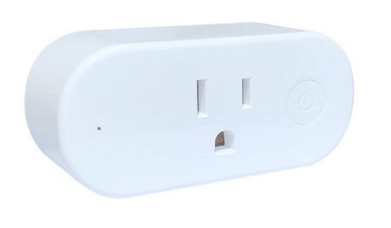

## GPIO Pinout

| Pin    | Function                    |
| ------ | --------------------------- |
| GPIO0  | LED (Inverted)              |
| GPIO2  | Blue LED (Inverted)         |
| GPIO4  | Relay                       |
| GPIO5  | HLWBL CF Pin (active power) |
| GPIO12 | HLWBL SEL                   |
| GPIO13 | Button                      |
| A0     | NTC                         |

HLWBL CF1 pin (GPIO14 according to Tasmota template) does not appear to connected in my test and returns junk data.
A0 might be hooked up to a NTC, I do not have the values needed to calibrate it to return proper data so I am not including it in my configuration.

## Configuration as relay with overpower protection

When integration with home assistant exists, it will appear as a switch, 6 sensors (button state, power, voltage, current, wifi strength and total daily energy)
When the `max_power` is exceeded, the relay will be switched off and a persistent notification will be created in home-assistant

Credit and thanks to

- https://templates.blakadder.com/shelly_plug_US.html for documenting the GPIO pins though I found some errors.
- https://github.com/esphome/esphome-devices/blob/main/src/docs/devices/Shelly-Plug-S/index.md, much of this borrows from it.
- https://www.reddit.com/r/homeautomation/comments/ps9iey/esphome_config_for_shelly_plug_us/, magic numbers for tuning sensors
- https://devices.esphome.io/devices/Aoycocr-X10S-Plug/, identical looking device from another manufacturer
- https://fccid.io/2ALAY-SHELLY, FCC documentation including several pictures of the circuts.

```yaml
substitutions:
  devicename: shelly-plug-us
  relay_name: Outlet
  wifi_ssid: !secret wifi_ssid
  wifi_pass: !secret wifi_pass
  api_pass: !secret api_pass
  ota_pass: !secret ota_pass

  # 110VAC * 15A , specs are from Shelly specs
  max_power: "1650"
  # Higher value gives lower watt readout
  current_res: "0.00290"
  # Lower value gives lower voltage readout
  voltage_div: "940"
  # Relay state on boot. Other options can be found here https://esphome.io/components/switch/gpio.html
  restore_mode: RESTORE_DEFAULT_ON

esphome:
  name: ${devicename}
  platform: ESP8266
  board: esp8285

wifi:
  ssid: ${wifi_ssid}
  password: ${wifi_pass}

# Enable logging
logger:

# Enable Home Assistant API
api:
  encryption:
    key: !secret api_key

ota:
  password: ${ota_pass}

time:
  - platform: homeassistant
    id: my_time

binary_sensor:
  - platform: gpio
    pin:
      number: GPIO13
      inverted: True
    name: "${devicename}_button"
    on_press:
      - switch.toggle: relay
      - output.turn_on: led_r
      - delay: 500ms
      - output.turn_off: led_r

output:
  - platform: gpio
    pin:
      number: GPIO00
      inverted: True
    id: led_r
  - platform: gpio
    pin:
      number: GPIO02
      inverted: True
    id: led_b

interval:
  - interval: 1s
    then:
      if:
        condition:
          wifi.connected:
        then:
          - output.turn_off: led_r
          - output.turn_on: led_b
        else:
          - output.turn_off: led_b
          - delay: 500ms
          - output.turn_on: led_r
          - delay: 500ms
          - output.turn_off: led_r
          - delay: 500ms
          - output.turn_on: led_b
switch:
  - platform: gpio
    pin: GPIO4
    id: relay
    restore_mode: ${restore_mode}
    name: "${relay_name}"

sensor:
  - platform: wifi_signal
    name: "${devicename} WiFi Signal"
    update_interval: 5min

  - platform: hlw8012
    sel_pin:
      number: GPIO12
      inverted: true
    cf_pin: GPIO5
    cf1_pin: GPIO14
    current_resistor: ${current_res}
    voltage_divider: ${voltage_div}
    current:
      name: "${relay_name} current"
    voltage:
      name: "${relay_name} voltage"
    power:
      name: "${relay_name} power"
      id: power
      unit_of_measurement: "W"
      icon: mdi:flash-outline
      # filters:
      # # This calibrations we generated with a 40W and 100W incandescent light bulb
      # - calibrate_linear:
      #   - 0 -> 0
      #   - 206.9 -> 40
      #   - 540 -> 100
      on_value_range:
        - above: ${max_power}
          then:
            - switch.turn_off: relay
            - homeassistant.service:
                service: persistent_notification.create
                data:
                  title: Message from ${devicename}
                data_template:
                  message: Switch turned off because power exceeded ${max_power}W
    update_interval: 10s

  - platform: total_daily_energy
    name: "${devicename} daily energy"
    power_id: power
    filters:
      # Multiplication factor from W to kW is 0.001
      - multiply: 0.001
    unit_of_measurement: kWh
```
