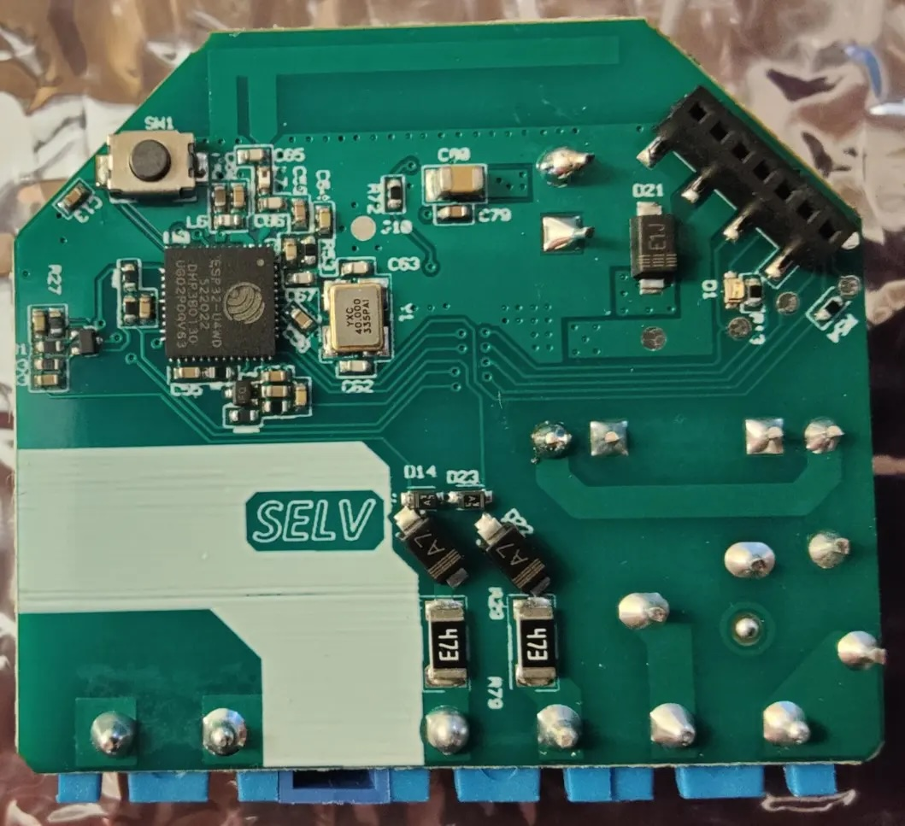

## GPIO Pinout

| Pin    | Function                    |
| ------ | --------------------------- |
| GPIO0  | LED (Inverted)              |
| GPIO4  | Switch 1 input              |
| GPIO18 | Switch 2 input              |
| GPIO25 | Button (Inverted, Pull-up)  |
| GPIO26 | PWM (Inverted)              |
| GPIO32 | NTC                         |

The Shelly Plus 0-10V is based on the ESP32-U4WDH (Single core, 160MHz, 4MB embedded flash).

The board is similar to the Shelly Plus 1 in pinout, but with an extra switch input and the PWM output instead of the relay.

**Please Note: this device is a 0-10V SINKING controller for lightning (to be attached to a transformer, for example): don't expect to read 0-10V on the PWM output.**

Please calibrate the NTC, the value below is just a rough estimate!

Credit and thanks to

- https://templates.blakadder.com/shelly_plus_0-10v_dimmer.html

## Complete configuration

```yaml
substitutions:
    device_name: shelly-0-10
    room: myhome
esphome:
  name: $device_name
  platformio_options:
    board_build.f_cpu: 160000000L
  area: ${room}
  project:
    name: "my-light"
    version: "1.0.0"
  min_version: 2024.4.0 #just to be sure that everything works

esp32:
  board: esp32doit-devkit-v1
  framework:
    type: esp-idf
    sdkconfig_options:
      CONFIG_FREERTOS_UNICORE: y
      CONFIG_ESP32_DEFAULT_CPU_FREQ_160: y
      CONFIG_ESP32_DEFAULT_CPU_FREQ_MHZ: "160"

wifi:
  ssid: !secret wifi_ssid
  password: !secret wifi_password
  power_save_mode: none
  ap:
    ssid: "${device_name} Fallback Hotspot"
    password: !secret ap_password

logger:

api:
  encryption:
    key: !secret api_encryption_key

ota:
  password: !secret ota_password


output:
  - platform: ledc
    pin: GPIO26
    id: led_output
    inverted: true
    frequency: "1220Hz"
    channel: 0
    min_power: 0.6 #Set the minimum % that gives at least some light, so that low values of the output are low values of light. Remove if not needed.
    zero_means_zero: true  #to avoid having the lamp on when at 0% with min power. Remove if not needed

# Example usage in a light
light:
  - platform: monochromatic
    output: led_output
    name: "${device_name} Light"
    default_transition_length: 100ms
    restore_mode: ALWAYS_ON
    id: dimmer_out

binary_sensor:
  - platform: gpio
    name: "${device_name} Switch 1"
    pin: GPIO4
    filters:
      - delayed_on_off: 50ms
  - platform: gpio
    name: "${device_name} Switch 2"
    pin: GPIO18
    filters:
      - delayed_on_off: 50ms
  - platform: gpio
    name: "${device_name} Button"
    pin:
      number: GPIO25
      inverted: yes
      mode:
        input: true
        pullup: true
    filters:
      - delayed_on_off: 5ms

sensor:
  - platform: ntc
    sensor: temp_resistance_reading
    name: "${device_name} Temperature"
    unit_of_measurement: "°C"
    accuracy_decimals: 1
    icon: "mdi:thermometer"
    calibration:
      b_constant: 3350
      reference_resistance: 10kOhm
      reference_temperature: 298.15K
    on_value_range:
      - above: "80.0"
        then:
          - light.turn_off: dimmer_out
  - platform: resistance
    id: temp_resistance_reading
    sensor: temp_analog_reading
    configuration: DOWNSTREAM
    resistor: 10kOhm
  - platform: adc
    id: temp_analog_reading
    pin: GPIO32
    attenuation: 12db


status_led:
  pin:
    number: GPIO0
    inverted: true
```
