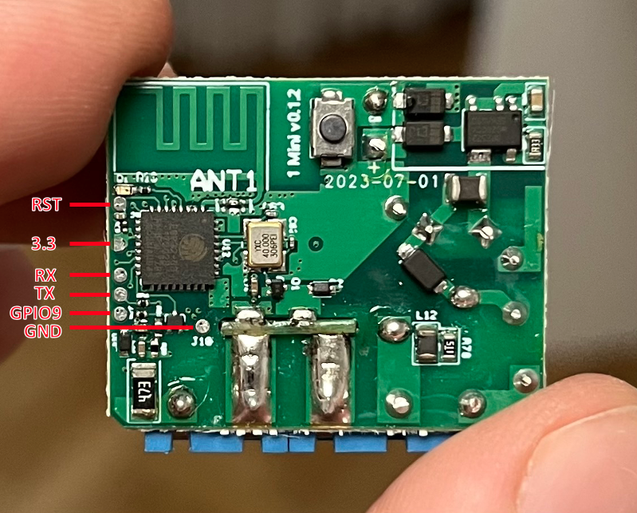

## GPIO Pinout

| Pin    | Function                    |
| ------ | --------------------------- |
| GPIO0  | LED (Inverted)              |
| GPIO1  | Button (Inverted, Pull-up)  |
| GPIO7  | Relay                       |
| GPIO10 | Switch input                |

The Shelly Plus 1 Mini is based on the ESP32-C3 (Single core, 160MHz, 4MB embedded flash)
To enter bootloader mode, GPIO9 needs to be pulled down (connected to ground).

## Configuration as relay

```yaml
substitutions:
  device_name: "Shelly Plus 1 Mini"

esphome:
  name: shelly-plus-1-mini
  platformio_options:
    board_build.flash_mode: dio

esp32:
  board: esp32-c3-devkitm-1
  framework:
    type: esp-idf

wifi:
  ssid: !secret wifi_ssid
  password: !secret wifi_password

logger:

api:
  encryption:
    key: !secret api_encryption_key

ota:
  password: !secret ota_password

output:
  - platform: gpio
    id: "relay_output"
    pin: 7

switch:
  - platform: output
    id: "relay"
    name: "${device_name} Relay"
    output: "relay_output"

binary_sensor:
  - platform: gpio
    name: "${device_name} Switch"
    pin: 10
    on_press:
      then:
        - switch.toggle: "relay"
    filters:
      - delayed_on_off: 50ms
  - platform: gpio
    name: "${device_name} Button"
    pin:
      number: 1
      inverted: yes
      mode:
        input: true
        pullup: true
    on_press:
      then:
        - switch.toggle: "relay"
    filters:
      - delayed_on_off: 5ms

sensor:
  - platform: ntc
    sensor: temp_resistance_reading
    name: "${device_name} Temperature"
    unit_of_measurement: "°C"
    accuracy_decimals: 1
    icon: "mdi:thermometer"
    calibration:
      b_constant: 3350
      reference_resistance: 10kOhm
      reference_temperature: 298.15K
  - platform: resistance
    id: temp_resistance_reading
    sensor: temp_analog_reading
    configuration: DOWNSTREAM
    resistor: 10kOhm
  - platform: adc
    id: temp_analog_reading
    pin: GPIO3
    attenuation: 12db

status_led:
  pin:
    number: 0
    inverted: true
```
