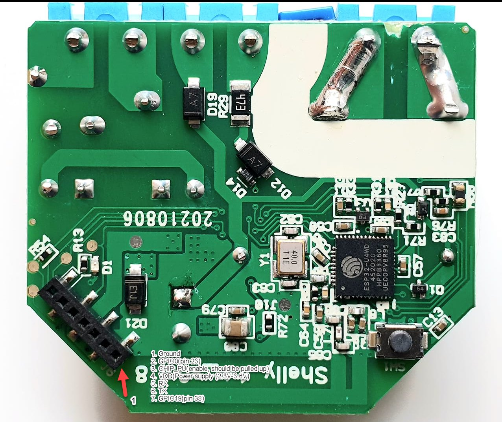

## GPIO Pinout

| Pin    | Function                    |
| ------ | --------------------------- |
| GPIO0  | LED (Inverted)              |
| GPIO4  | Switch input                |
| GPIO19 | Future external sensors?    |
| GPIO25 | Button (Inverted, Pull-up)  |
| GPIO26 | Relay                       |
| GPIO32 | NTC                         |
| GPIO33 | Relay supply voltage sensor |

The Shelly Plus 1 is based on the ESP32-U4WDH (Single core, 160MHz, 4MB embedded flash)

Please calibrate the NTC, the value below is just a rough estimate!

Credit and thanks to

- https://templates.blakadder.com/shelly_plus_1.html

## Configuration as relay with overtemperature protection

```yaml
substitutions:
  device_name: "Shelly Plus 1"
  # Higher value gives lower watt readout
  current_res: "0.001"
  # Lower value gives lower voltage readout
  voltage_div: "1925"

esphome:
  name: shelly-plus-1
  platformio_options:
    board_build.f_cpu: 160000000L

esp32:
  board: esp32doit-devkit-v1
  framework:
    type: esp-idf
    sdkconfig_options:
      CONFIG_FREERTOS_UNICORE: y
      CONFIG_ESP32_DEFAULT_CPU_FREQ_160: y
      CONFIG_ESP32_DEFAULT_CPU_FREQ_MHZ: "160"

wifi:
  ssid: !secret wifi_ssid
  password: !secret wifi_password

logger:

api:
  encryption:
    key: !secret api_encryption_key

ota:
  password: !secret ota_password

output:
  - platform: gpio
    id: "relay_output"
    pin: GPIO26

switch:
  - platform: output
    id: "relay"
    name: "${device_name} Relay"
    output: "relay_output"

binary_sensor:
  - platform: gpio
    name: "${device_name} Switch"
    pin: GPIO4
    on_press:
      then:
        - switch.toggle: "relay"
    filters:
      - delayed_on_off: 50ms
  - platform: gpio
    name: "${device_name} Button"
    pin:
      number: GPIO25
      inverted: yes
      mode:
        input: true
        pullup: true
    on_press:
      then:
        - switch.toggle: "relay"
    filters:
      - delayed_on_off: 5ms

sensor:
  - platform: ntc
    sensor: temp_resistance_reading
    name: "${device_name} Temperature"
    unit_of_measurement: "°C"
    accuracy_decimals: 1
    icon: "mdi:thermometer"
    calibration:
      b_constant: 3350
      reference_resistance: 10kOhm
      reference_temperature: 298.15K
    on_value_range:
      - above: "80.0"
        then:
          - switch.turn_off: "relay"
  - platform: resistance
    id: temp_resistance_reading
    sensor: temp_analog_reading
    configuration: DOWNSTREAM
    resistor: 10kOhm
  - platform: adc
    id: temp_analog_reading
    pin: GPIO32
    attenuation: 12db

  - platform: adc
    name: "${device_name} Relay Supply Voltage"
    pin: GPIO33
    attenuation: 12db
    filters:
      - multiply: 8

status_led:
  pin:
    number: GPIO0
    inverted: true
```
