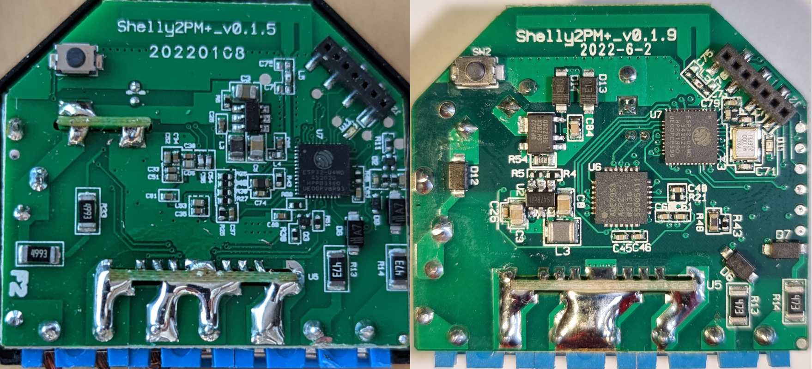
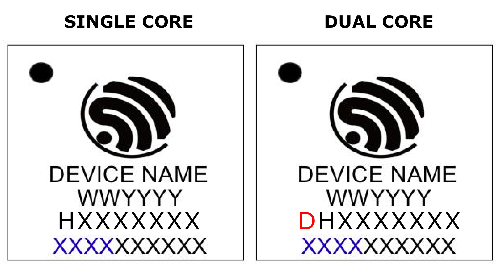

## Hardware Versions

There are currently 3 known hardware versions of the Shelly Plus 2PM. The pinout is incompatible between PCB version 0.1.5 and 0.1.9.

- PCB v0.1.5 with ESP32-U4WDH (Single core, 160MHz, 4MB embedded flash) Sold pre 2022
- PCB v0.1.9 with ESP32-U4WDH (Single core, 160MHz, 4MB embedded flash) Sold first half of 2022
- PCB v0.1.9 with ESP32-U4WDH (Dual core,   240MHz, 4MB embedded flash) Sold since 2022-09-20 (or earlier)

4 units bought directly from Shelly 2022-09-20 where confirmed to be PCB v0.1.9 with 3 units being dual core ESP32-U4WDH, the last a single core.
The advantage of the dual core version is that it supports the arduino framework.

The single core version of the ESP32-U4WDH will probably be discontinued according to [Espressif PCN](https://www.espressif.com/sites/default/files/pcn_downloads/PCN-2021-021%20ESP32-U4WDH%20%E5%8D%87%E7%BA%A7%E4%B8%BA%E5%8F%8C%E6%A0%B8%E5%A4%84%E7%90%86%E5%99%A8%E4%BA%A7%E5%93%81.pdf)

The PCB version number is printed on the back of the PCB.


The version of the ESP32-U4WDH can be determined by looking at the second to last line printed on the chip. If the line contains 8 characters starting with "H", the chip is single core 160MHz. If the line contains 9 characters starting with "DH", the chip is a dual core 240MHz.


## GPIO Pinout

| Function                    | v0.1.5 | v0.1.9 |
| --------------------------- | ------ | ------ |
| LED (Inverted)              | GPIO0  | GPIO0  |
| Button (Inverted, Pull-up)  | GPIO27 | GPIO4  |
| Switch 1 Input              | GPIO2  | GPIO5  |
| Switch 2 Input              | GPIO18 | GPIO18 |
| Relay 1                     | GPIO13 | GPIO13 |
| Relay 2                     | GPIO12 | GPIO12 |
| I2C SCL                     | GPIO25 | GPIO25 |
| I2C SDA                     | GPIO33 | GPIO26 |
| ADE7953_IRQ (power meter)   | GPIO36 | GPIO27 |
| Internal Temperature        | GPIO37 | GPIO35 |

## Internal Temperature Sensor

An internal NTC temperature sensor in a "DOWNSTREAM" configuration is fitted ([ESPHome reference](https://esphome.io/components/sensor/resistance.html)). Both R1 and R2 has been desoldered and found to be 10k fixed resistor and 10k@25C NTC. The Beta constant of the NTC cannot easily be measured, and is guessed to be ~3350.

v0.1.5 pinout credit to: [blakadder](https://templates.blakadder.com/shelly_plus_2PM.html)

## Minimal configuration for PCB v0.1.9 and Dual Core

Minimal configuration with all inputs/outputs and sensors configured

```yaml
substitutions:
  devicename: "shelly-plus-2pm"
  output_name_1: "Output 1"
  output_name_2: "Output 2"
  input_name_1: "Input 1"
  input_name_2: "Input 2"

# For PCB v0.1.9 with dual core ESP32
esphome:
  name: ${devicename}

esp32:
  board: esp32doit-devkit-v1
  framework:
    type: arduino

logger:

api:

ota:

wifi:
  ssid: !secret wifi_ssid
  password: !secret wifi_password

i2c:
  sda: GPIO26
  scl: GPIO25

output:
  - platform: gpio
    id: "relay_output_1"
    pin: GPIO12
  - platform: gpio
    id: "relay_output_2"
    pin: GPIO13

switch:
  - platform: output
    id: "relay_1"
    name: "${output_name_1}"
    output: "relay_output_1"
  - platform: output
    id: "relay_2"
    name: "${output_name_2}"
    output: "relay_output_2"

binary_sensor:
  # Button on device
  - platform: gpio
    name: "${devicename} Button"
    pin:
      number: GPIO4
      inverted: yes
      mode:
        input: true
        pullup: true
    internal: true
  # Input 1
  - platform: gpio
    name: "${input_name_1}"
    pin: GPIO5
    filters:
      - delayed_on_off: 50ms
    on_press:
      then:
        - switch.toggle: relay_1
    internal: true
  # Input 2
  - platform: gpio
    name: "${input_name_2}"
    pin: GPIO18
    filters:
      - delayed_on_off: 50ms
    on_press:
      then:
        - switch.toggle: relay_2
    internal: true

sensor:
  # Power Sensor
  - platform: ade7953_i2c
    irq_pin: GPIO27
    voltage:
      name: "${devicename} Voltage"
      entity_category: 'diagnostic'
    current_a:
      name: "${output_name_2} Current"
      entity_category: 'diagnostic'
    active_power_a:
      name: "${output_name_2} Power"
      id: power_channel_2
      entity_category: 'diagnostic'
      filters:
        - multiply: -1
    current_b:
      name: "${output_name_1} Current"
      entity_category: 'diagnostic'
    active_power_b:
      name: "${output_name_1} Power"
      id: power_channel_1
      entity_category: 'diagnostic'
    update_interval: 10s

  # Internal NTC Temperature sensor
  - platform: ntc
    sensor: temp_resistance_reading
    name: "${devicename} Temperature"
    unit_of_measurement: "°C"
    accuracy_decimals: 1
    icon: "mdi:thermometer"
    entity_category: 'diagnostic'
    calibration:
      b_constant: 3350
      reference_resistance: 4.7kOhm
      reference_temperature: 298.15K

  # Required for NTC sensor
  - platform: resistance
    id: temp_resistance_reading
    sensor: temp_analog_reading
    configuration: DOWNSTREAM
    resistor: 5.6kOhm

  # Required for NTC sensor
  - platform: adc
    id: temp_analog_reading
    pin: GPIO35
    attenuation: 11db
    update_interval: 10s
```

## Example snippet for Single Core

Shows which settings under esphome and esp32 need to be changed to support the single core 160MHz version of the chip

Note that single core chips are only supported by the esp-idf framework, not arduino. This means that for instance captive portal (required for fallback AP to work) cannot be used.

```yaml
# For Single Core ESP32
esphome:
  name: shelly-plus-2pm
  platformio_options:
    board_build.f_cpu: 160000000L

esp32:
  board: esp32doit-devkit-v1
  framework:
    type: esp-idf
    sdkconfig_options:
      CONFIG_FREERTOS_UNICORE: y
      CONFIG_ESP32_DEFAULT_CPU_FREQ_160: y
      CONFIG_ESP32_DEFAULT_CPU_FREQ_MHZ: "160"
```

## Advanced Configuration Example for PCB v0.1.9 and Dual Core

- Detached switch mode and toggle light switch
- Includes overpower and overtemperature protection.
- Will toggle a smart bulb in home assistant and has fallback to local power switching when connecion to home assitant is down.

```yaml
substitutions:
  devicename: "shelly-plus-2pm"
  upper_devicename: "Shelly Plus 2PM"
  device_name_1: "Shelly Plus 2PM Switch 1"
  device_name_2: "Shelly Plus 2PM Switch 2"
  # Home Assistant light bulb to toggle
  bulb_name_1: "light.smart_bulb_1"
  bulb_name_2: "light.smart_bulb_2"
  # Relay trip limits
  max_power: "3600.0"
  max_temp: "80.0"

# For PCB v0.1.9 with dual core ESP32
esphome:
  name: "${devicename}"

esp32:
  board: esp32doit-devkit-v1
  framework:
    type: arduino

# Enable logging
logger:

# Enable Home Assistant API
api:

ota:
  password: !secret ota_password

wifi:
  ssid: !secret wifi_ssid
  password: !secret wifi_password
  fast_connect: true

  ap:
    ssid: "${upper_devicename} fallback AP"
    password: !secret fallback_password

captive_portal:

time:
  - platform: homeassistant

i2c:
  sda: GPIO26
  scl: GPIO25

output:
  - platform: gpio
    id: "relay_output_1"
    pin: GPIO13

  - platform: gpio
    id: "relay_output_2"
    pin: GPIO12

#Shelly Switch Output
switch:
  - platform: output
    id: "relay_1"
    name: "${device_name_1} Output"
    output: "relay_output_1"
    restore_mode: RESTORE_DEFAULT_OFF

  - platform: output
    id: "relay_2"
    name: "${device_name_2} Output"
    output: "relay_output_2"
    restore_mode: RESTORE_DEFAULT_OFF

# Restart Button
button:
  - platform: restart
    id: "restart_device"
    name: "${device_name_1} Restart"
    entity_category: 'diagnostic'

#home assistant bulb to switch
text_sensor:
  - platform: homeassistant
    id: 'ha_bulb_1'
    entity_id: "${bulb_name_1}"
    internal: true
  - platform: homeassistant
    id: 'ha_bulb_2'
    entity_id: "${bulb_name_2}"
    internal: true

binary_sensor:
  #Shelly Switch Input 1
  - platform: gpio
    name: "${device_name_1} Input"
    pin: GPIO5
    #small delay to prevent debouncing
    filters:
      - delayed_on_off: 50ms
    # config for state change of input button
    on_state:
      then:
        - if:
            condition:
              and:
                - wifi.connected:
                - api.connected:
                - switch.is_on: "relay_1"
                - lambda: 'return (id(ha_bulb_1).state == "on" || id(ha_bulb_1).state == "off");'
            # toggle smart light if wifi and api are connected and relay is on
            then:
              - homeassistant.service:
                  service: light.toggle
                  data:
                    entity_id: "${bulb_name_1}"
            else:
              - switch.toggle: "relay_1"

  #Shelly Switch Input 2
  - platform: gpio
    name: "${device_name_2} Input"
    pin: GPIO18
    #small delay to prevent debouncing
    filters:
      - delayed_on_off: 50ms
    # config for state change of input button
    on_state:
      then:
        - if:
            condition:
              and:
                - wifi.connected:
                - api.connected:
                - switch.is_on: "relay_2"
                - lambda: 'return (id(ha_bulb_2).state == "on" || id(ha_bulb_2).state == "off");'
            # toggle smart light if wifi and api are connected and relay is on
            then:
              - homeassistant.service:
                  service: light.toggle
                  data:
                    entity_id: "${bulb_name_2}"
            else:
              - switch.toggle: "relay_2"

  #reset button on device
  - platform: gpio
    name: "${upper_devicename} Button"
    pin:
      number: GPIO4
      inverted: yes
      mode:
        input: true
        pullup: true
    on_press:
      then:
        - button.press: "restart_device"
    filters:
      - delayed_on_off: 5ms
    internal: true

sensor:
  # Uptime sensor.
  - platform: uptime
    name: "${upper_devicename} Uptime"
    entity_category: 'diagnostic'
    update_interval: 300s

  # WiFi Signal sensor.
  - platform: wifi_signal
    name: "${upper_devicename} WiFi Signal"
    update_interval: 60s
    entity_category: 'diagnostic'

  #temperature sensor
  - platform: ntc
    sensor: temp_resistance_reading
    name: "${upper_devicename} Temperature"
    unit_of_measurement: "°C"
    accuracy_decimals: 1
    icon: "mdi:thermometer"
    entity_category: 'diagnostic'
    calibration:
      #These default values don't seem accurate
      b_constant: 3350
      reference_resistance: 10kOhm
      reference_temperature: 298.15K
    on_value_range:
      - above: ${max_temp}
        then:
          - switch.turn_off: "relay_1"
          - switch.turn_off: "relay_2"
          - homeassistant.service:
                service: persistent_notification.create
                data:
                  title: "Message from ${upper_devicename}"
                data_template:
                  message: "${device_name_1} and ${device_name_2} turned off because temperature exceeded ${max_temp}°C"

  - platform: resistance
    id: temp_resistance_reading
    sensor: temp_analog_reading
    configuration: DOWNSTREAM
    resistor: 10kOhm

  - platform: adc
    id: temp_analog_reading
    pin: GPIO35
    attenuation: 11db
    update_interval: 60s

  #power monitoring
  - platform: ade7953_i2c
    irq_pin: GPIO27 # Prevent overheating by setting this
    voltage:
      name: "${upper_devicename} Voltage"
      entity_category: 'diagnostic'
    # On the Shelly 2.5 channels are mixed ch1=B ch2=A
    current_a:
      name: "${device_name_2} Current"
      entity_category: 'diagnostic'
    current_b:
      name: "${device_name_1} Current"
      entity_category: 'diagnostic'
    active_power_a:
      name: "${device_name_2} Power"
      id: power_channel_2
      entity_category: 'diagnostic'
      # active_power_a is normal, so don't multiply by -1
      on_value_range:
        - above: ${max_power}
          then:
            - switch.turn_off: "relay_2"
            - homeassistant.service:
                service: persistent_notification.create
                data:
                  title: "Message from ${upper_devicename}"
                data_template:
                  message: "${device_name_2} turned off because power exceeded ${max_power}W"
    active_power_b:
      name: "${device_name_1} Power"
      id: power_channel_1
      entity_category: 'diagnostic'
      # active_power_b is inverted, so multiply by -1
      filters:
        - multiply: -1
      on_value_range:
        - above: ${max_power}
          then:
            - switch.turn_off: "relay_1"
            - homeassistant.service:
                service: persistent_notification.create
                data:
                  title: "Message from ${upper_devicename}"
                data_template:
                  message: "${device_name_1} turned off because power exceeded ${max_power}W"
    update_interval: 30s

  - platform: total_daily_energy
    name: "${device_name_1} Daily Energy"
    power_id: power_channel_1
  - platform: total_daily_energy
    name: "${device_name_2} Daily Energy"
    power_id: power_channel_2

status_led:
  pin:
    number: GPIO0
    inverted: true
 ```
