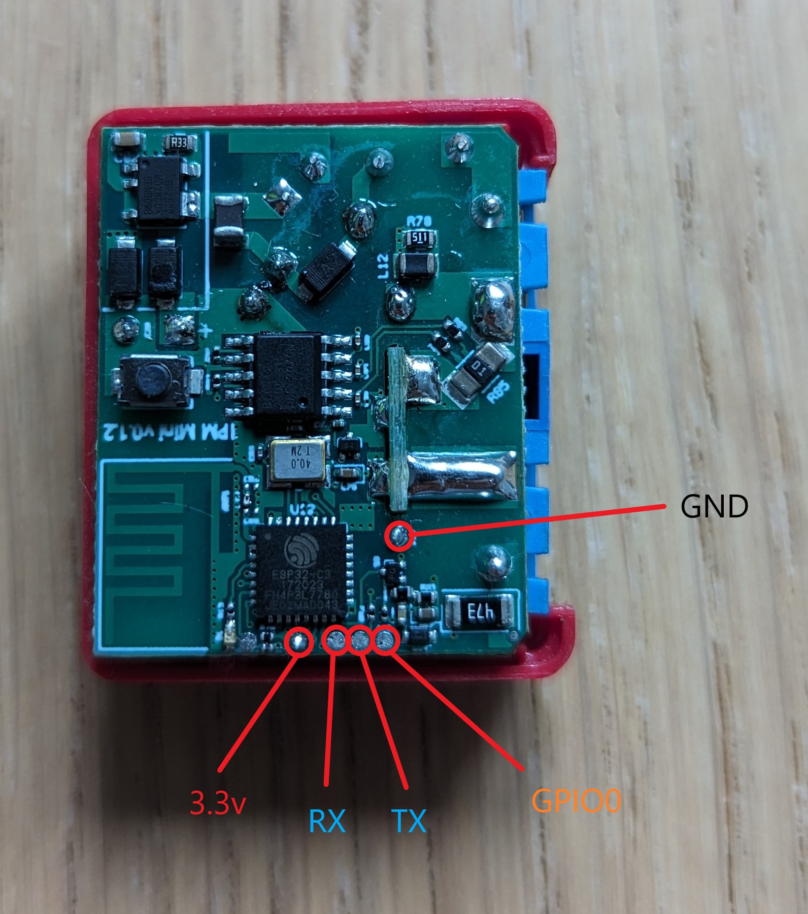

This is effectively a Shelly Plus 1PM Mini, but without the relay and the switch.

## GPIO Pinout

| Pin   | Function     |
| ----- | ------------ |
| GPI03 | NTC          |
| GPI06 | BL0942 TX    |
| GPI07 | BL0942 RX    |

## Serial Pinout

The UART Pinout is the same as the Shelly Plus 1PM Mini.



## Basic Configuration

```yaml
substitutions:
  device_name: "Shelly Plus PM Mini"

esphome:
  name: spare-mini
  friendly_name: "Shelly Plus PM Mini"

esp32:
  board: esp32-c3-devkitm-1
  framework:
    type: esp-idf
    version: recommended
    sdkconfig_options:
      COMPILER_OPTIMIZATION_SIZE: y
    advanced:
      ignore_efuse_mac_crc: false

wifi:
  ssid: !secret wifi_ssid
  password: !secret wifi_password
  ap:
    ssid: "$(device_name) Fallback Hotspot"
    password: !secret wifi_password

logger:

api:
  encryption:
    key: !secret api_encryption_key

ota:
  password: !secret ota_password

time:
  - platform: homeassistant

captive_portal:

sensor:
  - platform: ntc
    sensor: temp_resistance_reading
    name: "Temperature"
    unit_of_measurement: "°C"
    accuracy_decimals: 1
    icon: "mdi:thermometer"
    calibration:
      b_constant: 3350
      reference_resistance: 10kOhm
      reference_temperature: 298.15K
  - platform: resistance
    id: temp_resistance_reading
    sensor: temp_analog_reading
    configuration: DOWNSTREAM
    resistor: 10kOhm
  - platform: adc
    id: temp_analog_reading
    pin: GPIO3
    attenuation: 12db

  - platform: bl0942
    uart_id: uart_bus
    voltage:
      name: 'Voltage'
    current:
      name: 'Current'
    power:
      name: 'Power'
    frequency:
      name: "Frequency"
      accuracy_decimals: 2
    update_interval: 5s

uart:
  id: uart_bus
  tx_pin: GPIO6
  rx_pin: GPIO7
  baud_rate: 9600
  stop_bits: 1

```
