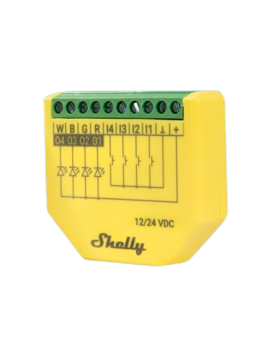
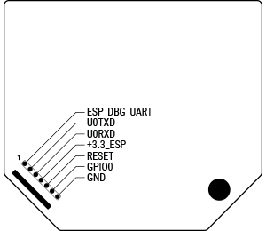

## GPIO Pinout

| Pin    | Function              |
| ------ | --------------------- |
| GPIO14 | Onboard LED           |
| GPIO22 | Onboard Button        |
| GPIO25 | PWM 1 (R)             |
| GPIO26 | PWM 3 (B)             |
| GPIO27 | PWM 2 (G)             |
| GPIO4  | PWM 4 (W)             |
| GPIO36 | Input 1               |
| GPIO37 | Input 2               |
| GPIO38 | Input 3               |
| GPIO39 | Input 4               |
| GPIO33 | NTC Temp Sensor       |
| GPIO34 | Voltage Monitor       |
| GPIO35 | OpAmp Current Monitor |

## Plus addon interface

Use it for flashing. Connect EN pin to the RESET pin of your USB-UART converter.



## Configuration for RGBW

```yaml
esphome:
  name: shelly-plus-rgbw-pm

esp32:
  board: esp32dev
  framework:
    type: esp-idf

wifi:
  ssid: !secret wifi_ssid
  password: !secret wifi_password

captive_portal:
logger:
api:
ota:
  platform: esphome

light:
  - platform: rgbw
    name: ${device_name} Led Stip
    red: pwm_r
    green: pwm_g
    blue: pwm_b
    white: pwm_w
    effects:
      - random:
      - strobe:
      - flicker:

status_led:
  pin: GPIO14

output:
  - platform: ledc
    pin: GPIO25
    id: pwm_r
    frequency: 19531
  
  - platform: ledc
    pin: GPIO26
    id: pwm_g
    frequency: 19531

  - platform: ledc
    pin: GPIO27
    id: pwm_b
    frequency: 19531

  - platform: ledc
    pin: GPIO4
    id: pwm_w
    frequency: 19531

binary_sensor:
  - platform: gpio
    pin:
      number: GPIO36
      inverted: True
    name: ${device_name} Input 1
    filters:
      - delayed_on_off: 10ms

  - platform: gpio
    pin:
      number: GPIO37
      inverted: True
    name: ${device_name} Input 2
    filters:
      - delayed_on_off: 10ms

  - platform: gpio
    pin:
      number: GPIO38
      inverted: True
    name: ${device_name} Input 3
    filters:
      - delayed_on_off: 10ms

  - platform: gpio
    pin:
      number: GPIO39
      inverted: True
    name: ${device_name} Input 4
    filters:
      - delayed_on_off: 10ms

  - platform: gpio
    pin:
      number: GPIO22
    name: ${device_name} Onboard Button
    filters:
      - delayed_on_off: 10ms

sensor:
  - platform: adc
    pin: GPIO33
    id: temp_analog_reading
    attenuation: 12db

  - platform: resistance
    sensor: temp_analog_reading
    id: temp_resistance_reading
    configuration: DOWNSTREAM
    resistor: 10kOhm

  - platform: ntc
    sensor: temp_resistance_reading
    name: ${device_name} Temperature
    calibration:
      b_constant: 3350
      reference_resistance: 10kOhm
      reference_temperature: 298.15K

  - platform: adc
    pin: GPIO34
    attenuation: 12db
    name: ${device_name} Voltage
    accuracy_decimals: 1
    filters:
      - multiply: 10.85

  - platform: adc
    pin: GPIO35
    attenuation: 12db
    name: ${device_name} Current
    accuracy_decimals: 2
    filters:
      - offset: -0.794
      - multiply: 16.13
    unit_of_measurement: A
```
