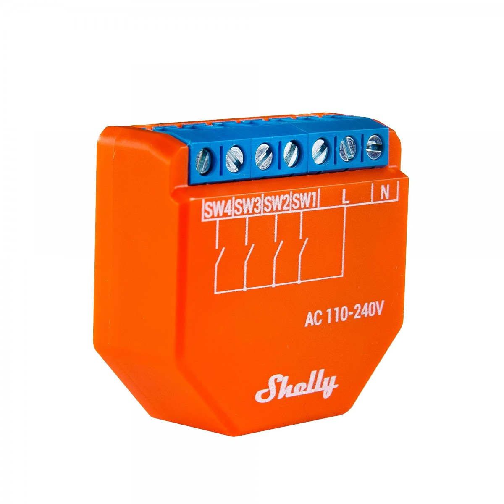

## GPIO Pinout

| Pin    | Function       |
| ------ | -------------- |
| GPIO12 | Switch 1 Input |
| GPIO14 | Switch 2 Input |
| GPIO26 | Switch 4 Input |
| GPIO27 | Switch 3 Input |

The Shelly Plus i4 is based on the ESP32-U4WDH (Single core, 160MHz, 4MB embedded flash)

Credit to: [blakadder](https://templates.blakadder.com/shelly_plus_i4.html)

## Configuration for generating Home Assistant Events and Multi-Click Actions

```yaml
substitutions:
  device_ssid: "Shelly Plus i4"
  device_name: shellyplusi4
  device_description: "Shelly Plus i4 Switch Module"
  friendly_name: "Shelly Plus i4"
  main_device_id: "shellyplusi4id" # Put the name that you want to see in Home Assistant.
  project_name: "shelly.plusi4-esp32-solo-esp-idf"
  project_version: "1.0"

esphome:
  name: ${device_name}
  comment: ${device_description}
  platformio_options:
    board_build.f_cpu: 160000000L
  project:
    name: "${project_name}"
    version: "${project_version}"

esp32:
  board: esp32doit-devkit-v1
  framework:
    type: esp-idf
    sdkconfig_options:
      CONFIG_FREERTOS_UNICORE: y
      CONFIG_ESP32_DEFAULT_CPU_FREQ_160: y
      CONFIG_ESP32_DEFAULT_CPU_FREQ_MHZ: "160"

# Enable logging
logger:

# Enable Home Assistant API
api:
  password: !secret api_password
  encryption:
    key: !secret api_encryption_key

ota:
  safe_mode: true
  password: !secret ota_password

wifi:
  ssid: !secret wifi_ssid
  password: !secret wifi_password
  power_save_mode: none
  # Enable fallback hotspot (captive portal) in case wifi connection fails
  ap:
    ssid: ${device_ssid} Fallback Hotspot
    password: !secret ap_password

# Sensors with general information.
sensor:
  - platform: uptime
    name: "${friendly_name} Uptime"
    id: uptime_sensor
  # WiFi Signal sensor.
  - platform: wifi_signal
    name: ${friendly_name} Signal strength
    update_interval: 60s
    internal: true

text_sensor:
  # Expose WiFi information as sensors.
  - platform: wifi_info
    ip_address:
      name: ${friendly_name} IP
    ssid:
      name: ${friendly_name} SSID
    bssid:
      name: ${friendly_name} BSSID

switch:
  # this provides for a possibility to restart from the web console or Home automation should we ever need it
  - platform: restart
    name: "${friendly_name} Restart"
  - platform: safe_mode
    name: "${friendly_name} Restart (Safe Mode)"

binary_sensor:
  - platform: gpio
    name: "${device_name} Button 1"
    pin:
      number: GPIO12
      mode:
        input: true
    on_multi_click:
      # double click
      - timing:
          - ON for at most 1s
          - OFF for at most 1s
          - ON for at most 1s
          - OFF for at least 0.2s
        then:
          # send double click event
          - homeassistant.event:
              event: esphome.button_pressed
              data:
                title: button 1 double click
        # long click
      - timing:
          - ON for at least 1.5s
        then:
          - homeassistant.event:
              event: esphome.button_pressed
              data:
                title: button 1 long click
        # single click
      - timing:
          - ON for at most 1s
          - OFF for at least 0.5s
        then:
          - homeassistant.event:
              event: esphome.button_pressed
              data:
                title: button 1 short click
    # internal: true
    id: button1
    filters:
      - delayed_on_off: 50ms
  - platform: gpio
    name: "${device_name} Button 2"
    pin:
      number: GPIO14
      mode:
        input: true
    on_multi_click:
      # double click
      - timing:
          - ON for at most 1s
          - OFF for at most 1s
          - ON for at most 1s
          - OFF for at least 0.2s
        then:
          # send double click event
          - homeassistant.event:
              event: esphome.button_pressed
              data:
                title: button 2 double click
        # long click
      - timing:
          - ON for at least 1.5s
        then:
          - homeassistant.event:
              event: esphome.button_pressed
              data:
                title: button 2 long click
        # single click
      - timing:
          - ON for at most 1s
          - OFF for at least 0.5s
        then:
          - homeassistant.event:
              event: esphome.button_pressed
              data:
                title: button 2 short click
    # internal: true
    id: button2
    filters:
      - delayed_on_off: 50ms
  - platform: gpio
    name: "${device_name} Button 3"
    pin:
      number: GPIO27
      mode:
        input: true
    on_multi_click:
      # double click
      - timing:
          - ON for at most 1s
          - OFF for at most 1s
          - ON for at most 1s
          - OFF for at least 0.2s
        then:
          # send double click event
          - homeassistant.event:
              event: esphome.button_pressed
              data:
                title: button 3 double click
        # long click
      - timing:
          - ON for at least 1.5s
        then:
          - homeassistant.event:
              event: esphome.button_pressed
              data:
                title: button 2 long click
        # single click
      - timing:
          - ON for at most 1s
          - OFF for at least 0.5s
        then:
          - homeassistant.event:
              event: esphome.button_pressed
              data:
                title: button 3 short click
    # internal: true
    id: button3
    filters:
      - delayed_on_off: 50ms
  - platform: gpio
    name: "${device_name} Button 4"
    pin:
      number: GPIO26
      mode:
        input: true
    on_multi_click:
      # double click
      - timing:
          - ON for at most 1s
          - OFF for at most 1s
          - ON for at most 1s
          - OFF for at least 0.2s
        then:
          # send double click event
          - homeassistant.event:
              event: esphome.button_pressed
              data:
                title: button 4 double click
        # long click
      - timing:
          - ON for at least 1.5s
        then:
          - homeassistant.event:
              event: esphome.button_pressed
              data:
                title: button 4 long click
        # single click
      - timing:
          - ON for at most 1s
          - OFF for at least 0.5s
        then:
          - homeassistant.event:
              event: esphome.button_pressed
              data:
                title: button 4 short click
    # internal: true
    id: button4
    filters:
      - delayed_on_off: 50ms
```

## Basic Configuration - 4 single click buttons

```yaml
substitutions:
  device_ssid: "Shelly Plus i4"
  device_name: shellyplusi4
  device_description: "Shelly Plus i4 Switch Module"
  friendly_name: "Shelly Plus i4"
  main_device_id: "shellyplusi4id" # Put the name that you want to see in Home Assistant.
  project_name: "shelly.plusi4-esp32-solo-esp-idf"
  project_version: "1.0"

esphome:
  name: ${device_name}
  comment: ${device_description}
  platformio_options:
    board_build.f_cpu: 160000000L
  project:
    name: "${project_name}"
    version: "${project_version}"

esp32:
  board: esp32doit-devkit-v1
  framework:
    type: esp-idf
    sdkconfig_options:
      CONFIG_FREERTOS_UNICORE: y
      CONFIG_ESP32_DEFAULT_CPU_FREQ_160: y
      CONFIG_ESP32_DEFAULT_CPU_FREQ_MHZ: "160"

# Enable logging
logger:

# Enable Home Assistant API
api:
  password: !secret api_password
  encryption:
    key: !secret api_encryption_key

ota:
  safe_mode: true
  password: !secret ota_password

wifi:
  ssid: !secret wifi_ssid
  password: !secret wifi_password
  power_save_mode: none
  # Enable fallback hotspot (captive portal) in case wifi connection fails
  ap:
    ssid: ${device_ssid} Fallback Hotspot
    password: !secret ap_password

# Sensors with general information.
sensor:
  - platform: uptime
    name: "${friendly_name} Uptime"
    id: uptime_sensor
  # WiFi Signal sensor.
  - platform: wifi_signal
    name: ${friendly_name} Signal strength
    update_interval: 60s
    internal: true

text_sensor:
  # Expose WiFi information as sensors.
  - platform: wifi_info
    ip_address:
      name: ${friendly_name} IP
    ssid:
      name: ${friendly_name} SSID
    bssid:
      name: ${friendly_name} BSSID

switch:
  # this provides for a possibility to restart from the web console or Home automation should we ever need it
  - platform: restart
    name: "${friendly_name} Restart"
  - platform: safe_mode
    name: "${friendly_name} Restart (Safe Mode)"

binary_sensor:
  - platform: gpio
    name: "${device_name} Button 1"
    pin:
      number: GPIO12
      mode:
        input: true
    id: button1
    filters:
      - delayed_on_off: 50ms
  - platform: gpio
    name: "${device_name} Button 2"
    pin:
      number: GPIO14
      mode:
        input: true
    id: button2
    filters:
      - delayed_on_off: 50ms
  - platform: gpio
    name: "${device_name} Button 3"
    pin:
      number: GPIO27
      mode:
        input: true
    id: button3
    filters:
      - delayed_on_off: 50ms
  - platform: gpio
    name: "${device_name} Button 4"
    pin:
      number: GPIO26
      mode:
        input: true
    id: button4
    filters:
      - delayed_on_off: 50ms
```

If you want to use the Arduino framework you can use the Tasmota platfomio
(https://github.com/tasmota/platform-espressif32/) port as follows:

``` yaml
esphome:
  name: ${device_name}
  friendly_name: ${friendly_name}
  platformio_options:
      board_build.f_cpu: 160000000L
      platform: https://github.com/tasmota/platform-espressif32/releases/download/2023.02.00/platform-espressif32.zip
      framework: arduino
      platform_packages:
        - framework-arduinoespressif32 @ https://github.com/espressif/arduino-esp32#master
      build_flags:
        - "-DCONFIG_FREERTOS_UNICORE=1"
        - "-DFRAMEWORK_ARDUINO_SOLO1"
      board: esp32-solo1

esp32:
  board: esp32doit-devkit-v1
### the rest of your config
```
