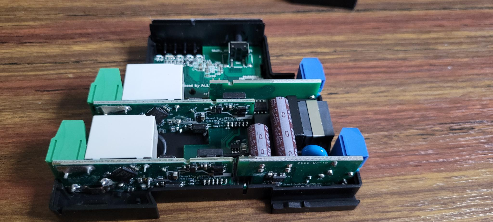
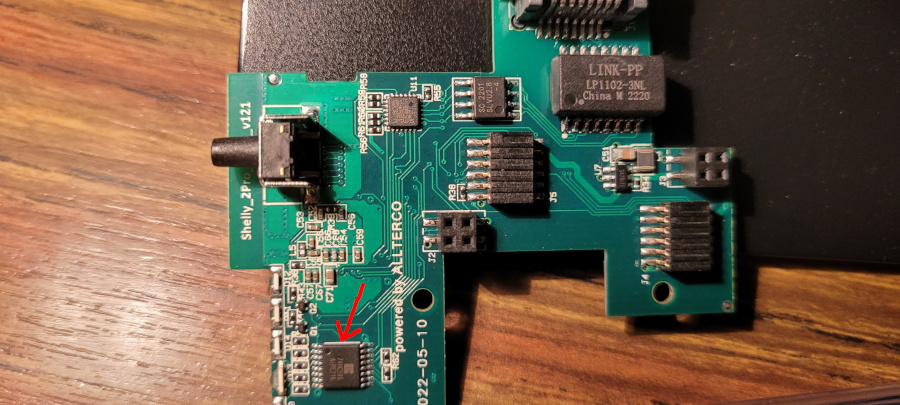

Information about the pinout and internals of the Shelly Pro 2 PM.

It's the same board as the [Shelly Pro 2](Shelly-Pro-2). The only
difference is the addition of two
[ADE7953](https://esphome.io/components/sensor/ade7953.html) chips (one on each
relay board).



## Pinout

ESP32 DOWDQ6 | Component
-------------|-------------
GPIO 0       |ADE7953 #1 SPI CS
GPIO 2       |ADE7953 RST
GPIO 4       |SN74HC595B SPI CS
GPIO 12      |SPI MISO
GPIO 13      |SPI MOSI
GPIO 14      |SPI CLK
GPIO 15      |ADE7953 #2 SPI CS
GPIO 17      |LAN8720A CLKIN
GPIO 18      |LAN8720A MDIO
GPIO 19      |LAN8720A TXD0
GPIO 21      |LAN8720A TXEN
GPIO 22      |LAN8720A TXD1
GPIO 23      |LAN8720A MDC
GPIO 25      |LAN8720A RXD0
GPIO 26      |LAN8720A RXD1
GPIO 27      |LAN8720A CRS_DV
GPIO 35      |Reset Button
GPIO 36      |ADC Temperature 1
GPIO 37      |ADC Temperature 2
GPIO 38      |Switch input 1
GPIO 39      |Switch input 2

## Shift register

A shift register is controlling the WIFI RGB LEDs and the 2 relays.



SN74HC595B | Component
-----------|----------
QA         |Relay 1 + Out 1 LED
QB         |Relay 2 + Out 2 LED
QC         |WIFI RGB LED (Blue)
QD         |WIFI RGB LED (Green)
QE         |WIFI RGB LED (Red)
QF         |NC
QG         |NC
QH         |NC

The Out 1 status LED and the relay 1 are on the same output. The same is true
for the Out 2 status LED and the relay 2. Turning on the relay turns the
corresponding LED on.

The WIFI LED is an RGB LED. By turning each component on or off, you have
access to 8 configurations:

R|G|B| Color
-|-|-|-------
0|0|0|OFF
0|0|1|Blue
0|1|0|Green
0|1|1|Cyan
1|0|0|Red
1|0|1|Magenta
1|1|0|Yellow
1|1|1|White

## Programming Pinout


Note that the pin pitch is 1.27mm, so standard 2.54mm Dupont cables won't work.

## ADE7953

Each of the relay sub-boards has a dedicated ADE7953 chip to provide the power
monitoring feature.

While each ADE7953 provides two channels A & B, only the channel A of each
measures the valuable data. Channel B is likely measuring references (0V, 0A,
0W).

### Reset pin

Each ADE7953 has a reset pin, but both reset pins are connected to the same
GPIO (GPIO2). The reset pin is active low, which means that if we don't do
anything, reset will be asserted and maintained and the ESP32 won't be able to
talk to the ADE7953s.

So we need to set GPIO2 to a high value. See the `output:` section in the
configuration below.

### Calibration data

The active power values will both be negative, so we need to multiply them by
-1 to get them both positive.

#### Arduino

On arduino platform, there is nothing to specify: the default values are
correct.

#### esp-idf

On esp-idf platform, for some unknown reason the ADE7953 default value for
`voltage_gain`, `current_gain_*` and `active_power_gain_*` (which is
`0x400000`) is not taken into account, and `0x200000` ends up in the registers.

The only way I found to get around it on `esp-idf` platform is to use following
hack for each ADE7953 configuration:

```yaml
voltage_pga_gain: 2x
current_pga_gain_a: 2x
current_pga_gain_b: 2x
active_power_gain_a: 0x200000
active_power_gain_b: 0x200000
```

`0x100000` will actually end up in the `active_power_gain_*` registers but
together with the other values, it will be correct.

## Basic Configuration

```yaml
esphome:
  name: shelly-pro-2-pm

esp32:
  board: esp32dev
  framework:
    type: arduino


logger:

api:

ota:
  platform: esphome

wifi:
  ssid: !secret wifi_ssid
  password: !secret wifi_password
  ap:
    ssid: "Shelly-Pro-2-PM"
    password: "BzwFc7HsRihG"

# ethernet:
#   type: LAN8720
#   mdc_pin: GPIO23
#   mdio_pin: GPIO18
#   clk_mode: GPIO17_OUT


captive_portal:

spi:
  clk_pin: GPIO14
  mosi_pin: GPIO13
  miso_pin:
    number: GPIO12
    ignore_strapping_warning: true

button:
  - platform: shutdown
    id: do_shutdown
  - platform: restart
    name: "Restart"
    id: do_restart

binary_sensor:
  - platform: gpio
    id: reset_button
    pin:
      number: 35
      inverted: true
    on_release:
      then:
        button.press: do_restart

  - platform: gpio
    id: input1
    pin:
      number: 38
    on_press:
      then:
        switch.toggle: relay1

  - platform: gpio
    id: input2
    pin:
      number: 39
    on_press:
      then:
        switch.toggle: relay2

sensor:
  - platform: adc
    id: temp_voltage1
    pin: GPIO36
    attenuation: auto
  - platform: resistance
    id: temp_resistance1
    sensor: temp_voltage1
    configuration: DOWNSTREAM
    resistor: 10kOhm
  - platform: ntc
    sensor: temp_resistance1
    name: Temperature 1
    unit_of_measurement: "°C"
    accuracy_decimals: 1
    icon: "mdi:thermometer"
    calibration:
      b_constant: 3350
      reference_resistance: 10kOhm
      reference_temperature: 298.15K
    on_value_range:
      - above: 90
        then:
          - switch.turn_off: relay1
          - switch.turn_off: relay2
          - button.press: do_shutdown

  - platform: adc
    id: temp_voltage2
    pin: GPIO37
    attenuation: auto
  - platform: resistance
    id: temp_resistance2
    sensor: temp_voltage2
    configuration: DOWNSTREAM
    resistor: 10kOhm
  - platform: ntc
    sensor: temp_resistance2
    name: Temperature 2
    unit_of_measurement: "°C"
    accuracy_decimals: 1
    icon: "mdi:thermometer"
    calibration:
      b_constant: 3350
      reference_resistance: 10kOhm
      reference_temperature: 298.15K
    on_value_range:
      - above: 90
        then:
          - switch.turn_off: relay1
          - switch.turn_off: relay2
          - button.press: do_shutdown

  - platform: ade7953_spi
    id: ade7953_1
    cs_pin:
      number: GPIO0
      ignore_strapping_warning: true
    voltage:
      id: voltage1
      name: "Voltage 1"
    current_a:
      id: current1
      name: "Current 1"
      filters:
        - lambda: |-
            if (x <= 0.02) return 0;
            return x;
    active_power_a:
      id: power1
      name: "Power 1"
      filters:
        - multiply: -1
        - lambda: |-
            if (x <= 0.2) return 0;
            return x;

  - platform: ade7953_spi
    id: ade7953_2
    cs_pin:
      number: GPIO15
      ignore_strapping_warning: true
    voltage:
      id: voltage2
      name: "Voltage 2"
    current_a:
      id: current2
      name: "Current 2"
      filters:
        - lambda: |-
            if (x <= 0.02) return 0;
            return x;
    active_power_a:
      id: power2
      name: "Power 2"
      filters:
        - multiply: -1
        - lambda: |-
            if (x <= 0.2) return 0;
            return x;

# Necessary for ADE7953s to come out of reset
# The reset pin is common to both ADE7953 chips
output:
  - platform: gpio
    id: ade7953_reset
    pin:
      number: GPIO2
      inverted: true
      ignore_strapping_warning: true

sn74hc595:
  - id: 'sn74hc595_hub'
    type: spi
    latch_pin: GPIO4
    sr_count: 1

switch:
  - platform: gpio
    name: "Relay 1"
    id: relay1
    pin:
      sn74hc595: sn74hc595_hub
      number: 0
      inverted: false

  - platform: gpio
    name: "Relay 2"
    id: relay2
    pin:
      sn74hc595: sn74hc595_hub
      number: 1
      inverted: false

  - platform: gpio
    id: wifi_led_blue
    pin:
      sn74hc595: sn74hc595_hub
      number: 2
      inverted: true

  - platform: gpio
    id: wifi_led_green
    pin:
      sn74hc595: sn74hc595_hub
      number: 3
      inverted: true

  - platform: gpio
    id: wifi_led_red
    pin:
      sn74hc595: sn74hc595_hub
      number: 4
      inverted: true
```

## Configuration as a garage door (or shutter)

In this setup, we control a garage door motor. We plug the opening phase to
`relay1`, and the closing phase to the `relay2`.

We plug an open button to `input1`, and a close button to `input2`.

We can then control the garage door either using the physical wall switch,
and/or using MQTT.

```yaml
substitutions:
  mqtt_server: mqtt.local
  client_id: garage_door
  last_will_topic: "garage_door/status"
  state_topic: "garage_door/state"
  command_topic: "garage_door/set"
  position_state_topic: "garage_door/position/state"
  position_command_topic: "garage_door/position/set"

esphome:
  name: garage-door

esp32:
  board: esp32dev
  framework:
    type: arduino

logger:
  level: INFO

ota:
  platform: esphome

web_server:
  port: 80
  local: true
  ota: false

ethernet:
  type: LAN8720
  mdc_pin: GPIO23
  mdio_pin: GPIO18
  clk_mode: GPIO17_OUT

mqtt:
  broker: ${mqtt_server}
  port: 1883
  username: !secret mqtt_username
  password: !secret mqtt_password
  client_id: ${client_id}
  clean_session: true
  discover_ip: false
  discovery: false
  topic_prefix: null
  log_topic: null
  birth_message:
    topic: ${last_will_topic}
    payload: online
    qos: 1
  will_message:
    topic: ${last_will_topic}
    payload: offline
    qos: 1
  shutdown_message:
    topic: ${last_will_topic}
    payload: offline
    qos: 1

spi:
  clk_pin: GPIO14
  mosi_pin: GPIO13
  miso_pin:
    number: GPIO12
    ignore_strapping_warning: true

binary_sensor:
  - platform: gpio
    id: reset_button
    pin:
      number: 35
      inverted: true
    on_release:
      then:
        button.press: do_restart

  - platform: gpio
    id: input1
    pin:
      number: 38
    on_press:
      then:
        cover.open: garage_door

  - platform: gpio
    id: input2
    pin:
      number: 39
    on_press:
      then:
        cover.close: garage_door

  - platform: status
    id: status1
    on_press:
      then:
        switch.turn_on: wifi_led_blue
    on_release:
      then:
        switch.turn_off: wifi_led_blue

button:
  - platform: shutdown
    id: do_shutdown
  - platform: restart
    name: "Restart"
    id: do_restart

sensor:
  - platform: adc
    id: temp_voltage1
    pin: GPIO36
    attenuation: auto
  - platform: resistance
    id: temp_resistance1
    sensor: temp_voltage1
    configuration: DOWNSTREAM
    resistor: 10kOhm
  - platform: ntc
    sensor: temp_resistance1
    name: "Temperature 1"
    unit_of_measurement: "°C"
    accuracy_decimals: 1
    icon: "mdi:thermometer"
    calibration:
      b_constant: 3350
      reference_resistance: 10kOhm
      reference_temperature: 298.15K
    on_value_range:
      - above: 90
        then:
          - switch.turn_off: relay1
          - switch.turn_off: relay2
          - button.press: do_shutdown

  - platform: adc
    id: temp_voltage2
    pin: GPIO37
    attenuation: auto
  - platform: resistance
    id: temp_resistance2
    sensor: temp_voltage2
    configuration: DOWNSTREAM
    resistor: 10kOhm
  - platform: ntc
    sensor: temp_resistance2
    name: "Temperature 2"
    unit_of_measurement: "°C"
    accuracy_decimals: 1
    icon: "mdi:thermometer"
    calibration:
      b_constant: 3350
      reference_resistance: 10kOhm
      reference_temperature: 298.15K
    on_value_range:
      - above: 90
        then:
          - switch.turn_off: relay1
          - switch.turn_off: relay2
          - button.press: do_shutdown

  - platform: ade7953_spi
    id: ade7953_1
    cs_pin:
      number: GPIO0
      ignore_strapping_warning: true
    voltage:
      id: voltage1
      name: "Open Voltage"
      filters:
        - throttle: 5s
    current_a:
      id: current1
      name: "Open current"
      filters:
        - lambda: |-
            if (x <= 0.02) return 0;
            return x;
    active_power_a:
      id: power1
      name: "Open power"
      filters:
        - multiply: -1
        - lambda: |-
            if (x <= 0.2) return 0;
            return x;
        - throttle: 1s
    update_interval: 0.4s

  - platform: ade7953_spi
    id: ade7953_2
    cs_pin:
      number: GPIO15
      ignore_strapping_warning: true
    voltage:
      id: voltage2
      name: "Close Voltage"
      filters:
        - throttle: 5s
    current_a:
      id: current2
      name: "Close current"
      filters:
        - lambda: |-
            if (x <= 0.02) return 0;
            return x;
    active_power_a:
      id: power2
      name: "Close power"
      filters:
        - multiply: -1
        - lambda: |-
            if (x <= 0.2) return 0;
            return x;
        - throttle: 1s
    update_interval: 0.4s


# Necessary for ADE7953s to come out of reset
# The reset pin is common to both ADE7953 chips
output:
  - platform: gpio
    id: ade7953_reset
    pin:
      number: GPIO2
      inverted: true
      ignore_strapping_warning: true

sn74hc595:
  - id: 'sn74hc595_hub'
    type: spi
    latch_pin: GPIO4
    sr_count: 1

switch:
  - platform: gpio
    id: relay1
    name: "Open relay"
    internal: true
    interlock: [relay2]
    interlock_wait_time: 200ms
    restore_mode: RESTORE_DEFAULT_OFF
    pin:
      sn74hc595: sn74hc595_hub
      number: 0
      inverted: false

  - platform: gpio
    id: relay2
    name: "Close relay"
    internal: true
    interlock: [relay1]
    interlock_wait_time: 200ms
    restore_mode: RESTORE_DEFAULT_OFF
    pin:
      sn74hc595: sn74hc595_hub
      number: 1
      inverted: false

  - platform: gpio
    id: wifi_led_blue
    pin:
      sn74hc595: sn74hc595_hub
      number: 2
      inverted: true

  - platform: gpio
    id: wifi_led_green
    pin:
      sn74hc595: sn74hc595_hub
      number: 3
      inverted: true

  - platform: gpio
    id: wifi_led_red
    pin:
      sn74hc595: sn74hc595_hub
      number: 4
      inverted: true

cover:
  - platform: current_based
    id: garage_door
    name: "Garage Door"
    open_sensor: current1
    open_moving_current_threshold: 0.1
    open_obstacle_current_threshold: 0.33
    open_duration: 20s
    open_action:
      - switch.turn_on: relay1
    close_sensor: current2
    close_moving_current_threshold: 0.1
    close_obstacle_current_threshold: 0.33
    close_duration: 19s
    close_action:
      - switch.turn_on: relay2
    stop_action:
      - switch.turn_off: relay1
      - switch.turn_off: relay2
    obstacle_rollback: 30%
    start_sensing_delay: 0.8s
    max_duration: 25s
    malfunction_detection: true
    malfunction_action:
      then:
        - logger.log: "Malfunction detected. Relay welded."
    state_topic: ${state_topic}
    command_topic: ${command_topic}
    position_state_topic: ${position_state_topic}
    position_command_topic: ${position_command_topic}
```
