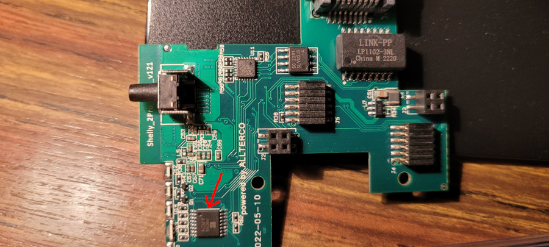

Information about the pinout and internals of the Shelly Pro 2.

It's the same board as the [Shelly Pro 1](Shelly-Pro-1). The only
difference is the addition of a second relay.


## Pinout

ESP32 DOWDQ6 | Component
-------------|-----------
GPIO 4       |SN74HC595B SPI CS
GPIO 12      |SPI MISO
GPIO 13      |SPI MOSI
GPIO 14      |SPI CLK
GPIO 17      |LAN8720A CLKIN
GPIO 18      |LAN8720A MDIO
GPIO 19      |LAN8720A TXD0
GPIO 21      |LAN8720A TXEN
GPIO 22      |LAN8720A TXD1
GPIO 23      |LAN8720A MDC
GPIO 25      |LAN8720A RXD0
GPIO 26      |LAN8720A RXD1
GPIO 27      |LAN8720A CRS_DV
GPIO 35      |Reset Button
GPIO 36      |ADC Temperature 1
GPIO 37      |ADC Temperature 2
GPIO 38      |Switch input 1
GPIO 39      |Switch input 2

## Shift register

A shift register is controlling the WIFI RGB LEDs and the 2 relays.



SN74HC595B | Component
-----------|----------
QA         |Relay 1 + Out 1 LED
QB         |Relay 2 + Out 2 LED
QC         |WIFI RGB LED (Blue)
QD         |WIFI RGB LED (Green)
QE         |WIFI RGB LED (Red)
QF         |NC
QG         |NC
QH         |NC

The Out 1 status LED and the relay 1 are on the same output. The same is true
for the Out 2 status LED and the relay 2. Turning on the relay turns the
corresponding LED on.

The WIFI LED is an RGB LED. By turning each component on or off, you have
access to 8 configurations:

R|G|B| Color
-|-|-|-------
0|0|0|OFF
0|0|1|Blue
0|1|0|Green
0|1|1|Cyan
1|0|0|Red
1|0|1|Magenta
1|1|0|Yellow
1|1|1|White

## Programming Pinout


Note that the pin pitch is 1.27mm, so standard 2.54mm Dupont cables won't work.

## Basic Configuration

```yaml
esphome:
  name: shelly-pro-2

esp32:
  board: esp32dev
  framework:
    type: arduino


logger:

api:

ota:
  platform: esphome

wifi:
  ssid: !secret wifi_ssid
  password: !secret wifi_password
  ap:
    ssid: "Shelly-Pro-2"
    password: "BzwFc7HsRihG"

# ethernet:
#   type: LAN8720
#   mdc_pin: GPIO23
#   mdio_pin: GPIO18
#   clk_mode: GPIO17_OUT


captive_portal:

spi:
  clk_pin: GPIO14
  mosi_pin: GPIO13
  miso_pin:
    number: GPIO12
    ignore_strapping_warning: true

button:
  - platform: shutdown
    id: do_shutdown
  - platform: restart
    name: "Restart"
    id: do_restart

binary_sensor:
  - platform: gpio
    id: reset_button
    pin:
      number: 35
      inverted: true
    on_release:
      then:
        button.press: do_restart

  - platform: gpio
    id: input1
    pin:
      number: 38
    on_press:
      then:
        switch.toggle: relay1

  - platform: gpio
    id: input2
    pin:
      number: 39
    on_press:
      then:
        switch.toggle: relay2

sensor:
  - platform: adc
    id: temp_voltage1
    pin: GPIO36
    attenuation: auto
  - platform: resistance
    id: temp_resistance1
    sensor: temp_voltage1
    configuration: DOWNSTREAM
    resistor: 10kOhm
  - platform: ntc
    sensor: temp_resistance1
    name: Temperature 1
    unit_of_measurement: "°C"
    accuracy_decimals: 1
    icon: "mdi:thermometer"
    calibration:
      b_constant: 3350
      reference_resistance: 10kOhm
      reference_temperature: 298.15K
    on_value_range:
      - above: 90
        then:
          - switch.turn_off: relay1
          - switch.turn_off: relay2
          - button.press: do_shutdown

  - platform: adc
    id: temp_voltage2
    pin: GPIO37
    attenuation: auto
  - platform: resistance
    id: temp_resistance2
    sensor: temp_voltage2
    configuration: DOWNSTREAM
    resistor: 10kOhm
  - platform: ntc
    sensor: temp_resistance2
    name: Temperature 2
    unit_of_measurement: "°C"
    accuracy_decimals: 1
    icon: "mdi:thermometer"
    calibration:
      b_constant: 3350
      reference_resistance: 10kOhm
      reference_temperature: 298.15K
    on_value_range:
      - above: 90
        then:
          - switch.turn_off: relay1
          - switch.turn_off: relay2
          - button.press: do_shutdown

sn74hc595:
  - id: 'sn74hc595_hub'
    type: spi
    latch_pin: GPIO4
    sr_count: 1

switch:
  - platform: gpio
    name: "Relay 1"
    id: relay1
    pin:
      sn74hc595: sn74hc595_hub
      number: 0
      inverted: false

  - platform: gpio
    name: "Relay 2"
    id: relay2
    pin:
      sn74hc595: sn74hc595_hub
      number: 1
      inverted: false

  - platform: gpio
    id: wifi_led_blue
    pin:
      sn74hc595: sn74hc595_hub
      number: 2
      inverted: true

  - platform: gpio
    id: wifi_led_green
    pin:
      sn74hc595: sn74hc595_hub
      number: 3
      inverted: true

  - platform: gpio
    id: wifi_led_red
    pin:
      sn74hc595: sn74hc595_hub
      number: 4
      inverted: true
```
