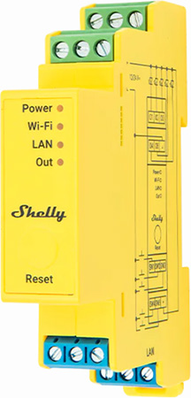
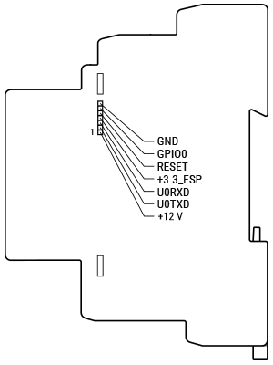

## GPIO Pinout

The SW inputs are connected via AiP4052 multiplexers (compatible with other 4052 chips). The multiplexer select lines S0
and S1 are connected to GPIO0 and GPIO2 respectively.

| Pin    | Condition        | Function        |
|--------|------------------|-----------------|
| GPIO0  | -                | Mux Select S0   |
| GPIO2  | -                | Mux Select S1   |
| GPIO12 | -                | PWM2            |
| GPIO13 | -                | PWM1            |
| GPIO14 | -                | PWM3            |
| GPIO16 | -                | PWM4            |
| GPIO17 | -                | PWM5            |
| ?      | ?                | NTC Temp Sensor |
| ?      | ?                | Voltage Monitor |
| ?      | ?                | Wi-Fi LED       |
| GPIO35 | -                | Reset Button    |
| GPIO36 | GPIO0=1, GPIO2=0 | SW4             |
| GPIO36 | GPIO0=0, GPIO2=1 | SW1             |
| GPIO37 | GPIO0=0, GPIO2=1 | SW2             |
| GPIO38 | GPIO0=0, GPIO2=1 | SW3             |
| GPIO39 | GPIO0=0, GPIO2=1 | SW5             |

## Pro addon interface

Use it for flashing. Connect GPIO0 to GND during reset. Do not connect +12V pin (neither +12V power to other connectors).



## Configuration monochromatic channel

`partitions_8mb_ota.csv`:

```csv
# Name,   Type, SubType, Offset,  Size, Flags
nvs,      data, nvs,     0x9000,  0x5000,
otadata,  data, ota,     0xe000,  0x2000,
app0,     app,  ota_0,   0x10000, 0x330000,
app1,     app,  ota_1,   0x340000,0x330000,
spiffs,   data, spiffs,  0x670000,0x190000,
```

```yaml

esphome:
  name: shelly-pro-rgbww-pm
  platformio_options:
    board_build.flash_mode: dio

esp32:
  board: esp32dev
  variant: esp32
  flash_size: 8MB
  framework:
    type: esp-idf
  partitions: partitions_8mb_ota.csv

wifi:
  ssid: !secret wifi_ssid
  password: !secret wifi_password

captive_portal:
logger:
api:
ota:
  platform: esphome

web_server:
  port: 80

light:
  - platform: monochromatic
    name: "Channel 1"
    output: pwm_1

  - platform: monochromatic
    name: "Channel 2"
    output: pwm_2

  - platform: monochromatic
    name: "Channel 3"
    output: pwm_3

  - platform: monochromatic
    name: "Channel 4"
    output: pwm_4

  - platform: monochromatic
    name: "Channel 5"
    output: pwm_5

#  Alternatively, use RGBWW light platform
#  - platform: rgbww
#    name: ${device_name} Led Stip
#    red: pwm_1
#    green: pwm_2
#    blue: pwm_3
#    cold_white: pwm_4
#    warm_white: pwm_5

output:
  - platform: ledc
    pin: GPIO13
    id: pwm_1

  - platform: ledc
    pin: GPIO12
    id: pwm_2

  - platform: ledc
    pin: GPIO14
    id: pwm_3

  - platform: ledc
    pin: GPIO16
    id: pwm_4

  - platform: ledc
    pin: GPIO17
    id: pwm_5

  - platform: gpio
    id: mux_a
    pin: 0

  - platform: gpio
    id: mux_b
    pin: 2

binary_sensor:
  - platform: gpio
    pin:
      number: GPIO35
      inverted: True
    name: ${device_name} Reset Button
    filters:
      - delayed_on_off: 10ms

  - platform: gpio
    id: in36
    pin: { number: 36, mode: INPUT }
  - platform: gpio
    id: in37
    pin: { number: 37, mode: INPUT }
  - platform: gpio
    id: in38
    pin: { number: 38, mode: INPUT }
  - platform: gpio
    id: in39
    pin: { number: 39, mode: INPUT }

  - platform: template
    name: "SW1"
    id: sw1

  - platform: template
    name: "SW2"
    id: sw2

  - platform: template
    name: "SW3"
    id: sw3

  - platform: template
    name: "SW4"
    id: sw4

  - platform: template
    name: "SW5"
    id: sw5

interval:
  - interval: 50ms
    then:
      - lambda: |-
          id(mux_a).turn_on();
          id(mux_b).turn_off();
          delay(1);
          id(sw4).publish_state(gpio_get_level(GPIO_NUM_36) == 0);

          id(mux_a).turn_off();
          id(mux_b).turn_on();
          delay(1);
          id(sw1).publish_state(gpio_get_level(GPIO_NUM_36) == 0);
          id(sw2).publish_state(gpio_get_level(GPIO_NUM_37) == 0);
          id(sw3).publish_state(gpio_get_level(GPIO_NUM_38) == 0);
          id(sw5).publish_state(gpio_get_level(GPIO_NUM_39) == 0);


```
