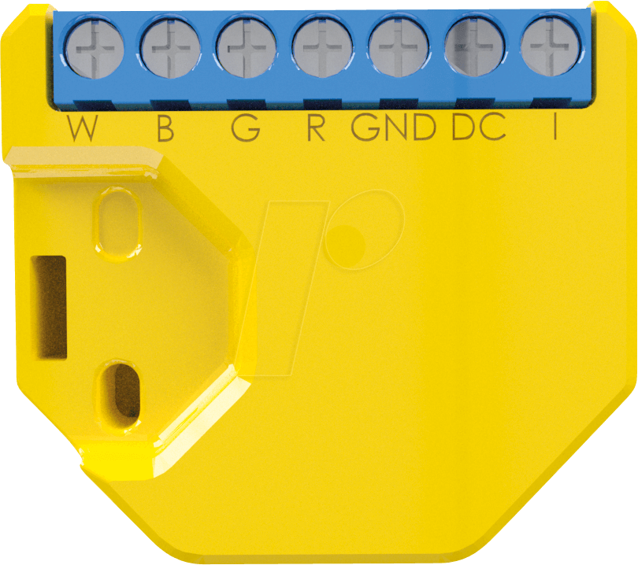

[Amazon Link](https://amzn.to/2ZcvAmy)



## GPIO Pinout

| Pin    | Function              |
| ------ | --------------------- |
| GPIO2  | Led Link              |
| GPIO4  | PWM 4 (W)             |
| GPIO5  | Switch input          |
| GPIO12 | PWM 1 (R)             |
| GPIO14 | PWM 3 (B)             |
| GPIO15 | PWM 2 (G)             |
| A0     | OpAmp Current Monitor |

## Configuration for RGBW

```yaml
esphome:
  name: shelly_rgbw2
  platform: ESP8266
  board: esp01_1m

wifi:
  ssid: !secret wifi_ssid
  password: !secret wifi_password

captive_portal:
logger:
api:
ota:

light:
  - platform: rgbw
    name: ledstrip_shelly_rgbw2
    red: pwm_r
    green: pwm_g
    blue: pwm_b
    white: pwm_w
    effects:
      - random:
      - strobe:
      - flicker:

output:
  - platform: esp8266_pwm
    pin: GPIO12
    frequency: 1000 Hz
    id: pwm_r

  - platform: esp8266_pwm
    pin: GPIO15
    frequency: 1000 Hz
    id: pwm_g

  - platform: esp8266_pwm
    pin: GPIO14
    frequency: 1000 Hz
    id: pwm_b

  - platform: esp8266_pwm
    pin: GPIO4
    frequency: 1000 Hz
    id: pwm_w
```

## Configuration for 4 monochromatic channels

```yaml
substitutions:
  device_name: shelly_rgbw2

esphome:
  name: ${device_name}
  platform: ESP8266
  board: esp01_1m

logger:
api:
ota:

wifi:
  ssid: !secret wifi_ssid
  password: !secret wifi_password

light:
  - platform: monochromatic
    name: ${device_name}_ch1
    id: ${device_name}_ch1
    output: ${device_name}_out_ch1
  - platform: monochromatic
    name: ${device_name}_ch2
    id: ${device_name}_ch2
    output: ${device_name}_out_ch2
  - platform: monochromatic
    name: ${device_name}_ch3
    id: ${device_name}_ch3
    output: ${device_name}_out_ch3
  - platform: monochromatic
    name: ${device_name}_ch4
    id: ${device_name}_ch4
    output: ${device_name}_out_ch4
# Example output entry
output:
  - platform: esp8266_pwm
    id: ${device_name}_out_ch1
    pin: GPIO12
    frequency: 1000 Hz
  - platform: esp8266_pwm
    id: ${device_name}_out_ch2
    pin: GPIO15
    frequency: 1000 Hz
  - platform: esp8266_pwm
    id: ${device_name}_out_ch3
    pin: GPIO14
    frequency: 1000 Hz
  - platform: esp8266_pwm
    id: ${device_name}_out_ch4
    pin: GPIO4
    frequency: 1000 Hz

binary_sensor:
  - platform: gpio
    pin: GPIO5
    id: light_0_touch
    on_click:
      then:
        - if:
            condition:
              - light.is_off: ${device_name}_ch1
              - light.is_off: ${device_name}_ch2
              - light.is_off: ${device_name}_ch3
              - light.is_off: ${device_name}_ch4
            then:
              - light.turn_on:
                  id: ${device_name}_ch1
                  brightness: 1.0
              - light.turn_on:
                  id: ${device_name}_ch2
                  brightness: 1.0
              - light.turn_on:
                  id: ${device_name}_ch3
                  brightness: 1.0
              - light.turn_on:
                  id: ${device_name}_ch4
                  brightness: 1.0
            else:
              - light.turn_off: ${device_name}_ch1
              - light.turn_off: ${device_name}_ch2
              - light.turn_off: ${device_name}_ch3
              - light.turn_off: ${device_name}_ch4
    on_press:
      then:
        - if:
            condition:
              light.is_off: ${device_name}_ch1
            then:
              - delay: 0.5s
              - while:
                  condition:
                    binary_sensor.is_on: light_0_touch
                  then:
                    - light.dim_relative:
                        id: ${device_name}_ch1
                        relative_brightness: 5%
                        transition_length: 0.1s
                    - delay: 0.1s
                    - light.dim_relative:
                        id: ${device_name}_ch2
                        relative_brightness: 5%
                        transition_length: 0.1s
                    - delay: 0.1s
                    - light.dim_relative:
                        id: ${device_name}_ch3
                        relative_brightness: 5%
                        transition_length: 0.1s
                    - delay: 0.1s
                    - light.dim_relative:
                        id: ${device_name}_ch4
                        relative_brightness: 5%
                        transition_length: 0.1s
                    - delay: 0.1s
            else:
              - delay: 0.5s
              - while:
                  condition:
                    and:
                      - binary_sensor.is_on: light_0_touch
                      - light.is_on: ${device_name}_ch1
                  then:
                    - light.dim_relative:
                        id: ${device_name}_ch1
                        relative_brightness: -5%
                        transition_length: 0.1s
                    - delay: 0.1s
                    - light.dim_relative:
                        id: ${device_name}_ch2
                        relative_brightness: -5%
                        transition_length: 0.1s
                    - delay: 0.1s
                    - light.dim_relative:
                        id: ${device_name}_ch3
                        relative_brightness: -5%
                        transition_length: 0.1s
                    - delay: 0.1s
                    - light.dim_relative:
                        id: ${device_name}_ch4
                        relative_brightness: -5%
                        transition_length: 0.1s
                    - delay: 0.1s
```

## Configuration for 2x CWWW (dual color Cold White Warm White) lights

This configuration disables the switch entirely and relies on software control and/or physical switch power removal.

```yaml
substitutions:
  device_name: "shelly_rgbw2_cwww"

esphome:
  name: ${device_name}
  platform: ESP8266
  board: esp01_1m
  on_boot:
    then:
      # Enable both strips at 60% Brightness, Warm Color on startup
      - light.turn_on:
          id: light1
          brightness: 60%
          color_temperature: 3500 K
      - light.turn_on:
          id: light2
          brightness: 60%
          color_temperature: 3500 K

logger:
api:

wifi:
  ssid: !secret wifi_ssid
  password: !secret wifi_pass

  # Enable fallback hotspot (captive portal) in case wifi connection fails
  ap:
    ssid: "${device_name}"
    password: !secret ap_pass

ota:
  safe_mode: True
  password: !secret ota_pass

captive_portal:

status_led:
  pin: GPIO2
  
light:
  - platform: cwww
    restore_mode: ALWAYS_OFF
    name: "${device_name}_1"
    cold_white: ${device_name}_out_ch2
    warm_white: ${device_name}_out_ch4
    cold_white_color_temperature: 6000 K
    warm_white_color_temperature: 3000 K
    constant_brightness: true
    id: light1

  - platform: cwww
    restore_mode: ALWAYS_OFF
    name: "${device_name}_2"
    cold_white: ${device_name}_out_ch1
    warm_white: ${device_name}_out_ch3
    cold_white_color_temperature: 6000 K
    warm_white_color_temperature: 3000 K
    constant_brightness: true
    id: light2

# Example output entry
output:
  - platform: esp8266_pwm
    id: ${device_name}_out_ch1
    pin: GPIO12
    frequency: 244 Hz
  - platform: esp8266_pwm
    id: ${device_name}_out_ch2
    pin: GPIO15
    frequency: 244 Hz
  - platform: esp8266_pwm
    id: ${device_name}_out_ch3
    pin: GPIO14
    frequency: 244 Hz
  - platform: esp8266_pwm
    id: ${device_name}_out_ch4
    pin: GPIO4
    frequency: 244 Hz

binary_sensor:
  - platform: gpio
    pin: GPIO5
    id: light_0_touch
```
