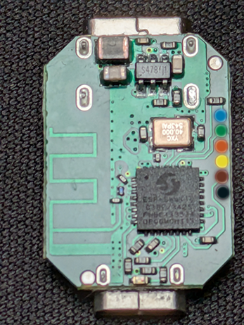

The Pill by Shelly (S3SN-0U53X) is a compact multi-purpose low-voltage Wi-Fi & Bluetooth sensor hub powered by 5V via USB-C.
It features 3 configurable GPIO pins exposed through a Micro-USB output connector, supporting DS18B20 temperature probes,
DHT22 sensors, analog voltage measurement (0-2.5V built-in, 0-30V with add-on), 
digital I/O, and I2C peripherals. It measures just 26 x 20 x 8.5 mm and weighs 3 grams.

The device uses an ESP32-C3 (ESP-Shelly-C38F) with 8 MB embedded flash. 
The top USB-C connector provides power and native USB-SERIAL-JTAG for flashing. 

The bottom Micro-USB connector is NOT a USB data port -- it is repurposed as a compact 5-pin GPIO connector for sensor and actuator connections.


## GPIO Pinout

| Pin            | GPIO      | Function                           | Notes                                  |
| -------------- | --------- | ---------------------------------- | -------------------------------------- |
| Micro-USB-1    | --        | 5V Power Out                       | Powers external sensors                |
| Micro-USB-2    | GPIO4     | **pin0** -- Primary I/O            | ADC1_CH4, 1-Wire, DHT22, Analog, I2C  |
| Micro-USB-3    | GPIO3     | **pin1** -- Secondary I/O          | ADC1_CH3, Digital I/O, Analog, I2C    |
| Micro-USB-4    | GPIO6     | **pin2** -- Secondary I/O          | Digital I/O only (no ADC)             |
| Micro-USB-5    | --        | GND                                |                                        |
| Button         | GPIO10    | Reset button (back of PCB)         | Hold >10s for factory reset            |
| LED            | GPIO8     | Status LED                         | Active-low                             |
| USB-C          | GPIO18/19 | USB Serial/JTAG                    | For flashing and debug console         |

The Micro-USB pin numbering follows the standard connector pinout (VBUS, D-, D+, ID, GND).

## Compatible Add-ons

Shelly offers plug-in accessories that connect via the Micro-USB sensor port. All are compatible with ESPHome using the GPIO mapping above.

- **5-Terminal Add-on** -- Exposes all 3 GPIOs + 5V + GND on screw terminals. Ideal for custom wiring, I2C sensors, and UART devices.
- **SSR Add-on** -- Dual-channel solid-state relay (30V/300mA). LOAD1 and LOAD2 are driven internally via IO1 + IO2, IO3 (GPIO6) remains free as digital I/O.
- **Analog 0-30V Add-on** -- Voltage divider on IO1 (GPIO4), use `multiply: 12.0` filter in ESPHome.
- **DS18B20 3.5mm cable** -- Temperature probe via 1-Wire on IO1 (GPIO4), included in box.
- **Splitter 1-to-5** -- Connects up to 5x DS18B20 sensors on the same 1-Wire bus.

### 5-Terminal Add-on to Micro-USB Mapping

| Terminal | Micro-USB Pin | GPIO      | Capabilities                                     |
| -------- | ------------- | --------- | ------------------------------------------------ |
| 5V       | Pin 1 (VBUS)  | --        | 5V power output for sensors                      |
| IO1      | Pin 2 (D-)    | **GPIO4** | DS18B20, DHT22, ADC (0-2.5V), Digital I/O, I2C   |
| IO2      | Pin 3 (D+)    | **GPIO3** | ADC, Digital I/O, I2C                             |
| IO3      | Pin 4 (ID)    | **GPIO6** | Digital I/O only (no ADC)                         |
| GND      | Pin 5 (GND)   | --        | Ground reference                                  |

With the 5-Terminal Add-on or a custom Micro-USB breakout, you can also attach I2C sensors (e.g. BME280, BH1750) using IO1/GPIO4 (SDA) + IO2/GPIO3 (SCL), 
or UART devices using any two of the three I/O terminals.

## Flashing

This device can be flashed directly over the top USB-C connector using the ESP32-C3's native USB-SERIAL-JTAG interface. 
No external UART adapter or soldering is needed.

1. Connect the USB-C cable to your computer.
2. Open [https://web.esphome.io/](https://web.esphome.io/) and click **Connect**.
3. Select the serial port and flash your firmware.

After initial flash, OTA updates work over Wi-Fi.

### Serial Programming Header



The test pads on the right edge of the PCB (visible in the top photo) provide a serial UART interface as an alternative programming method:

| Colour    | Signal    |
| --------- | --------- |
| Blue      | U0TXD     |
| Green     | U0RXD     |
| Orange    | 3V3       |
| Yellow    | BOOT      |
| Brown     | CHIP_EN   |
| Black     | GND       |

**Warning:** The bottom Micro-USB connector outputs 5V and 3.3V GPIO signals. Do NOT connect it to a computer or USB charger.

## Basic Configuration -- DS18B20 + Digital Outputs

```yaml
substitutions:
  device_name: shelly-pill
  friendly_name: "Shelly Pill"

esphome:
  name: ${device_name}
  friendly_name: ${friendly_name}
  platformio_options:
    board_build.flash_mode: dio
    board_build.flash_size: 8MB

esp32:
  board: esp32-c3-devkitm-1
  flash_size: 8MB
  framework:
    type: esp-idf

logger:
  hardware_uart: USB_SERIAL_JTAG

wifi:
  ssid: !secret wifi_ssid
  password: !secret wifi_password
  ap:
    ssid: "${friendly_name} Fallback"

captive_portal:

api:
  encryption:
    key: !secret api_key

ota:
  - platform: esphome
    password: !secret ota_password

# DS18B20 on pin0 (GPIO4)
one_wire:
  - platform: gpio
    pin: GPIO4

sensor:
  # Discovery: Run once without address to find sensor addresses in log
  - platform: dallas_temp
    name: "Temperature"
    update_interval: 30s

  - platform: wifi_signal
    name: "WiFi Signal"
    update_interval: 60s

  - platform: uptime
    name: "Uptime"
    update_interval: 60s

# Digital outputs on pin1 (GPIO3) + pin2 (GPIO6)
switch:
  - platform: gpio
    pin: GPIO3
    name: "Output 1"
    id: output_1
    restore_mode: RESTORE_DEFAULT_OFF

  - platform: gpio
    pin: GPIO6
    name: "Output 2"
    id: output_2
    restore_mode: RESTORE_DEFAULT_OFF

# Boot/reset button
binary_sensor:
  - platform: gpio
    pin:
      number: GPIO10
      mode: INPUT_PULLUP
      inverted: true
    name: "Button"

# Status LED
status_led:
  pin:
    number: GPIO8
    inverted: true

text_sensor:
  - platform: wifi_info
    ip_address:
      name: "IP Address"
```

## Alternative: DHT22 + Digital Inputs

```yaml
# Replace the one_wire + dallas_temp sections with:

sensor:
  - platform: dht
    model: DHT22
    pin: GPIO4
    temperature:
      name: "Temperature"
    humidity:
      name: "Humidity"
    update_interval: 30s

# Replace the switch section with:

binary_sensor:
  - platform: gpio
    pin:
      number: GPIO3
      mode: INPUT_PULLUP
      inverted: true
    name: "Door Sensor"
    device_class: door
    filters:
      - delayed_on_off: 50ms

  - platform: gpio
    pin:
      number: GPIO6
      mode: INPUT_PULLUP
      inverted: true
    name: "Motion Sensor"
    device_class: motion
```

## Alternative: Voltmeter + BLE Proxy

```yaml
# ADC Voltmeter on pin0 (GPIO4 = ADC1_CH4)
sensor:
  - platform: adc
    pin: GPIO4
    name: "Voltage"
    attenuation: 11db
    update_interval: 10s
    accuracy_decimals: 2
    unit_of_measurement: "V"
    # For 0-30V Add-on (12:1 voltage divider), uncomment:
    # filters:
    #   - multiply: 12.0

# BLE Proxy for Home Assistant
esp32_ble_tracker:
  scan_parameters:
    active: true

bluetooth_proxy:
  active: true
```

## Alternative: I2C Sensor (BME280)

Requires the 5-Terminal Add-on or a custom Micro-USB breakout cable.

```yaml
# I2C on pin0 (SDA) + pin1 (SCL), pin2 free for digital I/O
i2c:
  sda: GPIO4
  scl: GPIO3

sensor:
  - platform: bme280_i2c
    address: 0x76
    temperature:
      name: "Temperature"
    humidity:
      name: "Humidity"
    pressure:
      name: "Pressure"
    update_interval: 30s
```
