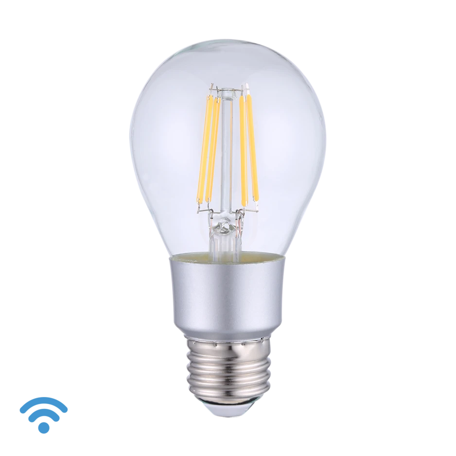

## Product Images



## GPIO Pinout

| Pin    | Function             |
| ------ | -------------------- |
| GPIO04 | Brightness           |

## Basic Configuration

```yaml
# Basic Config
---
substitutions:
  device_name: "shellyvintagea19"
  friendly_name: "Shelly Vintage A19"
  light_restore_mode: RESTORE_DEFAULT_ON

esphome:
  name: "${device_name}"
  name_add_mac_suffix: false

esp8266:
  board: esp01_1m
  restore_from_flash: true

preferences:
  flash_write_interval: 1min

# WiFi connection
wifi:
  ssid: !secret iot_wifi_ssid
  password: !secret iot_wifi_password
  power_save_mode: none
  fast_connect: true
  # Enable fallback hotspot (captive portal) in case wifi connection fails
  ap:
    ssid: "${displayname}"
    password: !secret ap_mode_password

captive_portal:

# Enable Home Assistant API
api:
  encryption:
    key: !secret api_enc

ota:
  password: !secret ota_password

logger:
  baud_rate: 0

mdns:
  disabled: false

web_server:
  port: 80

text_sensor:
  - platform: wifi_info
    ip_address:
      name: "${friendly_name} IP Address"
      disabled_by_default: false
    mac_address:
      name: "${friendly_name} MAC Address"
      disabled_by_default: false

output:
  - platform: esp8266_pwm
    id: brightness
    pin: GPIO4

light:
  - platform: monochromatic
    name: "${friendly_name} Light"
    output: brightness
```
