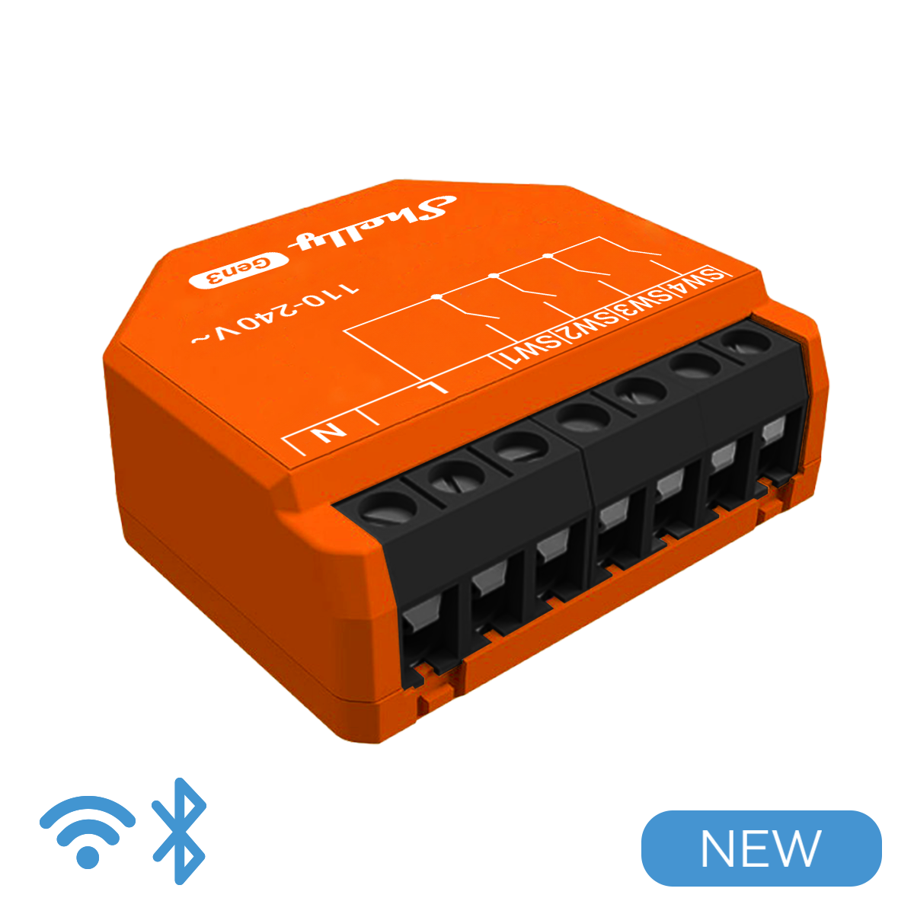

Generation 3 of Shelly Plus i4.

## GPIO Pinout

| Pin    | Function     |
| ------ | ------------ |
| ?      | LED          |
| GPI03  | NTC          |
| GPIO10 | Switch 1     |
| GPIO7  | Switch 2     |
| GPIO6  | Switch 3     |
| GPIO5  | Switch 4     |

## Programming Interface

same as for Shelly Plus i4

