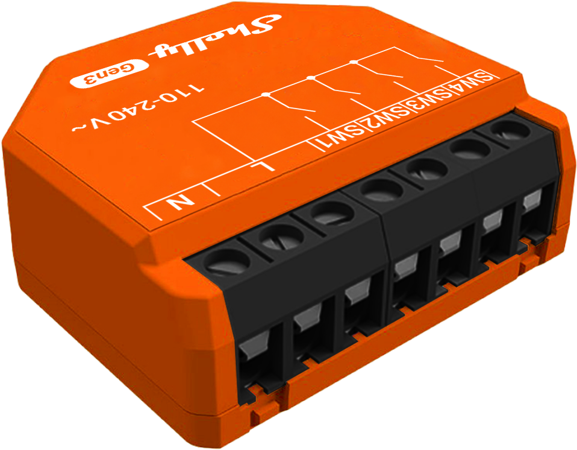
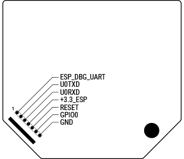

Generation 3 of Shelly Plus i4.



## GPIO Pinout

| Pin    | Function     |
| ------ | ------------ |
| ?      | LED          |
| GPI03  | NTC          |
| GPIO10 | Switch 1     |
| GPIO7  | Switch 2     |
| GPIO6  | Switch 3     |
| GPIO5  | Switch 4     |

## Programming Interface

same as for Shelly Plus i4



## Basic Configuration

```yaml
substitutions:
  device_name: "sehlly-i4-gen3"
  friendly_name : "Shelly i4 Gen3"

esphome:
  name: ${device_name}
  friendly_name: ${friendly_name}

esp32:
  board: esp32-c3-devkitm-1
  flash_size: 8MB
  framework:
    type: esp-idf
    version: recommended
    sdkconfig_options:
      COMPILER_OPTIMIZATION_SIZE: y
    advanced:
      ignore_efuse_mac_crc: false

wifi:
  ssid: !secret wifi_ssid
  password: !secret wifi_password
  ap:
    ssid: "$(device_name) Fallback Hotspot"
    password: !secret wifi_password

logger:

api:
  encryption:
    key: !secret api_encryption_key

ota:
  password: !secret ota_password

time:
  - platform: homeassistant

captive_portal:

sensor:
  - platform: ntc
    sensor: temp_resistance_reading
    name: "Temperature"
    unit_of_measurement: "°C"
    accuracy_decimals: 1
    icon: "mdi:thermometer"
    calibration:
      b_constant: 3350
      reference_resistance: 10kOhm
      reference_temperature: 298.15K
  - platform: resistance
    id: temp_resistance_reading
    sensor: temp_analog_reading
    configuration: DOWNSTREAM
    resistor: 10kOhm
  - platform: adc
    id: temp_analog_reading
    pin: GPIO3
    attenuation: 12db

binary_sensor:
  - platform: gpio
    name: "Switch 1"
    id: switch1
    pin: 10
    on_press:
      then:
        - logger.log: "Seitch 1 pressed"
    on_release:
      then:
        - logger.log: "Seitch 1 released"
    filters:
      - delayed_on_off: 50ms
  - platform: gpio
    name: "Switch 2"
    id: switch2
    pin: 7
    on_press:
      then:
        - logger.log: "Seitch 2 pressed"
    on_release:
      then:
        - logger.log: "Seitch 2 released"
    filters:
      - delayed_on_off: 50ms  
  - platform: gpio
    name: "Switch 3"
    id: switch3
    pin: 6
    on_press:
      then:
        - logger.log: "Seitch 3 pressed"
    on_release:
      then:
        - logger.log: "Seitch 3 released"
    filters:
      - delayed_on_off: 50ms  
  - platform: gpio
    name: "Switch 4"
    id: switch4
    pin: 5
    on_press:
      then:
        - logger.log: "Seitch 4 pressed"
    on_release:
      then:
        - logger.log: "Seitch 4 released"
    filters:
      - delayed_on_off: 50ms

status_led:
  pin:
    number: ?
    inverted: true
```
