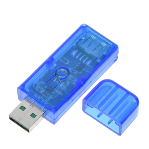
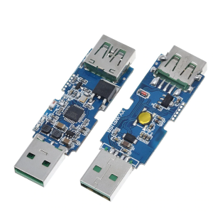
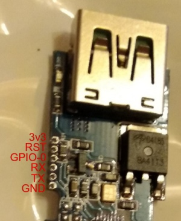

This device can be found on [Aliexpress](https://www.aliexpress.com/wholesale?SearchText=Sinilink+XY-WFUSB)
for about 5 USD.




## Flashing

The case can be pried open without too much difficulty. Be careful to keep both
halves as parallel as possible to not break the pins that hold them together.

Flashing must be done by connecting an FTDI adapter to the 1.27 mm pads close to the
USB female port. Here is the pinout:



The pads are small, so this is a bit tricky. I did it with some sewing pins stuck
into dupont wires. It could be done as well connecting alternating pins from either
side of the board.

GPIO0 has to be connected to GND to enter programming mode.

## GPIO Pinout

| Pin    | Function             | Note                                                               |
| ------ | -------------------- | ------------------------------------------------------------------ |
| GPIO00 | User (Pad GPIO-0)    | Pulled-up to HIGH, boot fails if pulled LOW                        |
| GPIO01 | User (Pad TX)        | HIGH at boot, spits debug output at boot, boot fails if pulled LOW |
| GPIO03 | User (Pad RX)        | HIGH at boot                                                       |
| GPIO04 | Toggle Button        | Pin input LOW when button is pressed                               |
| GPIO05 | Relay and Red LED    | USB socket power with LED is ON when pin output HIGH               |
| GPIO14 | Green LED            | LED is ON when pin output HIGH                                     |
| GPIO16 | Blue LED             | LED is ON when pin output HIGH                                     |

## Basic Config

The following configuration mimics [this Tasmota template string](https://templates.blakadder.com/sinilink_XY-WFUSB.html).

The green LED is turned on when the relay is off and vice versa. The blue LED
is used as the status LED. The button toggles the state of the relay.

I had to increase the `ap_timeout`, this board seems to take some time to connect to the WiFi.

```yaml
substitutions:
  devicename: usb_relay
  upper_devicename: "USB Relay"

esphome:
  name: $devicename
  platform: ESP8266
  board: esp01_1m

wifi:
  ...

  # Enable fallback hotspot (captive portal) in case wifi connection fails
  ap:
    ...
    ap_timeout: 3min

...

status_led:
  pin:
    number: GPIO16 # Blue LED

switch:
  # Relay
  - platform: gpio
    id: relay
    pin: GPIO5

  # Green LED
  - platform: gpio
    pin: GPIO14
    id: green_led
    inverted: true # start on

  # Switch template to link relay and green LED states
  # LED is on when relay is off
  - platform: template
    id: "${devicename}_relay"
    name: $upper_devicename
    lambda: |-
      if (id(relay).state) {
        return true;
      } else {
        return false;
      }
    turn_on_action:
        - switch.turn_on:
            id: green_led
        - switch.turn_on:
            id: relay
    turn_off_action:
        - switch.turn_off:
            id: green_led
        - switch.turn_off:
            id: relay

# Button
binary_sensor:
  - platform: gpio
    id: button
    pin:
      number: GPIO04
      mode: INPUT_PULLUP
      inverted: True
    on_press:
      - switch.toggle: "${devicename}_relay"
```

If the USB Relay controls a light, it can also be implemented like this:

```yaml
output:
  # Relay
  - platform: gpio
    id: relay
    pin: GPIO5

  # Green LED
  - platform: gpio
    pin: GPIO14
    id: green_led
    inverted: true # start on

  # Binary Output template to link relay and green LED states
  # LED is on when relay is off
  - platform: template
    type: binary
    id: "${devicename}_relay"
    write_action:
      if:
        condition:
          lambda: return state;
        then:
          - output.turn_on: relay
          - output.turn_on: green_led
        else:
          - output.turn_off: relay
          - output.turn_off: green_led

# Button
binary_sensor:
  - platform: gpio
    id: button
    pin:
      number: GPIO04
      mode: INPUT_PULLUP
      inverted: True
    on_press:
      light.toggle: $devicename

light:
  - platform: binary
    name: $upper_devicename
    id: $devicename
    output: "${devicename}_relay"
```

## Useful links

* [Tasmota page](https://templates.blakadder.com/sinilink_XY-WFUSB.html)
* [Andreas Spiess' review and guide](https://www.youtube.com/watch?v=lrHhn2AVzSA)
* [Scargill's Tech Blog](https://tech.scargill.net/aliexpress-sinilink-wifi-usb-controller/)
