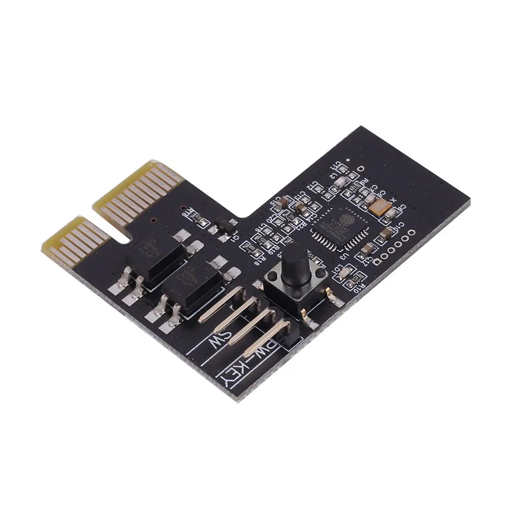
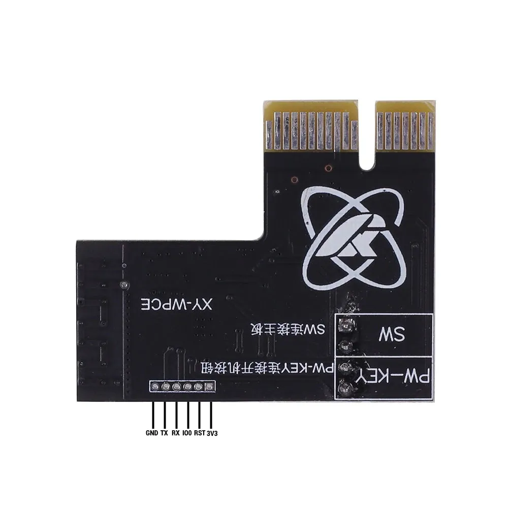

A simple remote control/monitor device for use with standard PCs.

Essentially a proxy between the power switch and motherboard.
Depending on the version, the module may also be wired between the power LED(s) to discern the power status (running/off/sleep) of the PC.

The `WPCE` version (this device) determines the power status via the normal/aux 3v3 rails on the PCI-Express slot so it does not feature the power led connections.



## Flashing

The module uses `1mm` pitch headers which are considerably smaller and fussier to deal with relative to the `2.54mm` pitch headers that are more common.
You don't _have_ to solder wires to program, though.
I was able to strip some **solid core** cat5 cables; the bare copper wire was _precisely_ the right size to fit inside of the hole.



| ESP32 Pin | USB Serial Pin | Comments                                                                                                                          |
| --------- | -------------- | --------------------------------------------------------------------------------------------------------------------------------- |
| 3V3       | 3V3            | Connect to dedicated 3V3 1A power supply if encountering brown out                                                                |
| RST       | 3V3            | ESP needs the RST/EN pin pulled UP to activate the chip                                                                           |
| IO0       | Ground         | IO0 must be pulled down to enable bootloader mode                                                                                 |
| RX        | TX             |                                                                                                                                   |
| TX        | RX             |                                                                                                                                   |
| GND       | Ground         | If using a dedicated power supply with the USB programmer, make sure that the GND for the programmer and power supply are linked! |

Connect all 6 pins as indicated and _then_ power up the device and _then_ plug in the USB programmer.
The module should immediately enter boot loader mode and should be "discoverable" with `esptool.py`.

While not strictly necessary, you may wish to backup the flash content before overwriting with ESPHome.

```shell
# Confirm that you can "see" the module
❯ esptool.py --port /dev/ttyUSB0 chip_id

# Double check the type/size of the flash chip
❯ esptool.py --port /dev/ttyUSB0 flash_id

# Read out the flash; in this case, the `flash_id` command indicated that the ESP had 2MB of built in flash memory
❯ esptool.py --port /dev/ttyUSB0 read_flash 0x000000 0x200000 flash_backup.bin
```

## GPIO Pinout

| Pin    | Function | Notes                                                                                       |
| ------ | -------- | ------------------------------------------------------------------------------------------- |
| GPIO2  | OUTPUT   | Status LED (inverted)                                                                       |
| GPIO4  | INPUT    | Button on module PCB, used by OEM firmware for WiFi config (inverted)                       |
| GPIO5  | OUTPUT   | Wired to PC motherboard, simulates pressing the power button                                |
| GPIO10 | INPUT    | Wired to the PC power button (inverted)                                                     |
| GPIO12 | INPUT    | Wired to the `3v3` power rail on PCI-Express slot to detect if PC is powered up. (inverted) |

## Basic Configuration

The configuration below covers just the basics for getting the various GPIO pins configured / usable in ESPHome.
Depending on your specific needs, more configuration will likely be needed.
E.G.: most motherboards will interpret the power button being pressed for 5+ seconds to mean "shutdown _now_". Exposing `GPIO5` to Home Assistant _directly_ as a gpio switch may result in the PC powering off a few seconds after it's powered on.

```yaml
substitutions:
  friendly_name: "My PC Power Control"
  friendly_name_short: "My PC"

  hostname: "my-pc-power-remote-control"

esphome:
  name: ${hostname}
  # Necessary to prevent relay trigger on ESP restart / wifi loss
  on_boot:
    then:
      - output.turn_off: out_relay

  # Shows up in UI
  comment: "Remote power button for ${friendly_name_short}."

esp8266:
  # Specifically a 'ESP8285H16' with 2MB built in flash
  # See: https://docs.platformio.org/en/stable/boards/espressif8266/esp8285.html
  board: esp8285

logger:
  level: INFO

script:
  - id: regular_press
    mode: single
    then:
      - output.turn_on: out_relay
      - delay: .5s
      - output.turn_off: out_relay

status_led:
  pin:
    number: GPIO02
    inverted: True

binary_sensor:
  - name: "${friendly_name_short} WiFi Config Button"
    platform: gpio
    pin:
      number: GPIO04
      mode: INPUT_PULLUP
      inverted: True

  - name: "${friendly_name_short} Power Status"
    platform: gpio
    id: inp_power_status
    pin:
      number: GPIO12
      mode: INPUT_PULLUP
      inverted: True

  - name: "${friendly_name_short} Case Button"
    platform: gpio
    pin:
      number: GPIO10
      mode: INPUT_PULLUP
      inverted: True

    # To accurately mimic the "button wired directly to motherboard" function, use on_press/on_release
    on_press:
      - output.turn_on: out_relay
    on_release:
      - output.turn_off: out_relay

    # To implement more sophisticated functionality like the "lock out" mode in the OEM firmware
    #   use on_click.
    ##
    on_click:
      then:
        - lambda: |-
            // Implement sophisticated logic here
            id(sw_pc_power).toggle();

switch:
  - name: "${friendly_name_short} Power"
    id: sw_pc_power
    platform: template
    lambda: |-
      if (id(inp_power_status).state) {
        return true;
      } else {
        return false;
      }

    # Mimic the user pressing the button
    turn_on_action:
      - script.execute: regular_press
    turn_off_action:
      - script.execute: regular_press

output:
  - platform: gpio
    id: out_relay
    pin: GPIO5
```
