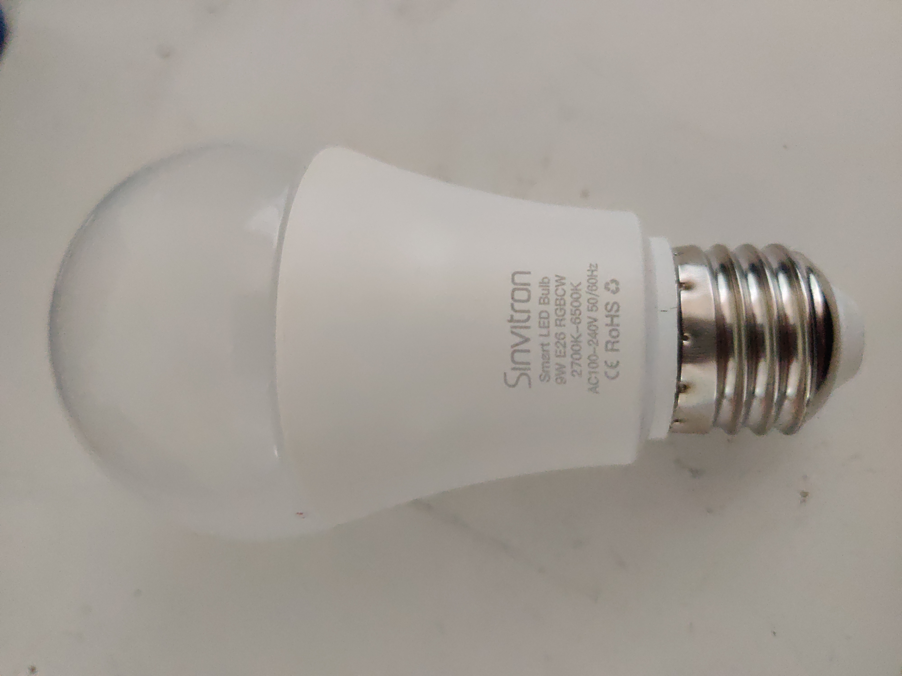
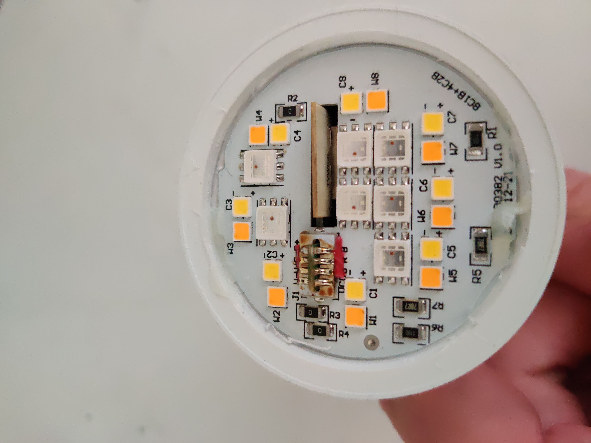

Standard RGB warm and cold white bulb. Flashable via tuya-convert.
[Purchased from Amazon, pack of 2.](https://amzn.to/3lVKCEp)

Generally don't power on both a white channel and the color channel at full brightness - this can overheat the bulb.

## Pictures




## GPIO Pinout

| Pin    | Function   |
| ------ | ---------- |
| GPIO4  | Red        |
| GPIO5  | Cold White |
| GPIO12 | Green      |
| GPIO13 | Warm White |
| GPIO14 | Blue       |

## Basic Configuration

```yaml
substitutions:
  device_name: sinvitron
  friendly_name: Sinvitron Bulb

esphome:
  name: ${device_name}

esp8266:
  board: esp01_1m

wifi:
  ssid: !secret wifi_ssid
  password: !secret wifi_password
  fast_connect: on #we only have one WiFi AP so just use the first one that matches
  ap: #since we listed an SSID above, this AP mode will only enable if no WiFi connection could be made
    ssid: ${friendly_name}_AP
    password: !secret wifi_password

# Enable logging
logger:
  baud_rate: 0 #disable UART logging since we aren't connected to GPIO1 TX

# Enable Home Assistant API
api:

# Enable OTA updates
ota:
  safe_mode: True

# Enable web server
web_server:
  port: 80

output:
  - platform: esp8266_pwm
    id: red
    pin: GPIO4
    inverted: False
  - platform: esp8266_pwm
    id: green
    pin: GPIO12
    inverted: False
  - platform: esp8266_pwm
    id: blue
    pin: GPIO14
    inverted: False
  - platform: esp8266_pwm
    id: cold_white
    pin: GPIO5
    inverted: False
  - platform: esp8266_pwm
    id: warm_white
    pin: GPIO13
    inverted: False

light:
  - platform: rgbww
    name: ${friendly_name}
    red: red
    green: green
    blue: blue
    cold_white: cold_white
    warm_white: warm_white
    cold_white_color_temperature: 6500 K
    warm_white_color_temperature: 2700 K
    id: thelight
    restore_mode: ALWAYS_ON #Start with light on after reboot/power-loss event, so that it works from a dumb lightswitch
    effects:
      - random:
      - strobe:
      - flicker:
          alpha: 50% #The percentage that the last color value should affect the light. More or less the “forget-factor” of an exponential moving average. Defaults to 95%.
          intensity: 50% #The intensity of the flickering, basically the maximum amplitude of the random offsets. Defaults to 1.5%.
      - lambda:
          name: Color Cycle
          update_interval: 11s
          lambda: |-
            static int state = 0;
            auto call = id(thelight).turn_on();
            call.set_transition_length(10000);
            if (state == 0) {
              call.set_rgb(1.0, 0.0, 0.0); // red
            } else if (state == 1) {
              call.set_rgb(1.0, 0.5, 0.0); // orange
            } else if (state == 2) {
              call.set_rgb(1.0, 0.86, 0.0); // yellow
            } else if (state == 3) {
              call.set_rgb(0.75, 1.0, 0.0); // chartreuse
            } else if (state == 4) {
              call.set_rgb(0.0, 1.0, 0.0); // green
            } else if (state == 5) {
              call.set_rgb(0.0, 1.0, 0.5); // spring green
            } else if (state == 6) {
              call.set_rgb(0.0, 1.0, 1.0); // cyan
            } else if (state == 7) {
              call.set_rgb(0.0, 0.5, 1.0); // azure
            } else if (state == 8) {
              call.set_rgb(0.0, 0.0, 1.0); // blue
            } else if (state == 9) {
              call.set_rgb(0.5, 0.0, 1.0); // violet
            } else if (state == 10) {
              call.set_rgb(1.0, 0.0, 1.0); // magenta
            } else if (state == 11) {
              call.set_rgb(1.0, 0.0, 0.5); // rose
            }
            call.perform();
            state++;
            if (state == 12)
              state = 0;
```

## Split Configuration

If you have multiple of these bulbs (likely since they come in packs), you may want to keep the shared code in one file
and only put device specific information in files for each relay.

sinvitron-common.yaml:

```yaml
esphome:
  name: ${device_name}

esp8266:
  board: esp01_1m

wifi:
  ssid: !secret wifi_ssid
  password: !secret wifi_password
  fast_connect: on #we only have one WiFi AP so just use the first one that matches
  ap: #since we listed an SSID above, this AP mode will only enable if no WiFi connection could be made
    ssid: ${friendly_name}_AP
    password: !secret wifi_password

# Enable logging
logger:
  baud_rate: 0 #disable UART logging since we aren't connected to GPIO1 TX

# Enable Home Assistant API
api:

# Enable OTA updates
ota:
  safe_mode: True

# Enable web server
web_server:
  port: 80

output:
  - platform: esp8266_pwm
    id: red
    pin: GPIO4
    inverted: False
  - platform: esp8266_pwm
    id: green
    pin: GPIO12
    inverted: False
  - platform: esp8266_pwm
    id: blue
    pin: GPIO14
    inverted: False
  - platform: esp8266_pwm
    id: cold_white
    pin: GPIO5
    inverted: False
  - platform: esp8266_pwm
    id: warm_white
    pin: GPIO13
    inverted: False

light:
  - platform: rgbww
    name: ${friendly_name}
    red: red
    green: green
    blue: blue
    cold_white: cold_white
    warm_white: warm_white
    cold_white_color_temperature: 6500 K
    warm_white_color_temperature: 2700 K
    id: thelight
    restore_mode: ALWAYS_ON #Start with light on after reboot/power-loss event, so that it works from a dumb lightswitch
    effects:
      - random:
      - strobe:
      - flicker:
          alpha: 50% #The percentage that the last color value should affect the light. More or less the “forget-factor” of an exponential moving average. Defaults to 95%.
          intensity: 50% #The intensity of the flickering, basically the maximum amplitude of the random offsets. Defaults to 1.5%.
      - lambda:
          name: Color Cycle
          update_interval: 11s
          lambda: |-
            static int state = 0;
            auto call = id(thelight).turn_on();
            call.set_transition_length(10000);
            if (state == 0) {
              call.set_rgb(1.0, 0.0, 0.0); // red
            } else if (state == 1) {
              call.set_rgb(1.0, 0.5, 0.0); // orange
            } else if (state == 2) {
              call.set_rgb(1.0, 0.86, 0.0); // yellow
            } else if (state == 3) {
              call.set_rgb(0.75, 1.0, 0.0); // chartreuse
            } else if (state == 4) {
              call.set_rgb(0.0, 1.0, 0.0); // green
            } else if (state == 5) {
              call.set_rgb(0.0, 1.0, 0.5); // spring green
            } else if (state == 6) {
              call.set_rgb(0.0, 1.0, 1.0); // cyan
            } else if (state == 7) {
              call.set_rgb(0.0, 0.5, 1.0); // azure
            } else if (state == 8) {
              call.set_rgb(0.0, 0.0, 1.0); // blue
            } else if (state == 9) {
              call.set_rgb(0.5, 0.0, 1.0); // violet
            } else if (state == 10) {
              call.set_rgb(1.0, 0.0, 1.0); // magenta
            } else if (state == 11) {
              call.set_rgb(1.0, 0.0, 0.5); // rose
            }
            call.perform();
            state++;
            if (state == 12)
              state = 0;
```

And for each device's yaml:

```yaml
substitutions:
  device_name: sinvitron
  friendly_name: Sinvitron Bulb

<<: !include sinvitron-common.yaml
```
