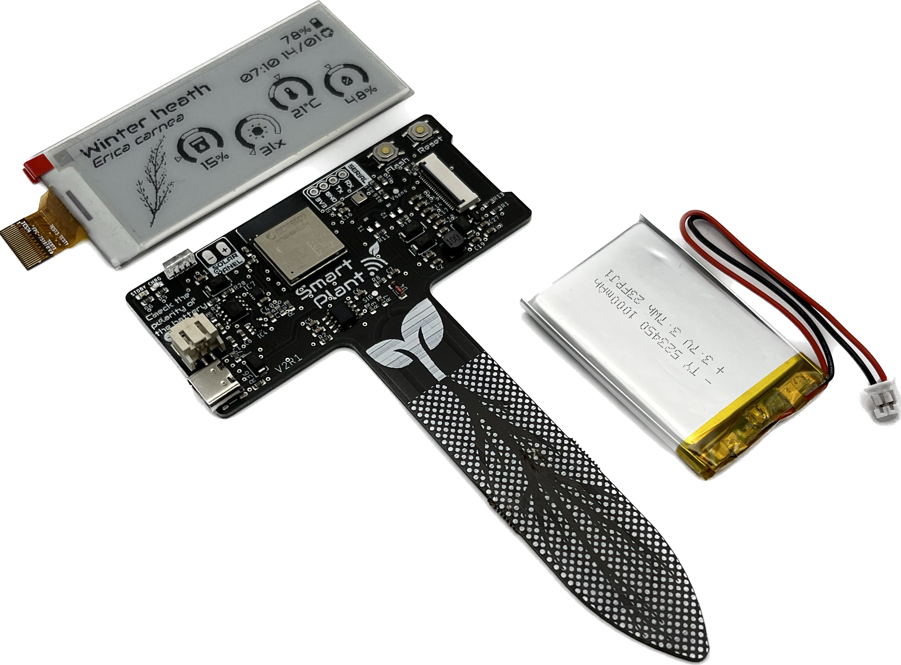

## Pinout

ESP32-S2    | Sensor        | e-Paper  | Other
------------|---------------|----------|----------
GPIO 00     |Flash button   |          |
GPIO 01     |Soil moisture  |          |
GPIO 02     |Battery volts  |          |
GPIO 03     |Solar charge   |          |
GPIO 04     |               |          |Sensor powering
GPIO 10     |               |CS        |
GPIO 11     |               |MOSI      |
GPIO 12     |               |CLK       |
GPIO 13     |               |DC/MISO   |
GPIO 14     |               |BUSY      |
GPIO 15     |               |RST       |
GPIO 33     |SDA            |          |
GPIO 34     |SCL            |          |

## Basic Configuration

```yaml
substitutions:
  device_name: "smart-plant"
  friendly_name: "Smart Plant"
  project_name: "smart.plant"
  project_version: "2.2"
  ap_pwd: "smartplant"

esphome:
  name: "${device_name}"
  name_add_mac_suffix: true
  project:
    name: "${project_name}"
    version: "${project_version}"
  # Initialize the IIC bus immediatelly after the powering the sensors
  on_boot:
    priority: 600
    then:
     - lambda: |-
        Wire.begin();
        delay(100);

     - script.execute: consider_deep_sleep


esp32:
  board: esp32-s2-saola-1
  framework:
    type: arduino
    
# OTA flashing
ota:
  - platform: esphome

wifi: # Your Wifi network details
  
# Enable fallback hotspot in case wifi connection fails  
  ap:

# Enabling the logging component
logger:

# Enable Home Assistant API
api:

# Enable the captive portal
captive_portal:

#Public location of this yaml file
dashboard_import:
  package_import_url: github://JGAguado/Smart_Plant/docs/source/files/configuration.yaml@V2R1
  import_full_config: false

improv_serial:

i2c:
  scl: GPIO34
  sda: GPIO33
  scan: false
  id: bus_a

spi:
  clk_pin:  GPIO12
  mosi_pin: GPIO11

image:
  - file: "https://smart-plant.readthedocs.io/en/v2r1/_images/Lemon_tree_label_page_1.png"
    id: page_1_background

font:
  - file: "gfonts://Audiowide"
    id: font_title
    size: 20
  - file: "gfonts://Audiowide"
    id: font_subtitle
    size: 15
  - file: "gfonts://Audiowide"
    id: font_parameters
    size: 15
  - file: 'gfonts://Material+Symbols+Outlined'
    id: font_icon
    size: 20
    glyphs:
      - "\U0000ebdc" # battery empty
      - "\U0000ebd9" # battery 1 bar
      - "\U0000ebe0" # battery 2 bar
      - "\U0000ebdd" # battery 3 bar
      - "\U0000ebe2" # battery 4 bar
      - "\U0000ebd4" # battery 5 bar
      - "\U0000e1a4" # battery full
      - "\U0000e627" # sync

time:
  - platform: homeassistant
    id: esptime

switch:
  - platform: gpio
    pin: GPIO4
    id: exc
    name: "Excitation switch"
    icon: "mdi:power"
    restore_mode: ALWAYS_ON


sensor:
  # Battery level sensor
  - platform: adc
    name: "Battery Voltage"
    id: batvolt
    pin: GPIO2
    accuracy_decimals: 2
    update_interval: 1s
    unit_of_measurement: "V"
    attenuation: 12db
    icon: mdi:battery-medium
    filters:
      - multiply: 2.15
      - median:
          window_size: 7
          send_every: 7
          send_first_at: 7
    on_value:
      then:
        - component.update: batpercent

  - platform: template
    name: "Battery %"
    id: batpercent
    lambda: return id(batvolt).state;
    accuracy_decimals: 0
    unit_of_measurement: "%"
    icon: mdi:battery-medium
    filters:
      - calibrate_linear:
         method: exact
         datapoints:
          - 0.00 -> 0.0
          - 3.30 -> 1.0
          - 3.39 -> 10.0
          - 3.75 -> 50.0
          - 4.11 -> 90.0
          - 4.20 -> 100.0
      - lambda: |-
          if (x <= 100) {
            return x;
          } else {
            return 100;
          }
          if (x <0) {
            return 0;
          }

  # Temperature and humidity sensor
  - platform: aht10
    variant: AHT20
    i2c_id: bus_a
    temperature:
      name: "Temperature"
      id: temp
      icon: "mdi:thermometer"
    humidity:
      name: "Air Humidity"
      id: hum
      icon: "mdi:water-percent"
    update_interval: 3s

  # Light sensor
  - platform: veml7700
    address: 0x10
    update_interval: 1s
    ambient_light:
      name: "Ambient light"
      id: light
      icon: "mdi:white-balance-sunny"
    actual_gain:
      name: "Actual gain"

  # Capacitive soil moisture sensor
  - platform: adc
    pin: GPIO1
    name: "Soil Moisture"
    id : soil
    icon: "mdi:cup-water"
    update_interval: 1s
    unit_of_measurement: "%"
    attenuation: 12db
    filters:
    - median:
        window_size: 5
        send_every: 5

    - calibrate_linear:
        - 1.25 -> 100.00
        - 2.8 -> 0.00
    - lambda: if (x < 1) return 0; else if (x > 100) return 100; return (x);
    accuracy_decimals: 0

display:
  - platform: waveshare_epaper
    cs_pin: GPIO10
    dc_pin: GPIO13
    busy_pin: GPIO14
    reset_pin: GPIO15
    rotation: 270
    model: 2.90inv2
    id: my_display
    update_interval: never
    full_update_every: 1
    pages:
      - id: page1
        lambda: |-
          #define H_LEFT_MARGIN 4
          #define H_RIGHT_MARGIN 280
          #define H_CENTER 128
          #define V_WEATHER 0
          #define V_CLOCK 1
          #define V_WIFI 30
          #define V_VOLTAGE 60
          #define V_BATTERY  90

          it.image(0, 0, id(page_1_background));

          // // Battery
          float battery_perc = id(batpercent).state;
          int battery_range = battery_perc / 16 ;
          battery_range = (battery_range > 6) ? 6 : battery_range;
          battery_range = (battery_range < 0)  ?  0 : battery_range;

          const char* battery_icon_map[] = {
            "\U0000ebdc", // battery empty
            "\U0000ebd9", // battery 1 bar
            "\U0000ebe0", // battery 2 bar
            "\U0000ebdd", // battery 3 bar
            "\U0000ebe2", // battery 4 bar
            "\U0000ebd4", // battery 5 bar
            "\U0000e1a4"  // battery full
          };

          it.printf(278, 1, id(font_icon), TextAlign::TOP_LEFT, battery_icon_map[battery_range]);
          it.printf(278, 1, id(font_subtitle), TextAlign::TOP_RIGHT,
          "%3.0f%%", battery_perc);

          // Date
          it.strftime(278, 18, id(font_subtitle), TextAlign::TOP_RIGHT,
          "%H:%M %d/%m", id(esptime).now());
          it.printf(278, 18, id(font_icon), TextAlign::TOP_LEFT, "\U0000e627");  


          // Parameters
          // Drawing the marker over the gauge
          float pi = 3.141592653589793;
          float alpha = 4.71238898038469; // Defined as the gauge angle in radians (270deg)
          float beta = 2*pi - alpha;
          int radius = 22;              // Radius of the gauge in pixels
          int thick = 7;                // Size of the marker

          // *** Moisture ***
          int min_range = 0;
          int max_range = 100;
          int xc = 80;
          int yc = 50;

          float measured = id(soil).state;

          if (measured < min_range) {
            measured = min_range;
          }
          if (measured > max_range) {
            measured = max_range;
          }

          float val = (measured - min_range) / abs(max_range - min_range) * alpha;

          int x0 = static_cast<int>(xc + radius + radius * cos(pi / 2 + beta / 2 + val));
          int y0 = static_cast<int>(yc + radius + radius * sin(pi / 2 + beta / 2 + val));
          int x1 = static_cast<int>(xc + radius + (radius+thick) * cos(pi / 2 + beta / 2 + val + 0.1));
          int y1 = static_cast<int>(yc + radius + (radius+thick) * sin(pi / 2 + beta / 2 + val + 0.1));
          int x2 = static_cast<int>(xc + radius + (radius+thick) * cos(pi / 2 + beta / 2 + val - 0.1));
          int y2 = static_cast<int>(yc + radius + (radius+thick) * sin(pi / 2 + beta / 2 + val - 0.1));
          it.line(x0, y0, x1, y1);
          it.line(x1, y1, x2, y2);
          it.line(x2, y2, x0, y0);

          it.printf(xc + radius, yc + 1.7*radius, id(font_parameters), TextAlign::TOP_CENTER,
          "%.0f%%", id(soil).state);

          // *** Light ***
          min_range = 0;
          max_range = 3775;
          xc = 134;
          yc = 70;

          measured = id(light).state;

          if (measured < min_range) {
            measured = min_range;
          }
          if (measured > max_range) {
            measured = max_range;
          }

          val = (measured - min_range) / abs(max_range - min_range) * alpha;
          x0 = static_cast<int>(xc + radius + radius * cos(pi / 2 + beta / 2 + val));
          y0 = static_cast<int>(yc + radius + radius * sin(pi / 2 + beta / 2 + val));
          x1 = static_cast<int>(xc + radius + (radius+thick) * cos(pi / 2 + beta / 2 + val + 0.1));
          y1 = static_cast<int>(yc + radius + (radius+thick) * sin(pi / 2 + beta / 2 + val + 0.1));
          x2 = static_cast<int>(xc + radius + (radius+thick) * cos(pi / 2 + beta / 2 + val - 0.1));
          y2 = static_cast<int>(yc + radius + (radius+thick) * sin(pi / 2 + beta / 2 + val - 0.1));
          it.line(x0, y0, x1, y1);
          it.line(x1, y1, x2, y2);
          it.line(x2, y2, x0, y0);

          it.printf(xc + radius, yc + 1.7*radius, id(font_parameters), TextAlign::TOP_CENTER,
          "%.0flx", id(light).state);  


          // *** Temperature ***
          min_range = -10;
          max_range = 50;
          xc = 188;
          yc = 50;

          measured = id(temp).state;

          if (measured < min_range) {
            measured = min_range;
          }
          if (measured > max_range) {
            measured = max_range;
          }

          val = (measured - min_range) / abs(max_range - min_range) * alpha;
          x0 = static_cast<int>(xc + radius + radius * cos(pi / 2 + beta / 2 + val));
          y0 = static_cast<int>(yc + radius + radius * sin(pi / 2 + beta / 2 + val));
          x1 = static_cast<int>(xc + radius + (radius+thick) * cos(pi / 2 + beta / 2 + val + 0.1));
          y1 = static_cast<int>(yc + radius + (radius+thick) * sin(pi / 2 + beta / 2 + val + 0.1));
          x2 = static_cast<int>(xc + radius + (radius+thick) * cos(pi / 2 + beta / 2 + val - 0.1));
          y2 = static_cast<int>(yc + radius + (radius+thick) * sin(pi / 2 + beta / 2 + val - 0.1));
          it.line(x0, y0, x1, y1);
          it.line(x1, y1, x2, y2);
          it.line(x2, y2, x0, y0);

          it.printf(xc + radius, yc + 1.7*radius, id(font_parameters), TextAlign::TOP_CENTER,
          "%.0f°C", id(temp).state);


          // *** Humidity ***
          min_range = 20;
          max_range = 80;
          xc = 242;
          yc = 70;

          measured = id(hum).state;

          if (measured < min_range) {
            measured = min_range;
          }
          if (measured > max_range) {
            measured = max_range;
          }

          val = (measured - min_range) / abs(max_range - min_range) * alpha;
          x0 = static_cast<int>(xc + radius + radius * cos(pi / 2 + beta / 2 + val));
          y0 = static_cast<int>(yc + radius + radius * sin(pi / 2 + beta / 2 + val));
          x1 = static_cast<int>(xc + radius + (radius+thick) * cos(pi / 2 + beta / 2 + val + 0.1));
          y1 = static_cast<int>(yc + radius + (radius+thick) * sin(pi / 2 + beta / 2 + val + 0.1));
          x2 = static_cast<int>(xc + radius + (radius+thick) * cos(pi / 2 + beta / 2 + val - 0.1));
          y2 = static_cast<int>(yc + radius + (radius+thick) * sin(pi / 2 + beta / 2 + val - 0.1));
          it.line(x0, y0, x1, y1);
          it.line(x1, y1, x2, y2);
          it.line(x2, y2, x0, y0);

          it.printf(xc + radius, yc + 1.7*radius, id(font_parameters), TextAlign::TOP_CENTER,
          "%.0f%%", id(hum).state);

deep_sleep:
  id: deep_sleep_control
  # run_duration: 5s
  sleep_duration: 1h

script:
  - id: consider_deep_sleep
    mode: queued
    then:
      - delay: 5s
      - component.update: my_display
      - delay: 5s
      - if:
          condition:
            sensor.in_range:
              id: batpercent
              above: 95
          then:
            - deep_sleep.prevent: deep_sleep_control
          else:
            - deep_sleep.enter: deep_sleep_control

      - delay: 25s
      - script.execute: consider_deep_sleep
```
