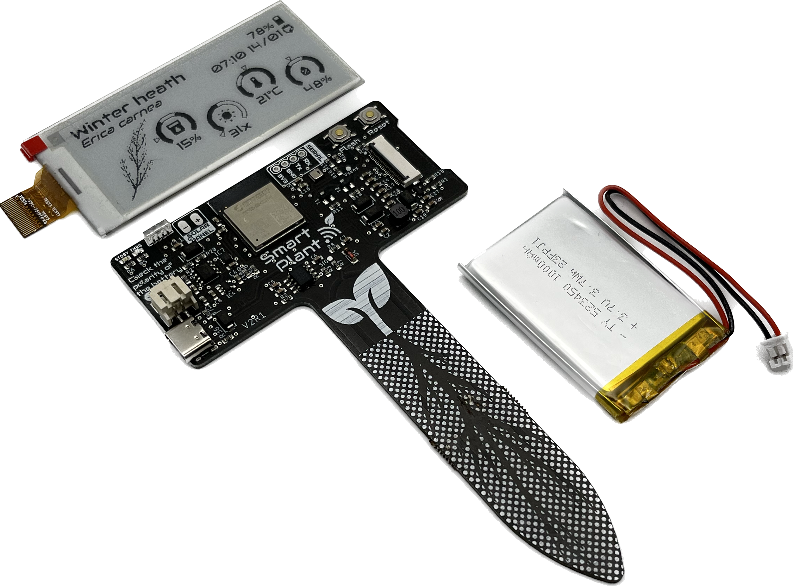

## Pinout

| ESP32-S2 | Sensor        | e-Paper | Other           |
| -------- | ------------- | ------- | --------------- |
| GPIO 00  | Flash button  |         |                 |
| GPIO 01  | Soil moisture |         |                 |
| GPIO 02  | Battery volts |         |                 |
| GPIO 03  | Solar charge  |         |                 |
| GPIO 04  |               |         | Sensor powering |
| GPIO 10  |               | CS      |                 |
| GPIO 11  |               | MOSI    |                 |
| GPIO 12  |               | CLK     |                 |
| GPIO 13  |               | DC/MISO |                 |
| GPIO 14  |               | BUSY    |                 |
| GPIO 15  |               | RST     |                 |
| GPIO 33  | SDA           |         |                 |
| GPIO 34  | SCL           |         |                 |

## Configuration

```yaml url=https://github.com/JGAguado/Smart_Plant/blob/V2R1/docs/source/files/configuration.yaml
```
