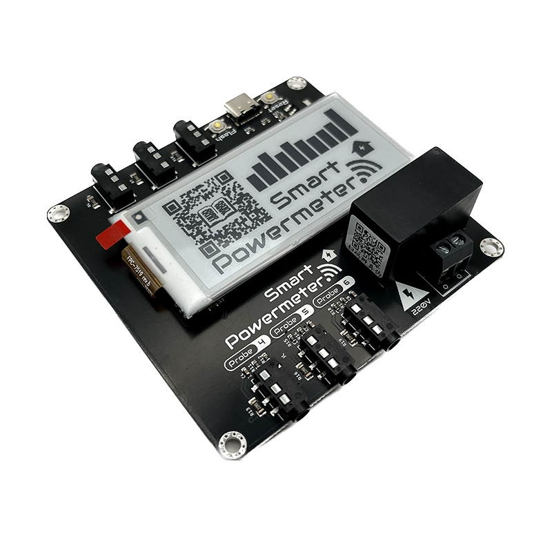

## Pinout

ESP32-S2    | CT-Clamps  | e-Paper  | Component
------------|------------|----------|----------
GPIO 01     |Probe 1     |          |
GPIO 02     |Probe 2     |          |
GPIO 03     |Probe 3     |          |
GPIO 04     |Probe 4     |          |
GPIO 05     |Probe 5     |          |
GPIO 06     |Probe 6     |          |
GPIO 08     |            |          |LED
GPIO 10     |            |CS        |
GPIO 11     |            |MOSI      |
GPIO 12     |            |CLK       |
GPIO 13     |            |DC/MISO   |
GPIO 14     |            |BUSY      |
GPIO 15     |            |RST       |
GPIO 33     |            |          |SDA
GPIO 34     |            |          |SCL

## Basic Configuration

```yaml
substitutions:
  device_name: "smart-powermeter"
  friendly_name: "Smart Powermeter"
  project_name: "smart.powermeter"
  project_version: "2.0"
  ap_ssid: "Smart-Powermeter"
  ap_pwd: "smartpowermeter"

esphome:
  name: "${device_name}"
  name_add_mac_suffix: true
  project:
    name: "${project_name}"
    version: "${project_version}"

esp32:
  board: esp32-s2-saola-1
  framework:
    type: arduino

# Enable logging
logger:

# Enable Home Assistant API
api:

# Enable Over The Air updates
ota:

#Public location of this yaml file
dashboard_import:
  package_import_url: github://JGAguado/Smart_Powermeter/docs/source/files/configuration.yaml@V2R1
  import_full_config: true

# Enable fallback hotspot (captive portal) in case wifi connection fails
captive_portal:

improv_serial:

wifi:
  ssid: !secret wifi_ssid
  password: !secret wifi_password
  ap:
    ssid: "${ap_ssid}"
    password: "${ap_pwd}"

sensor:
  - platform: adc
    pin: GPIO1
    id: Input_1
    attenuation: 12db
    update_interval: 1s

  - platform: adc
    pin: GPIO2
    id: Input_2
    attenuation: 12db
    update_interval: 1s

  - platform: adc
    pin: GPIO3
    id: Input_3
    attenuation: 12db
    update_interval: 1s

  - platform: adc
    pin: GPIO4
    id: Input_4
    attenuation: 12db
    update_interval: 1s

  - platform: adc
    pin: GPIO5
    id: Input_5
    attenuation: 12db
    update_interval: 1s

  - platform: adc
    pin: GPIO6
    id: Input_6
    attenuation: 12db
    update_interval: 1s

  - platform: ct_clamp
    sensor: Input_1
    id: Probe_1
    name: "Probe 1"
    sample_duration: 200ms
    update_interval: 1s
    filters:
      - calibrate_linear:
          - 0 -> 0
          - 0.022 -> 0.66

  - platform: ct_clamp
    sensor: Input_2
    name: "Probe 2"
    id: Probe_2
    sample_duration: 200ms
    update_interval: 1s
    filters:
      - calibrate_linear:
          - 0 -> 0
          - 0.022 -> 0.66

  - platform: ct_clamp
    sensor: Input_3
    name: "Probe 3"
    id: Probe_3
    sample_duration: 200ms
    update_interval: 1s
    filters:
      - calibrate_linear:
          - 0 -> 0
          - 0.022 -> 0.66

  - platform: ct_clamp
    sensor: Input_4
    name: "Probe 4"
    id: Probe_4
    sample_duration: 200ms
    update_interval: 1s
    filters:
      - calibrate_linear:
          - 0 -> 0
          - 0.022 -> 0.66

  - platform: ct_clamp
    sensor: Input_5
    name: "Probe 5"
    id: Probe_5
    sample_duration: 200ms
    update_interval: 1s
    filters:
      - calibrate_linear:
          - 0 -> 0
          - 0.022 -> 0.66

  - platform: ct_clamp
    sensor: Input_6
    name: "Probe 6"
    id: Probe_6
    sample_duration: 200ms
    update_interval: 1s
    filters:
      - calibrate_linear:
          - 0 -> 0
          - 0.022 -> 0.66

  - platform: total_daily_energy
    name: "Total Daily Power"
    power_id: current_power
    id: daily_power

  - platform: template
    id: current_power
    name: "Measured Power"
    lambda: return (id(Probe_1).state + id(Probe_2).state + id(Probe_3).state) * 230.0 / 1000; #Power = Current * Voltage
    unit_of_measurement: 'kW'
    update_interval: 5s

spi:
  clk_pin: GPIO12
  mosi_pin: GPIO11  # Works on the e-paper

display:
  - platform: waveshare_epaper
    cs_pin: GPIO10
    dc_pin: GPIO13
    busy_pin: GPIO14
    reset_pin: GPIO15
    model: 2.90inv2
    rotation: 270
    update_interval: 1min
    full_update_every: 1
```
