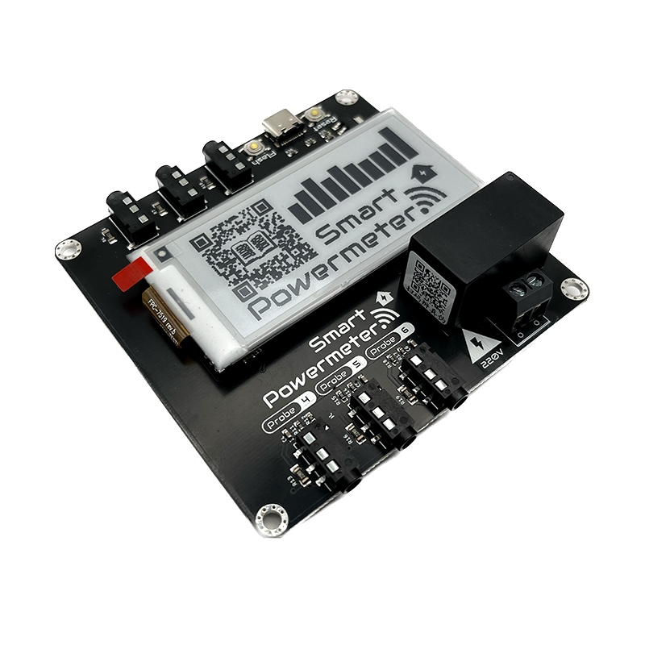

## Pinout

| ESP32-S2    | CT-Clamps  | e-Paper  | Component |
|-------------|------------|----------|-----------|
| GPIO 01     | Probe 1    |          |           |
| GPIO 02     | Probe 2    |          |           |
| GPIO 03     | Probe 3    |          |           |
| GPIO 04     | Probe 4    |          |           |
| GPIO 05     | Probe 5    |          |           |
| GPIO 06     | Probe 6    |          |           |
| GPIO 08     |            |          | LED       |
| GPIO 10     |            | CS       |           |
| GPIO 11     |            | MOSI     |           |
| GPIO 12     |            | CLK      |           |
| GPIO 13     |            | DC/MISO  |           |
| GPIO 14     |            | BUSY     |           |
| GPIO 15     |            | RST      |           |
| GPIO 33     |            |          | SDA       |
| GPIO 34     |            |          | SCL       |

## Configuration

```yaml url=https://github.com/JGAguado/Smart_Powermeter/blob/V2R1/docs/source/files/configuration.yaml
```
