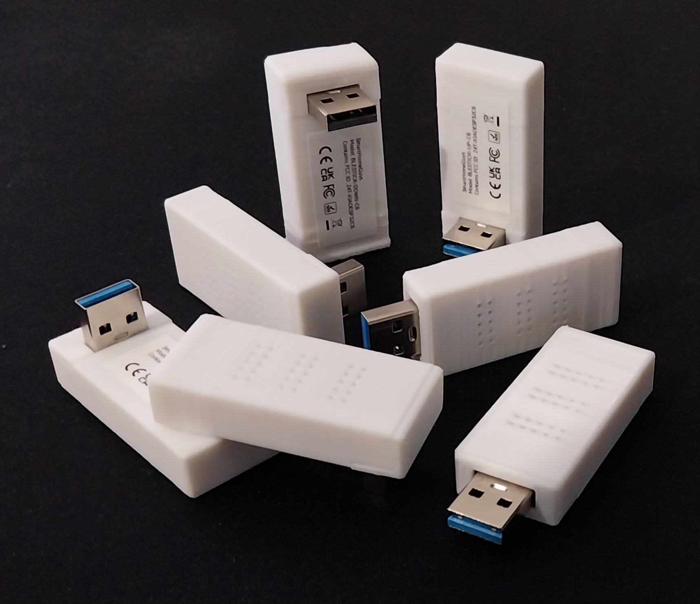
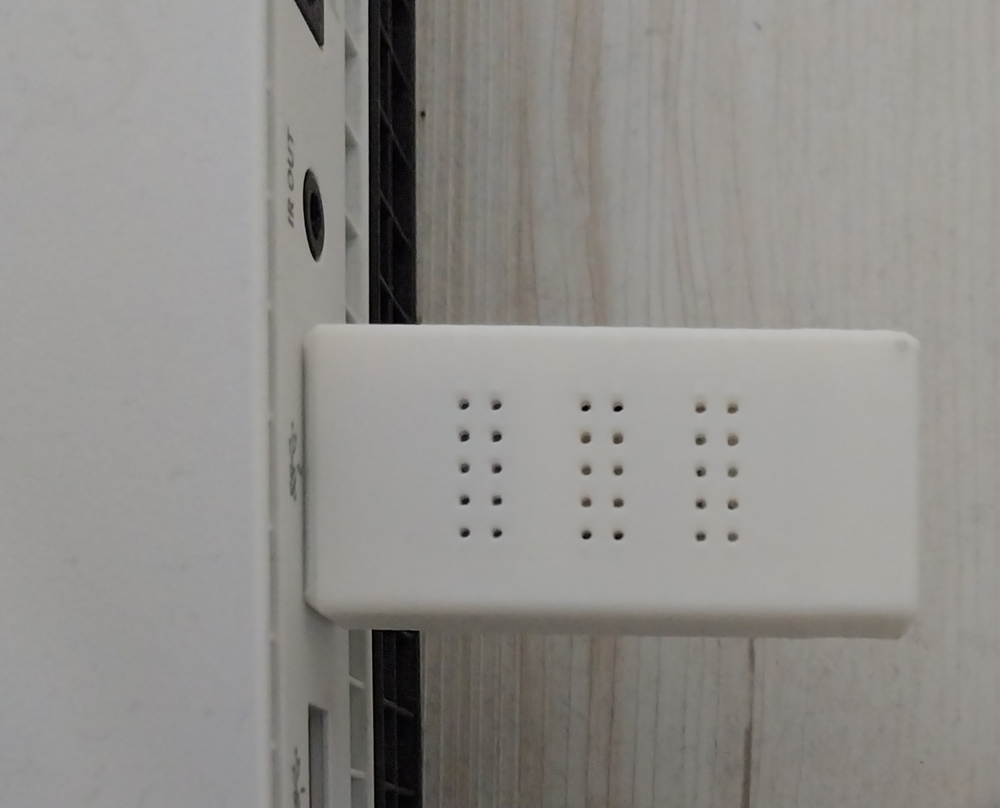
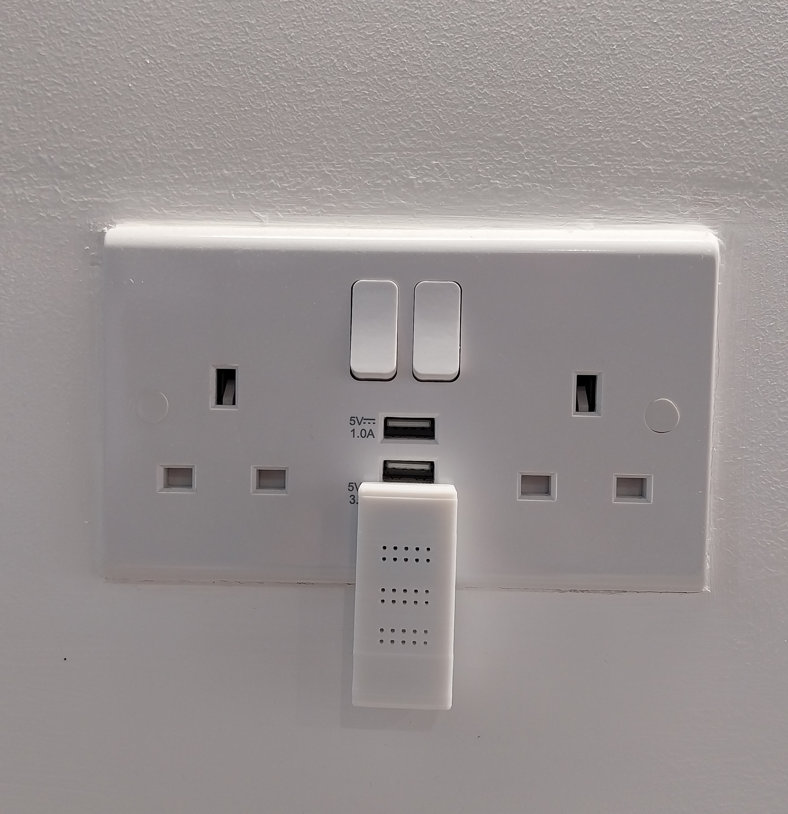

## Description

This compact Bluetooth (BLE) Proxy is designed for Home Assistant and plugs directly into any USB port - no cables required. 
It’s a simple, tidy way to extend Bluetooth coverage around your home.

The right‑angle versions are especially useful for wall sockets with USB-A ports, keeping the device against the wall instead of sticking outward.

We designed these to look good, be as small as possible and blend in with your home.

## Support

- [Shop](https://www.ebay.co.uk/itm/227206771185)
- [Official Documentation](https://smarthomeguys.github.io/Bluetooth-Proxy/)
- [GitHub](https://github.com/SmartHomeGuys/Bluetooth-Proxy)
