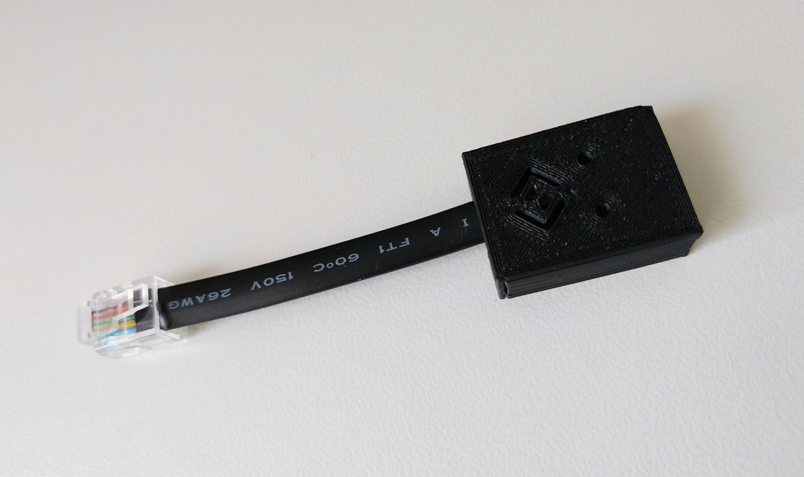
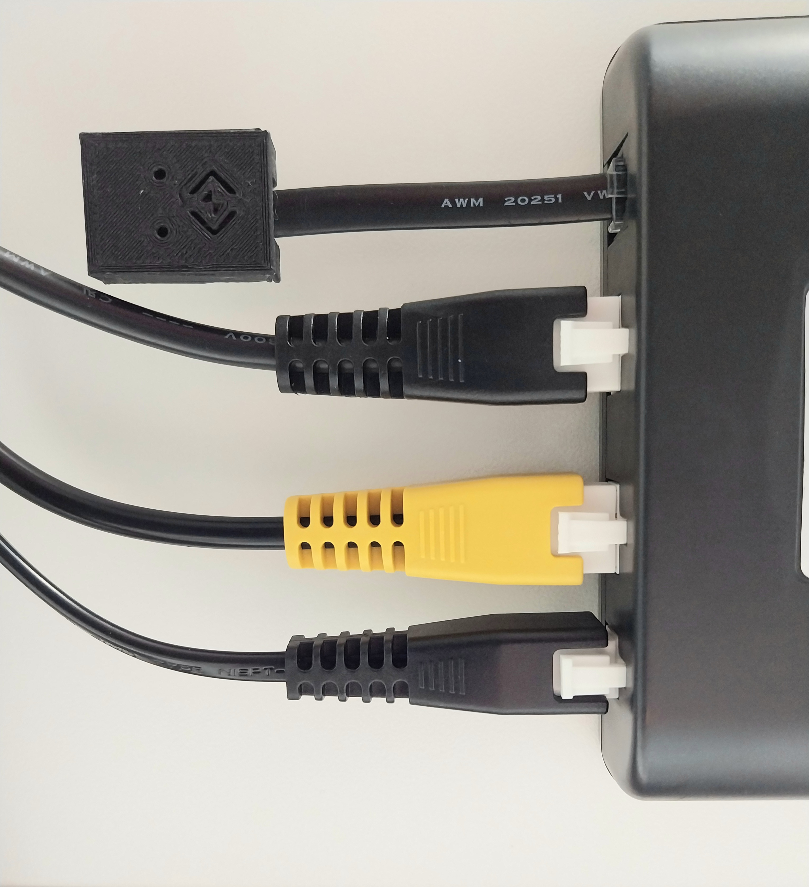
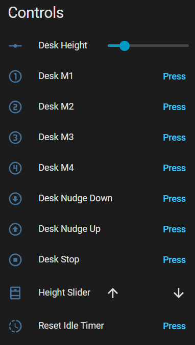
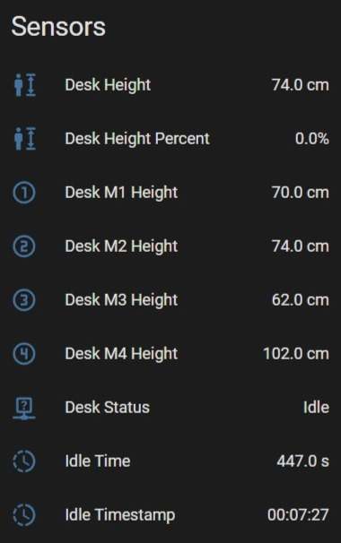

## Description
If your standing desk controller has an RJ11 / RJ12 port use the DeskUp Pro to integrate your desk with your smart home automation system to control your standing desk from your phone, dashboards, automations or voice.

DeskUp Pro has full integration with Home Assistant but any smart home hub that can send a Rest Api request is also supported using its Api.

All the existing functionality of the desk's controller is retained. 

  
  
  
  

## Support

- [Shop](https://www.ebay.co.uk/itm/226942026649)
- [Official Documentation](https://smarthomeguys.github.io/DeskUp-Pro-Controller-RJ12/)
- [GitHub](https://github.com/SmartHomeGuys/DeskUp-Pro-Controller-RJ12)
