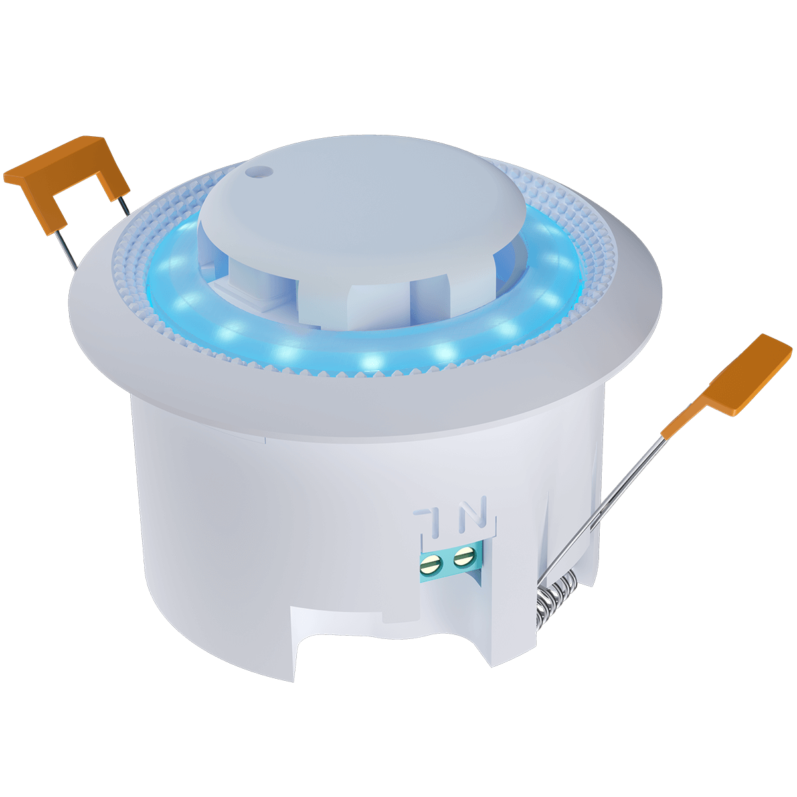
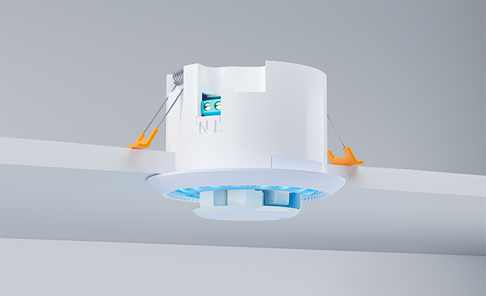
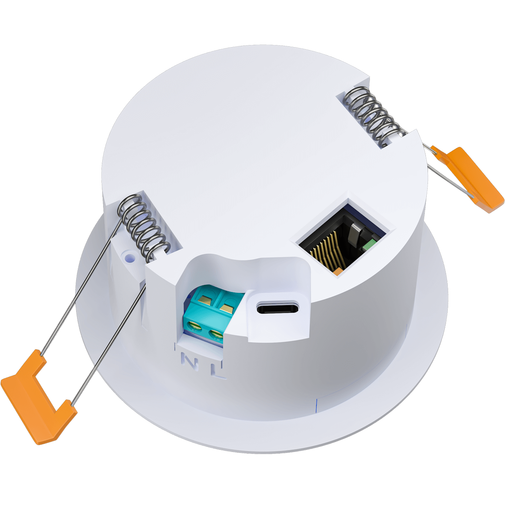

<!-- markdownlint-disable MD041 -->

## Description

**CeilSense** is a recessed, all-in-one smart room sensor for ceilings (and walls) that combines **24 GHz mmWave presence (HLK-LD2412)**, **ambient light (BH1750)**, **barometric pressure (BMP3xx)**, optional **CO₂/Temperature/Humidity (SCD41)**, plus a ring of **16 individually addressable WS2812 RGB LEDs**.  
Power it via **110–240 VAC**, **USB-C (5 V)**, or **PoE Ethernet**. It fits a **standard 68 mm** (GU10) cut-out; visible trim ring ≈ Ø 82 mm.

### Highlights

- Reliable **presence detection** (micro-motion) with **HLK-LD2412**  
- **BH1750** ambient light + **BMP3xx** pressure (always present)  
- **16× WS2812** status/ambient ring  
- **Complete** variant adds **SCD41 CO₂/Temp/Humidity**  
- **Wi-Fi or Ethernet (PoE)** firmware variants; **OTA** with ESPHome  
- Fully **local** and **open source**; maintained in the **CeilSense** GitHub repo

### Specs at a glance

- Cut-out: **68 mm**, install depth ≈ **45 mm** (allow ~+15 mm with RJ45 plug)  
- LEDs: **16× WS2812**, individually addressable  
- Radar: **HLK-LD2412** (24 GHz), tuned ESPHome config  
- Sensors (Basic): **BH1750** (illuminance) + **BMP3xx** (pressure) + **LD2412** (presence)  
- Sensors (Complete): **Basic + SCD41** (CO₂/Temp/Humidity)

## Variants

- **CeilSense Basic** — LD2412 + BH1750 + BMP3xx + 16× RGB ring  
- **CeilSense Complete** — **Basic + SCD41** (CO₂/Temp/Humidity)

> Ethernet/PoE builds are separate YAMLs. Flash the **Ethernet** variant if you plan to use PoE.

## Quickstart

1. **Install** the device in a **68 mm** cut-out; connect mains or USB-C; optionally RJ45 for PoE.  
2. **Flash** the matching firmware (Basic/Complete × Wi-Fi/Ethernet).  
3. **Onboard**  
   - **Wi-Fi** builds: join CeilSense AP → provide Wi-Fi → appears as **Discovered** in Home Assistant.  
   - **Ethernet** builds: plug UTP → gets DHCP → appears as **Discovered**.  
4. **Adopt** in ESPHome / Home Assistant and tune (radar thresholds, LED effects).

> Please check our full documentation and Quick Start Guide: **https://smarthomeshop.io/quick-start-ceilsense**

## Support & Links

- [Shop](https://ceilsense.nl/en)
- [GitHub](https://github.com/smarthomeshop/ceilsense)
- [Wiki](https://docs.smarthomeshop.io/)
- [Discord](https://smarthomeshop.io/discord)
- [YouTube](https://www.youtube.com/@smarthomeshop-io)

## Gallery

| Top view | In-ceiling (cut-out) |
| --- | --- |
|  |  |

| Bottom view |
| --- |
|  |
