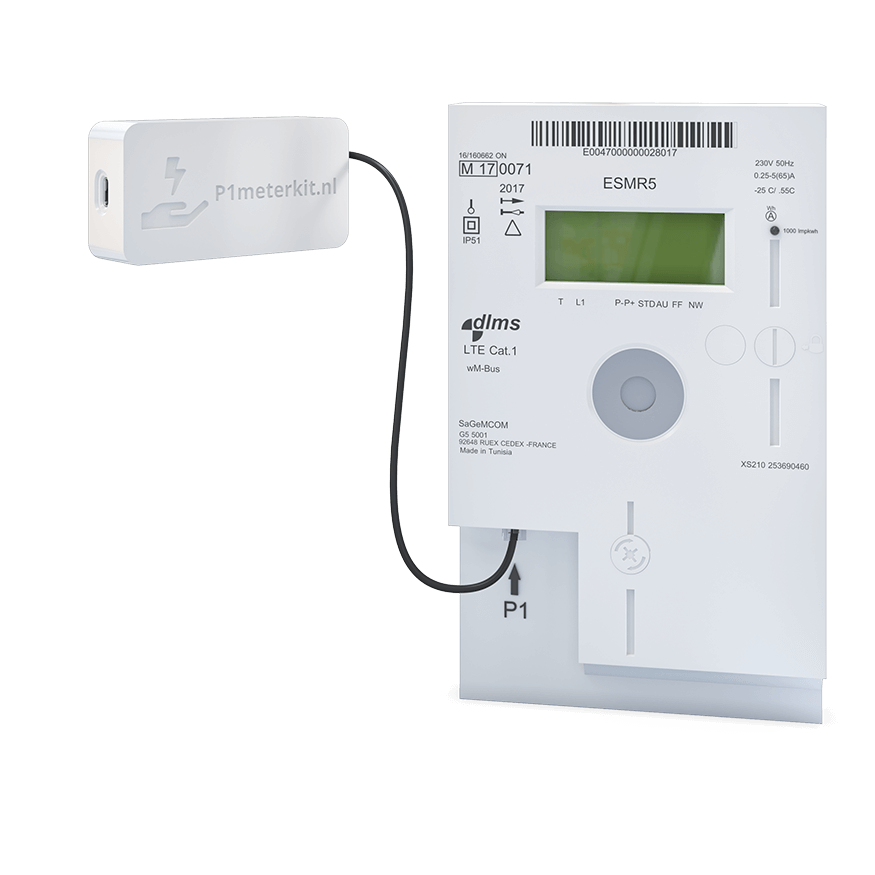
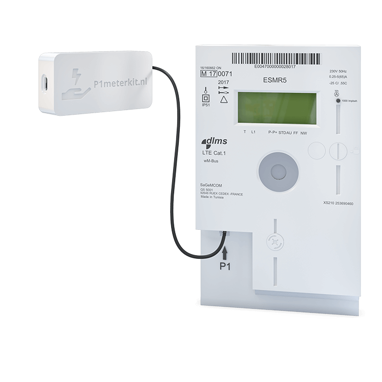

## Description

The **P1MeterKit V2** is an **ESP32-C3** based **DSMR P1 smart meter reader** for **Home Assistant** and **ESPHome**.
It reads telegrams from the **P1 port** of compatible smart meters and exposes electricity, gas, and environmental data
fully locally, with onboarding through **captive portal**, **Improv BLE**, and **Improv Serial**.

This page documents the **V2** hardware revision only.

### Features

- **ESP32-C3** hardware with **Improv BLE** and **Improv Serial**
- Reads **electricity** and **gas** data from the **DSMR P1** interface
- Built-in **temperature** and **humidity** sensing
- **Wi-Fi** onboarding through captive portal, Bluetooth, or USB
- **HTTP OTA** update support through ESPHome
- Fully **local** and **open source**

### Specifications

- MCU: **ESP32-C3**
- Smart meter interface: **DSMR P1**
- Smart meter compatibility: **DSMR 4.0**, **DSMR 5.0**, and **ESMR 5.0**
- Connectivity: **Wi-Fi 2.4 GHz**
- Power: **USB-C**, or via supported **DSMR 5.0** P1 power
- Firmware: **ESPHome**

## Sensors

- **Energy consumed** tariff 1 / 2
- **Energy produced** tariff 1 / 2
- **Current power** consumed / produced
- **Voltage** and **current** per phase
- **Gas consumed**
- **Temperature**
- **Humidity**
- **Wi-Fi diagnostics**

## Quickstart

1. Connect the kit to the smart meter with the included **RJ12** cable.
2. Power the device using **USB-C** or, when supported, directly from the **P1 port**.
3. Onboard the device using the fallback hotspot, **Improv BLE**, or **Improv Serial**.
4. Adopt the device in **Home Assistant** / **ESPHome**.

Please check our [quick start guide](https://smarthomeshop.io/quick-start-p1meterkit)
and the [product page](https://p1meterkit.nl/en) for installation details.

## Links

- [Product Page](https://p1meterkit.nl/en)
- [GitHub](https://github.com/smarthomeshop/p1meterkit)
- [Firmware](https://smarthomeshop.io/en/firmware)
- [Quick Start Guide](https://smarthomeshop.io/quick-start-p1meterkit)
- [Discord](https://smarthomeshop.io/discord)

## Product Images

| Product view | Product photo |
| ------------ | ------------- |
|  |  |
