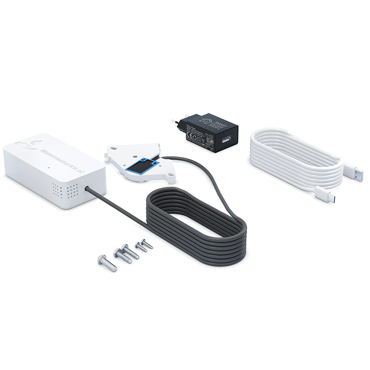

## Description

The **WaterMeterKit V3** is a compact **ESP32-C6** based water meter sensor for compatible analog water meters.
It tracks **real-time water flow** and **total water usage** using a pulse input and also includes onboard
**temperature** and **humidity** sensing with the **HDC1080**.

It is designed for fully local use with **ESPHome** and **Home Assistant**, with onboarding through
**captive portal**, **Improv BLE**, or **Improv Serial**, and supports **HTTP OTA** firmware updates.
It is also one of the earliest purpose-built ESPHome water meter kits created specifically for Home Assistant users.

### Features

- **ESP32-C6** platform with **Wi-Fi** and **Bluetooth LE**
- **Pulse meter** based water usage tracking
- Built-in **HDC1080** temperature and humidity sensing
- **Improv BLE**, **Improv Serial**, and **captive portal** onboarding
- **HTTP OTA** firmware update support
- Fully **local** and **open source**

### Specifications

- MCU: **ESP32-C6**
- Flash: **4 MB**
- Water meter interface: **Pulse input**
- Sensors: **HDC1080** temperature and humidity
- Firmware: **ESPHome**

## Variants

- **WaterMeterKit V3** — ESP32-C6 hardware revision with Wi-Fi firmware

## Quickstart

1. Install the WaterMeterKit on a compatible analog water meter.
2. Power the device.
3. Onboard it using the fallback hotspot, **Improv BLE**, or **Improv Serial**.
4. Adopt the device in **Home Assistant** / **ESPHome**.
5. Monitor live flow rate, total consumption, temperature, and humidity.

Please check our [full documentation and Quick Start Guide](https://smarthomeshop.io/quick-start-watermeterkit)
and our [compatible water meters overview](https://watermeterkit.nl/en/) to confirm fitment for your meter type.

## Links

- [Shop](https://watermeterkit.nl/en)
- [Compatible Water Meters](https://watermeterkit.nl/en)
- [GitHub](https://github.com/smarthomeshop/watermeterkit)
- [Firmware](https://smarthomeshop.io/en/firmware)
- [Quick Start Guide](https://smarthomeshop.io/quick-start-watermeterkit)
- [Discord](https://smarthomeshop.io/discord)

## Product Images

| Product view                                      | In the box                                        |
| ------------------------------------------------- | ------------------------------------------------- |
|    |     |
