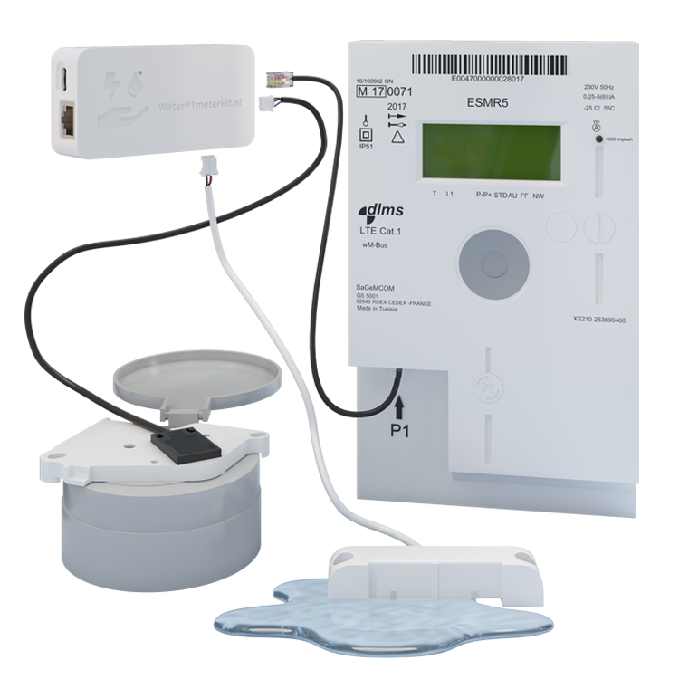
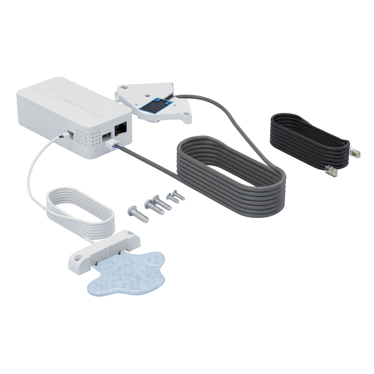

## Description

The **WaterP1MeterKit** combines **DSMR P1 smart meter reading** and **water meter pulse monitoring**
in a single ESPHome-based device for **Home Assistant**.
It can monitor **energy**, **gas**, and **water** from one kit, and the latest **V3** hardware adds a
**detachable water sensor**, **PoE support**, and an **expansion port** for an optional leak or door sensor.

It is designed for fully local use with **ESPHome** and **Home Assistant**, with onboarding through
**captive portal**, **Improv BLE**, or **Improv Serial**, and supports **HTTP OTA** firmware updates.

### Features

- Combined **P1 smart meter** and **water meter** monitoring in one device
- Reads **electricity**, **gas**, and **water** usage locally in Home Assistant
- Built-in **HDC1080** temperature and humidity sensing
- **Wi-Fi** and **Ethernet** firmware variants depending on hardware revision
- **PoE** support on **V2** and **V3**
- Optional **expansion port** on **V3** for a water leak sensor or door sensor
- Fully **local**, **open source**, and maintained in the **WaterP1MeterKit** GitHub repo

### Specifications

- MCU: **ESP32**
- Smart meter interface: **DSMR P1**
- Smart meter compatibility: **DSMR 2.2 - 5.0**
- Water meter input: pulse sensor with included water meter holder
- Connectivity:
  - **V1**: Wi-Fi and Ethernet
  - **V2**: Wi-Fi, Ethernet, and PoE
  - **V3**: Wi-Fi, Ethernet, and PoE
- Sensors: **HDC1080** temperature and humidity
- Firmware: **ESPHome**

## Variants

- **WaterP1MeterKit V1 WiFi** — original ESP32 hardware with combined P1 and water monitoring
- **WaterP1MeterKit V1 Ethernet** — original ESP32 hardware with wired Ethernet
- **WaterP1MeterKit V2 WiFi** — ESP32 hardware with PoE-capable design
- **WaterP1MeterKit V2 Ethernet** — ESP32 hardware with Ethernet and PoE support
- **WaterP1MeterKit V3 WiFi** — latest ESP32 hardware with detachable water sensor and expansion port
- **WaterP1MeterKit V3 Ethernet** — latest ESP32 hardware with Ethernet, PoE, and expansion support

## Compatibility

- **DSMR smart meters**: compatible with DSMR **2.2 - 5.0**
- **Water meters**: compatible with many common analog water meters from brands such as
  **Actaris**, **Elster**, **Honeywell**, **Itron**, and **Sensus**

Please check the [official compatibility overview](https://waterp1meterkit.nl/en) for supported
meter photos and model names.

## Quickstart

1. Connect the kit to the **P1 port** of the smart meter and mount the water sensor on the water meter.
2. Power the device using **USB-C**, or use **PoE** on supported hardware.
3. Flash or keep the default **WiFi** build and onboard via the fallback hotspot, **Improv BLE**, or **Improv Serial**.
4. Adopt the device in **Home Assistant** / **ESPHome**.
5. If preferred, switch later to the **Ethernet** firmware directly from the device update entity.

Please check our [full documentation and Quick Start Guide](https://smarthomeshop.io/quick-start-waterp1meterkit)
and the [product page](https://waterp1meterkit.nl/en) for supported meter details and installation guidance.

## Links

- [Product Page](https://waterp1meterkit.nl/en)
- [GitHub](https://github.com/smarthomeshop/waterp1meterkit)
- [Firmware](https://smarthomeshop.io/en/firmware)
- [Quick Start Guide](https://smarthomeshop.io/quick-start-waterp1meterkit)
- [Discord](https://smarthomeshop.io/discord)

## Product Images

| Product view | In the box |
| ------------ | ---------- |
|  |  |
