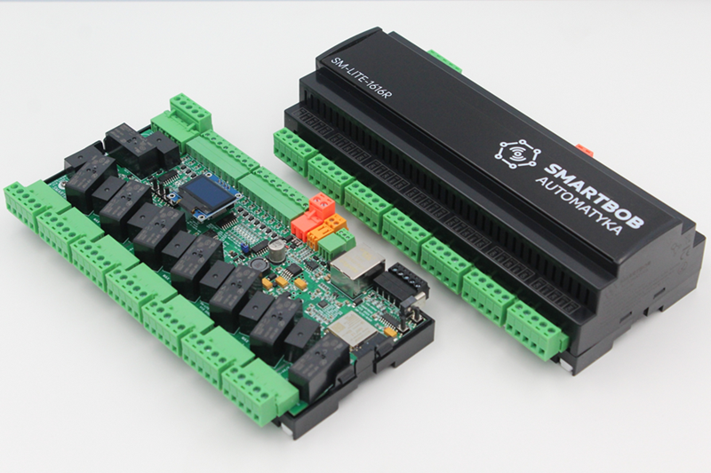
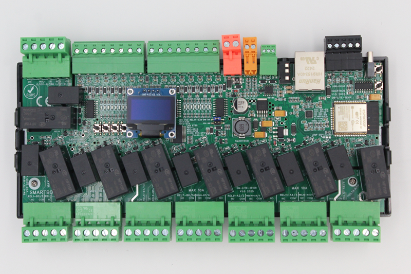

SMARTBOB devices are a series of smart-home controllers designed for open home automation.
They are based on ESP32 controllers and offer various useful options.

The product is dedicated to controlling AC and DC circuits (without power regulation, on/off),
such as lights, power supplies, blinds, valves, sockets, and relays, as well as control signals
for gate control and alarms

Available pre-flashed with ESPHome or SUPLA.

Maker: https://smartbob.pl

Product page: https://smartbob.pl/pl/lite-1-poziom/3-sm-lite-1616r.html

## SM-LITE-1616R V1.5 version basic description

* 24V DC power supply (max 0.5A)
* 16 input, VCC or GND logic level (by MCP23017 expander)
* 16 output by 10A relays, potential-free with the possibility of roller shutter interlock (by MCP23017 expander)
* 2x ADC for up to 24V voltage measurement (or input)
* 1x ADC for power supply voltage measurement
* Additional communication by: 2x I2C, 1WIRE, RS485
* CT clamp input for SCT clamps
* LAN or WIFI communication
* 0.96C OLED display
* Integrated USB programmer
* Integrated hardware over-temp protection by 2xTMP102 (all relay off, hardware 80C or lower defined in YAML)
* Integrated input control test buttons

## GPIO Pinout for V1.5 version

### LAN7820

Can be used for ethernet 10/100Mb communication.

| Pin    | Function  |
|--------|-----------|
| TYPE   | LAN7820   |
| GPIO23 | MDC       |
| GPIO18 | MDIO      |
| GPIO17 | CLOCK OUT |
| GPIO25 | RX DO     |
| GPIO26 | RX D1     |
| GPIO27 | CRS       |
| GPIO19 | TX D0     |
| GPIO22 | TX D1     |
| GPIO21 | TX EN     |
| PHY    | 1         |

### I2C

Contains two I2C data lines :

* I2C 1 internal for MCP23017 expanders and OLED (reference speed 400kHz)
* I2C 2 for external sensors or as input (3.3V logic level). Can be used to read external I2C
* sensor like SHT31 or as input (3.3V logic level). Integrated 2.3k Ohm pull up on all lines.

| Pin    | Function       |
|--------|----------------|
| GPIO15 | SDA 1 internal |
| GPIO5  | SCL 1 internal |
| GPIO16 | SDA 2 external |
| GPIO14 | SDA 2 external |

Board contain this devices on internal I2C 1 line:

| Address | Device       |
|---------|--------------|
| 0x20    | MCP23017 IN  |
| 0x21    | MCP23017 OUT |
| 0x3C    | OLED         |
| 0x48    | TMP102 1     |
| 0x49    | TMP102 2     |

### RS485

Can be used to read external modbus devices like power meter like Eastron SDM120/240/630.

| Pin    | Function |
|--------|----------|
| GPIO13 | RX       |
| GPIO33 | TX       |

### 1WIRE

Can be used to read external sensor by 1WIRE like. DS18B20 or as input (3.3V logic level).
Integrated 2.3k Ohm pull up.

| Pin    | Function |
|--------|----------|
| GPIO32 | 1WIRE    |

### ADC or additional input

ADC1, ADC2 can be used to read ADC voltage up to 24V or use as input (24V logic level).
One ADC3 is connected to power connector to measure voltage connected to board.

| Pin    | Function               |
|--------|------------------------|
| GPIO35 | External ADC1 or INPUT |
| GPIO34 | External ADC2 or INPUT |
| GPIO36 | Internal ADC3          |

Integrated divider with calibration values for ADC1-2:

| Adc   | Voltage |
|-------|---------|
| 0.62  | 5       |
| 1.22  | 10      |
| 1.83  | 15      |
| 2.425 | 20      |
| 2.975 | 25      |

Integrated divider with calibration values for ADC3:

| Adc   | Voltage |
|-------|---------|
| 0.55  | 10      |
| 0.825 | 15      |
| 1.10  | 20      |
| 1.37  | 25      |

### CT current clamp sensor input

Can be used to read from SCT-013 witch xA/1V output.

| Pin    | Function |
|--------|----------|
| GPIO39 | CT_CLAMP |

Example YAML:

```yaml

substitutions:
  name: sm-lite-1616r-v15
  friendly_name: sm-lite-1616r-v15

# NAME
esphome:
  name: ${name}
  comment: ${friendly_name}
  on_boot:
    then:
      - display.page.show: page1
      - delay: 7s
      - display.page.show: page2

# HA
api:
  encryption:
    key: "xxxxxxxxxxxxxxxxxxxxxxxxxxxxxxx"
  reboot_timeout: 0s

# OTA
ota:
  - platform: esphome
  #password: "xxxxxxxxxxxxxxxxxxxxxxxxxxxxxxx"

# PROCESOR
esp32:
  board: esp32dev
  framework:
    type: arduino

# LOGOWANIE
logger:
  level: DEBUG

# 1WIRE
one_wire:
  - platform: gpio
    pin: GPIO32

# UART-RS485
uart:
  - id: mod_uart
    rx_pin: 13
    tx_pin: 33
    baud_rate: 9600
    stop_bits: 1
    data_bits: 8
    parity: NONE
    debug:
      direction: BOTH

# SENSOR CONFIGURATION
sensor:
  # SCT SENSOR
  - platform: ct_clamp
    sensor: adc_ct
    name: "SCT Current"
    update_interval: 1s
    filters:
      - calibrate_linear:
        - 0 -> 0
        - 0.1 -> 2.5

  # SCT ADC
  - platform: adc
    pin: GPIO39
    id: adc_ct
    attenuation: 11db

  # EXT ADC INPUT 2
  - platform: adc
    pin: GPIO34
    id: adc_sensor_2
    attenuation: 11db
    name: "Voltage ADC 2"
    device_class: "voltage"
    filters:
      - calibrate_linear:
        - 0.62 -> 5
        - 1.22 -> 10
        - 1.83 -> 15
        - 2.425 -> 20
        - 2.975 -> 25
    update_interval: 1s

  # EXT ADC INPUT 1
  - platform: adc
    pin: GPIO35
    id: adc_sensor_1
    attenuation: 11db
    name: "Voltage ADC 1"
    device_class: "voltage"
    filters:
      - calibrate_linear:
        - 0.62 -> 5
        - 1.22 -> 10
        - 1.83 -> 15
        - 2.425 -> 20
        - 2.975 -> 25
    update_interval: 1s
  
  # ADC INPUT VOLTAGE CHANNEL
  - platform: adc
    pin: GPIO36
    id: adc_sensor_4
    attenuation: 11db
    name: "Power voltage"
    device_class: "voltage"
    filters:
      - calibrate_linear:
        - 0.55 -> 10
        - 0.825 -> 15
        - 1.10 -> 20
        - 1.37 -> 25
    update_interval: 1s

  # TMP102
  - platform: tmp102
    i2c_id: bus_a
    name: "Temperatura PCB 1"
    address: 0x48
    id: temp_1
    update_interval: 8s
    on_value:
      if:
        condition:
          sensor.in_range:
            id: temp_1
            above: 70.0
        then:
        - display.page.show: page3
        - switch.turn_off: relay_01
        - switch.turn_off: relay_02
        - switch.turn_off: relay_03
        - switch.turn_off: relay_04
        - switch.turn_off: relay_05
        - switch.turn_off: relay_06
        - switch.turn_off: relay_07
        - switch.turn_off: relay_08
        - switch.turn_off: relay_09
        - switch.turn_off: relay_10
        - switch.turn_off: relay_11
        - switch.turn_off: relay_12
        - switch.turn_off: relay_13
        - switch.turn_off: relay_14
        - switch.turn_off: relay_15
        - switch.turn_off: relay_16
  
  # TMP102
  - platform: tmp102
    i2c_id: bus_a
    name: "Temperatura PCB 2"
    address: 0x49
    id: temp_2
    update_interval: 8s
    on_value:
      if:
        condition:
          sensor.in_range:
            id: temp_2
            above: 70.0
        then:
        - display.page.show: page3
        - switch.turn_off: relay_01
        - switch.turn_off: relay_02
        - switch.turn_off: relay_03
        - switch.turn_off: relay_04
        - switch.turn_off: relay_05
        - switch.turn_off: relay_06
        - switch.turn_off: relay_07
        - switch.turn_off: relay_08
        - switch.turn_off: relay_09
        - switch.turn_off: relay_10
        - switch.turn_off: relay_11
        - switch.turn_off: relay_12
        - switch.turn_off: relay_13
        - switch.turn_off: relay_14
        - switch.turn_off: relay_15
        - switch.turn_off: relay_16
  
  # TIME
  - platform: uptime
    name: Uptime Sensor
    id: uptime_sensor_M03
    internal: true
    update_interval: 60s
    on_raw_value:
      then:
        - text_sensor.template.publish:
            id: uptime_human_M03
            state: !lambda |-
              int seconds = round(id(uptime_sensor_M03).raw_state);
              int days = seconds / (24 * 3600);
              seconds = seconds % (24 * 3600);
              int hours = seconds / 3600;
              seconds = seconds % 3600;
              int minutes = seconds /  60;
              seconds = seconds % 60;
              return (
                (days ? to_string(days) + "d " : "") +
                (hours ? to_string(hours) + "h " : "") +
                (minutes ? to_string(minutes) + "m " : "") +
                (to_string(seconds) + "s")
              ).c_str();
  
  # UPTIME
  - platform: uptime
    name: "Uptime Sensor M03"
    id: upt_M03
    internal: true

# KONFIGRUACJA ZEGARA CZASU RZECZYWISTEGO
time:
  - platform: homeassistant
    id: homeassistant_time
  - platform: sntp
    id: sntp_time
    timezone: Europe/Sofia
    servers:
     - 0.pool.ntp.org
     - 1.pool.ntp.org
     - 2.pool.ntp.org

# LAN OR WIFI
#wifi:
  #ssid: "MY_WIFI_XX"  
  #password: "MY_WIFI_XX"
  #id: eth

ethernet:
  type: LAN8720
  mdc_pin: GPIO23
  mdio_pin: GPIO18
  clk_mode: GPIO17_OUT
  phy_addr: 1
  id: eth
  
  #manual_ip:
  #  static_ip: 192.168.0.50
  #  gateway: 192.168.0.1
  #  subnet: 255.255.255.0
  #  dns1 : 8.8.8.8
  #  dns2 : 8.8.4.4


# I2C
i2c:
   - id: bus_a
     sda: 15
     scl: 5
     scan: true
     frequency: 400kHz
   - id: bus_b
     sda: 16
     scl: 14
     scan: true
     frequency: 400kHz

# MCP23017
mcp23017:
  - id: 'mcp23017_hub_2'
    address: 0x20
    i2c_id: bus_a
  - id: 'mcp23017_hub_1'
    address: 0x21
    i2c_id: bus_a

# OUTPUTS
switch:
  - platform: gpio
    name: "REALY-01"
    id: relay_01
    pin:
      mcp23xxx: mcp23017_hub_1
      number: 8
      mode: OUTPUT
      inverted: false
  - platform: gpio
    name: "REALY-02"
    id: relay_02
    pin:
      mcp23xxx: mcp23017_hub_1
      number: 9
      mode: OUTPUT
      inverted: false
  - platform: gpio
    name: "REALY-03"
    id: relay_03
    pin:
      mcp23xxx: mcp23017_hub_1
      number: 10
      mode: OUTPUT
      inverted: false
  - platform: gpio
    name: "REALY-04"
    id: relay_04
    pin:
      mcp23xxx: mcp23017_hub_1
      number: 11
      mode: OUTPUT
      inverted: false
  - platform: gpio
    name: "REALY-05"
    id: relay_05
    pin:
      mcp23xxx: mcp23017_hub_1
      number: 12
      mode: OUTPUT
      inverted: false
  - platform: gpio
    name: "REALY-06"
    id: relay_06
    pin:
      mcp23xxx: mcp23017_hub_1
      number: 13
      mode: OUTPUT
      inverted: false
  - platform: gpio
    name: "REALY-07"
    id: relay_07
    pin:
      mcp23xxx: mcp23017_hub_1
      number: 14
      mode: OUTPUT
      inverted: false
  - platform: gpio
    name: "REALY-08"
    id: relay_08
    pin:
      mcp23xxx: mcp23017_hub_1
      number: 15
      mode: OUTPUT
      inverted: false
  - platform: gpio
    name: "REALY-09"
    id: relay_09
    pin:
      mcp23xxx: mcp23017_hub_1
      number: 2
      mode: OUTPUT
      inverted: false
  - platform: gpio
    name: "REALY-10"
    id: relay_10
    pin:
      mcp23xxx: mcp23017_hub_1
      number: 3
      mode: OUTPUT
      inverted: false
  - platform: gpio
    name: "REALY-11"
    id: relay_11
    pin:
      mcp23xxx: mcp23017_hub_1
      number: 4
      mode: OUTPUT
      inverted: false
  - platform: gpio
    name: "REALY-12"
    id: relay_12
    pin:
      mcp23xxx: mcp23017_hub_1
      number: 5
      mode: OUTPUT
      inverted: false
  - platform: gpio
    name: "REALY-13"
    id: relay_13
    pin:
      mcp23xxx: mcp23017_hub_1
      number: 6
      mode: OUTPUT
      inverted: false
  - platform: gpio
    name: "REALY-14"
    id: relay_14
    pin:
      mcp23xxx: mcp23017_hub_1
      number: 7
      mode: OUTPUT
      inverted: false
  - platform: gpio
    name: "REALY-15"
    id: relay_15
    pin:
      mcp23xxx: mcp23017_hub_1
      number: 1
      mode: OUTPUT
      inverted: false
  - platform: gpio
    name: "REALY-16"
    id: relay_16
    pin:
      mcp23xxx: mcp23017_hub_1
      number: 0
      mode: OUTPUT
      inverted: false

# INPUTS
binary_sensor:
  - platform: gpio
    name: "INPUT-01"
    id: input_01
    pin:
      mcp23xxx: mcp23017_hub_2
      number: 4
      mode:
        input: true
        pullup: false
      inverted: true
    filters:
    - delayed_on: 30ms
    on_press:
       then:
        - switch.toggle: relay_01
  - platform: gpio
    name: "INPUT-02"
    id: input_02
    pin:
      mcp23xxx: mcp23017_hub_2
      number: 5
      mode:
        input: true
        pullup: false
      inverted: true
    filters:
    - delayed_on: 30ms
    on_press:
       then:
        - switch.toggle: relay_02
  - platform: gpio
    name: "INPUT-03"
    id: input_03
    pin:
      mcp23xxx: mcp23017_hub_2
      number: 6
      mode:
        input: true
        pullup: false
      inverted: true
    filters:
    - delayed_on: 30ms
    on_press:
       then:
        - switch.toggle: relay_03
  - platform: gpio
    name: "INPUT-04"
    id: input_04
    pin:
      mcp23xxx: mcp23017_hub_2
      number: 7
      mode:
        input: true
        pullup: false
      inverted: true
    filters:
    - delayed_on: 30ms
    on_press:
       then:
        - switch.toggle: relay_04
  - platform: gpio
    name: "INPUT-05"
    id: input_05
    pin:
      mcp23xxx: mcp23017_hub_2
      number: 3
      mode:
        input: true
        pullup: false
      inverted: true
    filters:
    - delayed_on: 30ms
    on_press:
       then:
        - switch.toggle: relay_05
  - platform: gpio
    name: "INPUT-06"
    id: input_06
    pin:
      mcp23xxx: mcp23017_hub_2
      number: 2
      mode:
        input: true
        pullup: false
      inverted: true
    filters:
    - delayed_on: 30ms
    on_press:
       then:
        - switch.toggle: relay_06
  - platform: gpio
    name: "INPUT-07"
    id: input_07
    pin:
      mcp23xxx: mcp23017_hub_2
      number: 1
      mode:
        input: true
        pullup: false
      inverted: true
    filters:
    - delayed_on: 30ms
    on_press:
       then:
        - switch.toggle: relay_07
  - platform: gpio
    name: "INPUT-08"
    id: input_08
    pin:
      mcp23xxx: mcp23017_hub_2
      number: 0
      mode:
        input: true
        pullup: false
      inverted: true
    filters:
    - delayed_on: 30ms
    on_press:
       then:
        - switch.toggle: relay_08
  - platform: gpio
    name: "INPUT-09"
    id: input_09
    pin:
      mcp23xxx: mcp23017_hub_2
      number: 15
      mode:
        input: true
        pullup: false
      inverted: true
    filters:
    - delayed_on: 30ms
    on_press:
       then:
        - switch.toggle: relay_09
  - platform: gpio
    name: "INPUT-10"
    id: input_10
    pin:
      mcp23xxx: mcp23017_hub_2
      number: 14
      mode:
        input: true
        pullup: false
      inverted: true
    filters:
    - delayed_on: 30ms
    on_press:
       then:
        - switch.toggle: relay_10
  - platform: gpio
    name: "INPUT-11"
    id: input_11
    pin:
      mcp23xxx: mcp23017_hub_2
      number: 13
      mode:
        input: true
        pullup: false
      inverted: true
    filters:
    - delayed_on: 30ms
    on_press:
       then:
        - switch.toggle: relay_11
  - platform: gpio
    name: "INPUT-12"
    id: input_12
    pin:
      mcp23xxx: mcp23017_hub_2
      number: 12
      mode:
        input: true
        pullup: false
      inverted: true
    filters:
    - delayed_on: 30ms
    on_press:
       then:
        - switch.toggle: relay_12
  - platform: gpio
    name: "INPUT-13"
    id: input_13
    pin:
      mcp23xxx: mcp23017_hub_2
      number: 11
      mode:
        input: true
        pullup: false
      inverted: true
    filters:
    - delayed_on: 30ms
    on_press:
       then:
        - switch.toggle: relay_13
  - platform: gpio
    name: "INPUT-14"
    id: input_14
    pin:
      mcp23xxx: mcp23017_hub_2
      number: 10
      mode:
        input: true
        pullup: false
      inverted: true
    filters:
    - delayed_on: 30ms
    on_press:
       then:
        - switch.toggle: relay_14
  - platform: gpio
    name: "INPUT-15"
    id: input_15
    pin:
      mcp23xxx: mcp23017_hub_2
      number: 9
      mode:
        input: true
        pullup: false
      inverted: true
    filters:
    - delayed_on: 30ms
    on_press:
       then:
        - switch.toggle: relay_15
  - platform: gpio
    name: "INPUT-16"
    id: input_16
    pin:
      mcp23xxx: mcp23017_hub_2
      number: 8
      mode:
        input: true
        pullup: false
      inverted: true
    filters:
    - delayed_on: 30ms
    on_press:
       then:
        - switch.toggle: relay_16


# WEB SERWER
web_server:
  port: 80  

# TEXT
text_sensor:
  - platform: template
    name: "ESP32-M03 Uptime"
    id: uptime_human_M03
    icon: mdi:clock-start
  - platform: template
    name: "IP"
    id: ip_address
    entity_category: diagnostic
    icon: "mdi:ip-network"
    #lambda: return { id(eth).get_ip_address().str() };
    lambda: return { id(eth).get_ip_addresses()[0].str() };
    update_interval: 10s

# FONT
font:
- file: "gfonts://Roboto"
  id: font1
  size: 12

# DISPLAY
display:
  - platform: ssd1306_i2c
    i2c_id: bus_a
    model: "SSD1306_128X64"
    id: oled_display
    pages:
      - id: page1
        lambda: |-
          it.printf(32, 5, id(font1), "SMARTBOB");
          it.printf(27, 22, id(font1), "AUTOMATYKA");  
          it.printf(5, 39, id(font1), "WWW.SMARTBOB.PL");  
      - id: page2
        lambda: |-
          int seconds = round(id(upt_M03).state);
          int days = seconds / (24 * 3600);
          seconds = seconds % (24 * 3600);
          int hours = seconds / 3600;
          it.printf(1, 1,  id(font1), "%s", id(ip_address).state.c_str());
          it.printf(1, 17, id(font1),"%d dni, %02d godzin",days,hours);
          it.printf(1, 33, id(font1), "SM-LITE-1616R");
          it.printf(1, 49, id(font1), "%.1f°, %.1f°", id(temp_1).state, id(temp_2).state);
      - id: page3
        lambda: |-
          it.printf(33, 5, id(font1), "OVERHEAT");
          it.printf(33, 52, id(font1), "%.1f°, %.1f°", id(temp_1).state, id(temp_2).state);
