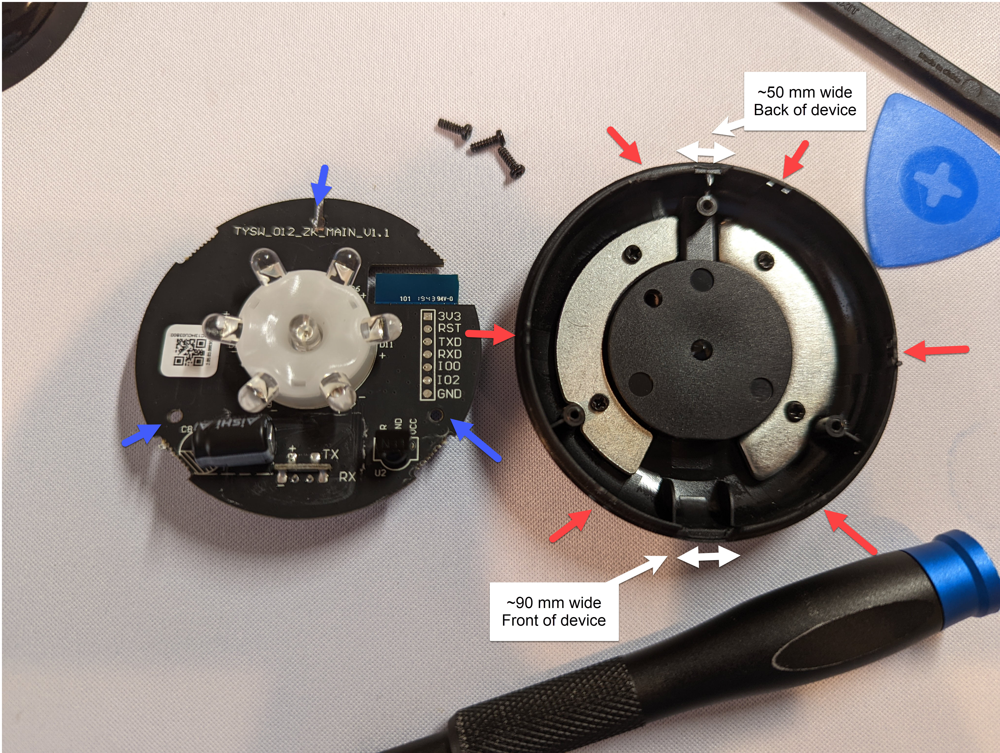
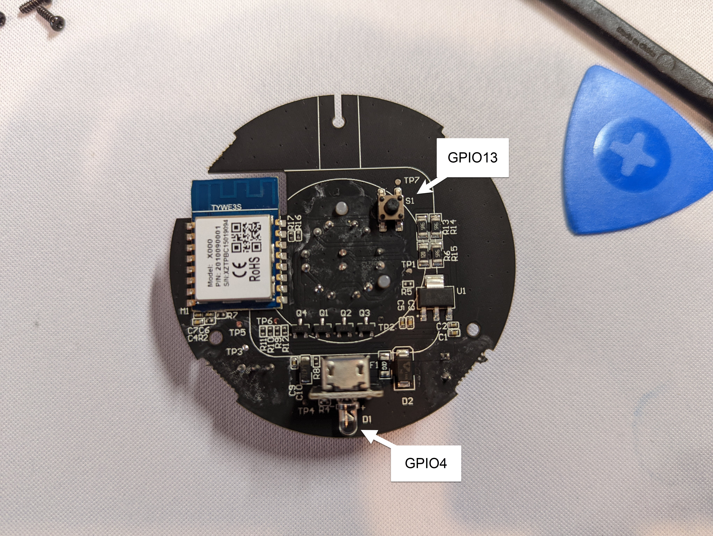

Manufacturer: [SmartPoint](https://www.smartpointco.com/product-page/smart-wifi-remote-control)

Available at:

- [Walmart](https://www.walmart.com/ip/Smartpoint-Wifi-Smart-Remote-Controller-Compatible-with-Alexa-and-Google-Assistant-Hands-Free-Voice-Control/824016383)
- [Amazon](https://amzn.to/3n1c2LD)

## GPIO Pinout

| Pin    | Function                    |
| ------ | --------------------------- |
| GPIO4  | External Blue LED           |
| GPIO5  | IR Receiver (inverted)      |
| GPIO13 | Underside Button (inverted) |
| GPIO14 | IR Blaster Array            |

## Flashing (Older Devices)

On older models of this device, [tuya-convert](https://www.esphome-devices.com/guides/tuya-convert/) should be able to flash this device, but I am unsure how old the device needs to be for this method to still work.

## Flashing (Newer Devices)

On newer patched devices (likely yours), [tuya-convert](https://www.esphome-devices.com/guides/tuya-convert/) will not work. In order to flash, gain access to the [TYWE3S](https://tasmota.github.io/docs/devices/TYWE3S/) board by prying off the top of the device.

- Solder onto the silkscreen labeled pads to the corresponding serial pins - 3v3, TX, RX, and GND.
- Ground GPIO0 during boot to enter flashing mode.
- Flash using any of the ESPHome flashing methods.

> Note that the Tasmota flashing documentation for the  [TYWE3S](https://tasmota.github.io/docs/devices/TYWE3S/) specifies that the TX and RX pins are reversed. I did not find that to be true and was able to follow the silkscreen on the board.

## Disassembly



- There are 6 clips holding the semi-transparent plastic top dome to the base (red arrows). The top can be removed by disengaging each of these clips.
- There are two holes along the front (where the logo faces outwards) and back of the device that can be used to create leverage when prying the top from the clips. The hole on the back is slightly two small for the black iFixit spudger.
- The bottom plastic is easily marred, even when using the plastic iFixit tools, and the clips may require substantial force to move.
- (Optional) After removal of the top dome, the [TYWE3S](https://tasmota.github.io/docs/devices/TYWE3S/) ESP8266 chip can be accessed by unscrewing 3 black Phillips #1 screws (blue arrows) to disconnect the main board from the button of the outer covering.



## Basic Configuration

```yaml
substitutions:
  devicename: smartpoint-ir
  friendly_name: Smartpoint IR

# Set device attributes
esphome:
  name: $devicename
  platform: ESP8266
  board: esp01_1m

# Enable Wi-Fi connection
wifi:
  ssid: My_Wireless
  password: !secret wifi_password
  ap:
    ssid: ESP-${devicename}
    password: !secret fallback_password

# Enable captive poral
captive_portal:

# Enable websever
web_server:
  port: 80
  auth:
    username: !secret web_username
    password: !secret web_password

# Enable HomeAssistant API
api:
  password: !secret api_password

# Enable OTA updates
ota:
  password: !secret ota_password
  safe_mode: True

# Enable logging without UART support as there would be no way to read it
logger:
  baud_rate: 0

# Enable external blue LED as a status indictator
status_led:
  pin:
    number: GPIO4

# Enable the IR receiver to dump all IR commands to the log. Change dump type to your capture remote type. Use the captured IR command to replicate that IR command. You can disable this part when you aren't capturing IR command data.
remote_receiver:
  pin:
    number: GPIO5
    inverted: true
  dump: all

# Enable the remote transmitter
remote_transmitter:
  pin: GPIO14
  carrier_duty_percent: 50%

# Enable the underside button.
binary_sensor:
  - platform: gpio
    pin:
      number: GPIO13
      inverted: true
    name: Underside Button

# Simple example template switch to control the power of a Samsung TV using IR commands
switch:
  - platform: template
    name: "TV Power"
    optimistic: true
    assumed_state: true
    turn_on_action:
      # Data would be the IR command captured in the log by the remote receiver
      - remote_transmitter.transmit_samsung:
          data: 0xE0E09966
    turn_off_action:
      # Data would be the IR command captured in the log by the remote receiver
      - remote_transmitter.transmit_samsung:
          data: 0xE0E019E6
```
