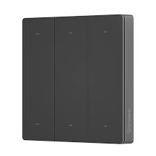
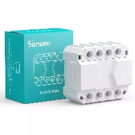
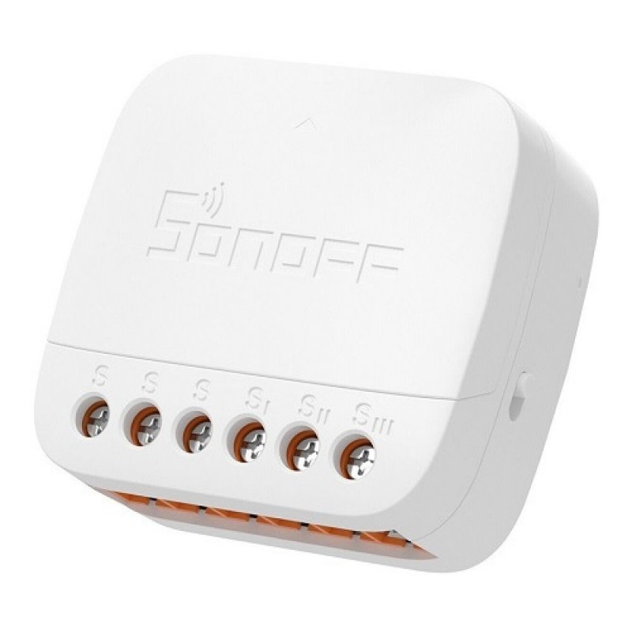

- Following code will catch BLE advertisements from Sonoff SwitchMan R5, S-Mate & S-Mate2.
  - code will generate HA events with data: device id, button pressed and kind of action
- Sonoff SwitchMan R5 will detect following actions: “short”, “double” & “long” press.
- Sonoff S-Mate:
  - In DIP Switch position “Rocker” switch - generates event “short” on both transitions open-close & close-open.
  - In position “Pulse” - only generates “short” on transition open-close contact, nothing more.
- Sonoff S-Mate2:
  - When DIP switch in position “Momentary switch” - detects “short/double/long” events.
  - In position “Rocker” switch - generates same event “short” on both transitions open-close & close-open.

## Notes

- any ESP32 with BLE radio required to run BLE tracker
- BLE tracker not compatible with power_save_mode NONE
- events can see: Developer Tools → Events → Event to subscribe to: esphome.sonoff_ble → Start Listening

## Basic Configuration

```yaml
esp32:
  board: <REPLACEME>
  
wifi:
  power_save_mode: LIGHT

globals:
  - id: btdata_uuid4
    type: std::vector<uint32_t>
    restore_value: no
    #button press UUID by order. The order may vary according to device version
    initial_value: '{0x8A6BECDA, 0xD535B385, 0x1FFC794F, 0xE60781B6, 0x2FCF487F, 0xD734B087, 0x02E36652, 0xEB0B8FBB, 0x32D15662,
                     0xFA1B99AA, 0x9575F6C5, 0x9F7CFCCF, 0x29C84B79, 0xBF5FDDEF, 0xA043C2F0, 0xBF5EDAEF, 0xA141C4F1, 0x9D7EF8CD}'
  - id: button_actions
    type: std::vector<std::string>
    restore_value: no
    initial_value: '{"short", "double", "long"}'

binary_sensor: # to stop BLE scanner while WiFi/API not connected
  - platform: template
    id: ble_scan_torun
    internal: true
    entity_category: diagnostic
    device_class: connectivity
    lambda: !lambda |-
      return global_api_server->is_connected();
    on_press:
    - esp32_ble_tracker.start_scan:
        continuous: true
    on_release:
    - esp32_ble_tracker.stop_scan:

esp32_ble_tracker:
  scan_parameters:
    interval: 150ms
    window: 150ms
    active: true
    continuous : true

  on_ble_advertise:
    - mac_address: "66:55:44:33:22:11" # Sonoff
      then:
        - lambda: |-
            static std::vector< esphome::esp32_ble::ESPBTUUID > btdata_store;
            auto btdata = x.get_service_uuids();
            ESP_LOGD("Sonoff", "data received");

            if (btdata.size() >= 6 && btdata[1].contains(0x78, 0xF6)) {
              if (btdata_store == btdata) {
                ESP_LOGD("Sonoff", "---- duplicate");
              } else {
                btdata_store = btdata;
                uint32_t btdevice = (btdata[2].get_uuid().uuid.uuid32 & 0xff000000) |
                                    (btdata[3].get_uuid().uuid.uuid32 & 0x00ffffff);
                uint32_t uuid4u32 = (btdata[4].get_uuid().uuid.uuid32);
                ESP_LOGD("Sonoff", "0x%x : 0x%x", btdevice, uuid4u32);

                for (size_t i = 0; i < id(btdata_uuid4).size(); i++) {
                  uint32_t stored_value = id(btdata_uuid4)[i];
                  if ((((uuid4u32 >> 24) ^ (stored_value >> 24)) == ((uuid4u32 >> 16 & 0xff) ^ (stored_value >> 16 & 0xff))) &&
                      (((uuid4u32 >> 8 & 0xff) ^ (stored_value >> 8 & 0xff)) == ((uuid4u32 & 0xff) ^ (stored_value & 0xff)))) {

                    int button_number = i / 3 + 1;  // each button is grouped in multiples of
                    int button_action = i % 3;

                    esphome::api::CustomAPIDevice capi;
                    capi.fire_homeassistant_event("esphome.sonoff_ble",
                      {{"device", format_hex(btdevice)},
                       {"button", to_string(button_number)},
                       {"action", id(button_actions)[button_action].c_str()},
                       {"service", format_hex(uuid4u32)}}
                    );
                    ESP_LOGI("Sonoff", "0x%x : %i : %s", btdevice, button_number,id(button_actions)[button_action].c_str());
                    return;
                  }
                }
              }
            }
```

## Related materials

- [ESPHome Bluetooth/BLE](https://esphome.io/components/#bluetooth-ble)
- [ESP32 Bluetooth Low Energy Tracker Hub](https://esphome.io/components/esp32_ble_tracker.html#esp32-bluetooth-low-energy-tracker-hub)
- [Tasmota discussion on Sonoff BLE data](https://github.com/arendst/Tasmota/discussions/15220)
- [Home Assistant support request](https://community.home-assistant.io/t/add-support-for-sonoff-s-mate-and-r5-ewelink-remote-sub-devices/614342/1)

## Home Assistant automation example

```yaml
  automation:
    - id: sonoff_ble_events
      alias: "Sonoff BLE events"
      description: ''
      mode: restart
      trigger:
        - platform: event
          event_type: esphome.sonoff_ble
      condition: []
      variables:
        data: "{{ trigger.event.data }}"
      action:
      - choose:
        - conditions: "{{ data.device == '5a2bcfd9' }}"
          sequence:
            - choose:
              - conditions: "{{ data.button == '1' and data.action == 'short' }}"
                sequence:
                  - action: switch.toggle
                    target:
                      entity_id:
                        - switch.xxx
```
