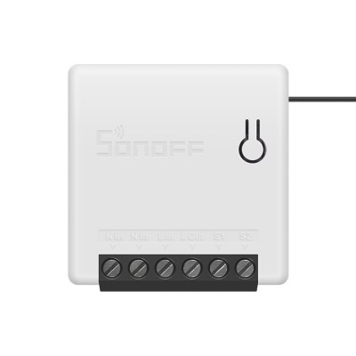

  

[https://sonoff.tech/product/wifi-diy-smart-switches/sonoff-mini](https://sonoff.tech/product/wifi-diy-smart-switches/sonoff-mini)

## GPIO Pinout

| Pin    | Function                   |
|--------|----------------------------|
| GPIO00 | BUTTON                     |
| GPIO01 | TX                         |
| GPIO02 | AVAILABE                   |
| GPIO03 | RX                         |
| GPIO04 | S2 (external switch input) |
| GPIO12 | Relay and RED LED          |
| GPIO13 | BLUE LED                   |
| GPIO16 | OTA jumper pin             |
| GND    | S1 (external switch input) |

## Basic Config

```yaml
substitutions:
  device_name: sonoffmini_1
  device_ip: 192.168.x.x

esphome:
  name: ${device_name}
esp8266:
  board: esp8285

wifi:
  ssid: !secret wifi_ssid
  password: !secret wifi_password
  manual_ip:
    static_ip: ${device_ip}
    gateway: 192.168.x.x
    subnet: 255.255.255.0
  # Enable fallback hotspot (captive portal) in case wifi connection fails
  ap:
    ssid: "ESPHOME"
    password: "12345678"

logger:
  
api:
  reboot_timeout: 15min
  encryption:
    key: !secret api_encryption_key

ota:
  password: !secret ota_password

# the web_server & sensor components can be removed without affecting core functionaility.

web_server:
  port: 80

sensor:
  - platform: wifi_signal
    name: ${device_name} Wifi Signal Strength
    update_interval: 60s
  - platform: uptime
    name: ${device_name} Uptime

#######################################
# Device specific Config Begins Below #
#######################################

binary_sensor:
  - platform: gpio
    pin: GPIO00
    id: reset
    internal: true
    filters:
      - invert:
      - delayed_off: 10ms
    on_press:
      - switch.toggle:
          id: relay_1

  - platform: gpio
    name: ${device_name}_status
    pin: GPIO04
    id: switch_1
    on_press:
      then:
        - switch.toggle:
            id: relay_1
    on_release:
      then:
        - switch.toggle:
            id: relay_1

switch:
  - platform: gpio
    name: ${device_name}_switch
    icon: "mdi:lightbulb_outline"
    pin: GPIO12
    id: relay_1
    restore_mode: restore_default_off

status_led:
  pin:
    number: GPIO13
    allow_other_uses: true
    inverted: true

output:
  - platform: esp8266_pwm
    id: blue_led
    pin:
      number: GPIO13
      allow_other_uses: true
    inverted: True

light:
  # the 4 lines below define the Blue LED light on Sonoff Mini, to expose in HomeAssistant remove line "internal: true"
  - platform: monochromatic
    name: ${device_name}_blueled
    output: blue_led
    internal: true # hides the Blue LED from HomeAssistant
```

## Alternative Config for Lights

This config will cause the entities to appears as lights rather than switches in Home Assistant

```yaml
substitutions:
  device_name: sonoffmini
  device_ip: 192.168.x.x

esphome:
  name: ${device_name}
  platform: ESP8266
  board: esp01_1m

wifi:
  ssid: !secret wifi_ssid
  password: !secret wifi_password
  manual_ip:
    static_ip: ${device_ip}
    gateway: 192.168.0.1
    subnet: 255.255.255.0
  # Enable fallback hotspot (captive portal) in case wifi connection fails
  ap:
    ssid: "ESPHOME"
    password: "12345678"

logger:
  
api:
  reboot_timeout: 15min
  encryption:
    key: !secret api_encryption_key

ota:
  password: !secret ota_password

# the web_server & sensor components can be removed without affecting core functionaility.

web_server:
  port: 80

sensor:
  - platform: wifi_signal
    name: ${device_name} Wifi Signal Strength
    update_interval: 60s
  - platform: uptime
    name: ${device_name} Uptime
#######################################
# Device specific Config Begins Below #
#######################################

binary_sensor:
  # the 7 lines below define the reset button
  - platform: gpio
    pin: GPIO00
    id: reset
    internal: true  # hides reset switch from HomeAssistant
    filters:
      - invert:
      - delayed_off: 10ms
  # the 3 lines below toggle the main relay on press of reset button
    on_press:
      - light.toggle:
          id: light_id

  # the 13 lines below toggle the main relay on command
  - platform: gpio
    name: relay_toggle
    internal: true  # hides relay toggle from HomeAssistant
    pin: GPIO04
    id: gpio_light_id
    on_press:
      then:
        - light.toggle:
            id: light_id
    on_release:
      then:
        - light.toggle:
            id: light_id

  # the 2 lines below create a status entity in HomeAssistant.
  - platform: status
    name: ${device_name} Status

status_led:
  pin:
    number: GPIO13
    allow_other_uses: true
    inverted: true

output:
  # the 3 lines below control the main relay
  - platform: gpio
    pin: GPIO12
    id: main_light_relay  
  # the 3 lines below control the Blue LED
  - platform: esp8266_pwm
    id: blue_led
    pin:
      number: GPIO13
      allow_other_uses: true
    inverted: True

light:
  # the 4 lines below define the main relay as a light
  - platform: binary
    name: ${device_name}_light # you can enter a custom name to appear in HomeAsistant here.
    output: main_light_relay  
    id: light_id
  # the 4 lines below define the Blue LED light on Sonoff Mini, to expose in HomeAssistant remove line "internal: true"
  - platform: monochromatic
    name: ${device_name}_blueled
    output: blue_led
    internal: true # hides the Blue LED from Homeassistant
 ```
