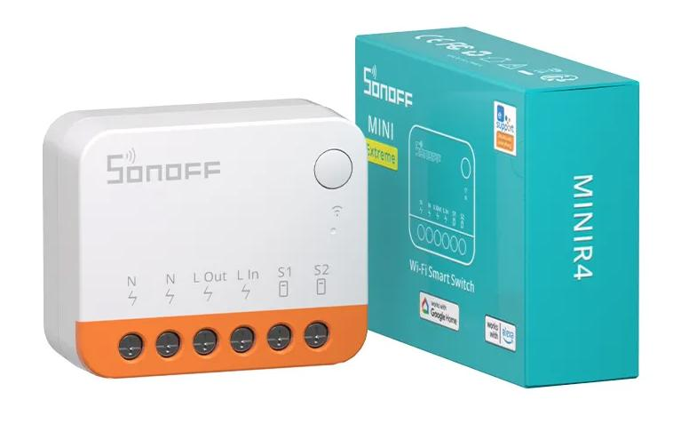
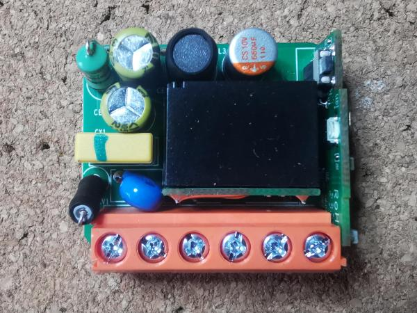
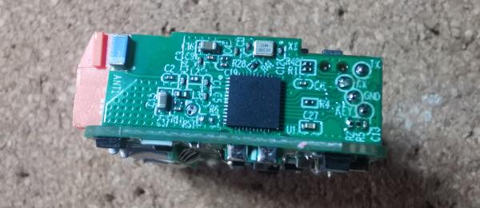
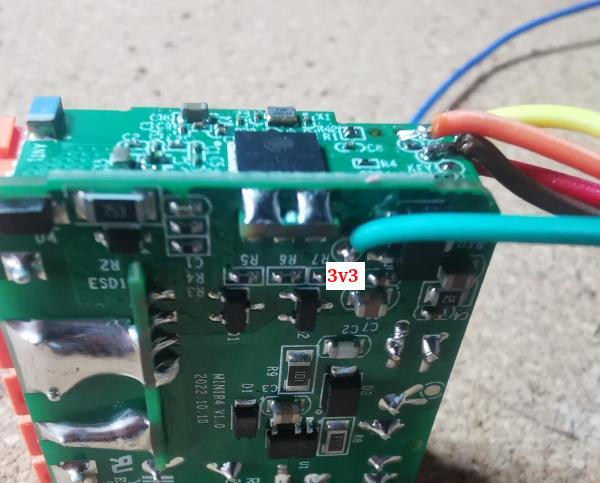

Advertised as Smallest Wi-Fi Smart Switch Ever, with one relay, one external input, one button. Switch is really small, approx 40x30mm, easily fits behind wall switch.

Product page: [https://sonoff.tech/product/diy-smart-switches/minir4/](https://sonoff.tech/product/diy-smart-switches/minir4/)

## Features

Detected with esptool:

```bash
# esptool.py v4.6.2
# Detecting chip type... ESP32
# Chip is ESP32-D0WD-V3 (revision v3.0)
# Features: WiFi, BT, Dual Core, 240MHz, VRef calibration in efuse, Coding Scheme None
# Crystal is 40MHz
# Detected flash size: 4MB
```

## Programming

Firmware programming need disassembly (easy) and moderate soldering skills to attach USB-RS232 converter cables.
Pins are very easy to find as they are lebelled, but due to small size they are quite hard to solder.





Rx, Tx, Gnd available on ESP module,
Vcc (3V3) on main board, pad is covered with some protecting coating - needs to be scratched, very subtly, for solder to cover it.

In order to enter programming mode need to hold button pressed while enabling power supply.
Bootloader uses 76800 baud rate, once application is started 115200 is used.

Programming can be done with esptool or directly through ESPHome (I'm using docker image)

## GPIO Pinout

| Pin    | Function                   |
|--------|----------------------------|
| GPIO00 | BUTTON                     |
| GPIO01 | likely TX (not tested)     |
| GPIO03 | likely RX (not tested)     |
| GPIO19 | blue LED                   |
| GPIO26 | Relay output               |
| GPIO27 | S2 (external switch input) |
| GND    | S1 (external switch input) |

## Basic Config with light

```yaml
substitutions:
  device_name: minir4-extreme

esphome:
  name: ${device_name}
  comment: "Sonoff MiniR4 Extreme"

esp32:
  board: esp32dev
  framework:
    type: arduino
    
# OTA flashing
ota:
  - platform: esphome

wifi: # Your Wifi network details
  
# Enable fallback hotspot in case wifi connection fails  
  ap:

# Enabling the logging component
logger:

# Enable Home Assistant API
api:

# Enable the captive portal
captive_portal:

web_server:
  port: 80

sensor:
  - platform: wifi_signal
    name: ${device_name} Wifi Signal Strength
    update_interval: 90s
    entity_category: "diagnostic"

  - platform: uptime
    name: ${device_name} Uptime
    update_interval: 300s
    entity_category: "diagnostic"

text_sensor:
  - platform: wifi_info
    ssid:
      name: Connected SSID
    ip_address:
      name: IP Address
    dns_address:
      name: DNS Address

#######################################
# Device specific Config Begins Below #
#######################################

status_led:
  pin:
    number: GPIO19
    inverted: true

output:
  # Physical relay on GPIO
  - platform: gpio
    pin: GPIO26
    id: relay_1

light:
  - platform: binary
    id: light_1
    name: ${device_name}
    icon: mdi:ceiling-light-multiple-outline
    restore_mode: restore_default_off
    output: relay_1

binary_sensor:
  - platform: gpio
    pin: GPIO00
    id: button
    filters:
      - invert:
      - delayed_off: 50ms
    on_press:
      - light.toggle:
          id: light_1

  - platform: gpio
    name: s1
    pin: GPIO27
    id: s1
    filters:
      - invert:
      - delayed_off: 50ms
    on_press:
      then:
        - light.turn_on:
            id: light_1
    on_release:
      then:
        - light.turn_off:
            id: light_1
```
