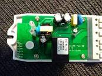

## Product Images



## GPIO Pinout

| Pin    | Function                           |
| ------ | ---------------------------------- |
| GPIO0  | Push Button (HIGH = off, LOW = on) |
| GPIO12 | Relay and its status LED           |
| GPIO13 | Blue LED (HIGH = off, LOW = on)    |
| GPIO1  | RX pin (for serial programming)    |
| GPIO3  | TX pin (for serial programming)    |

## Basic Configuration

As the only controllable LED is the Blue LED, it is configured here to use the
[`status_led` light component](https://esphome.io/components/light/status_led), which will take
over the LED in the event of a error/warning state, such as when WiFi is disrupted.

```yaml
# Basic Config
substitutions:
  update_interval: 60s
  name: "sonoff-pow-r2"
  ota_password: "your_ota_password_here"

esphome:
  name: "${name}"

esp8266:
  board: esp01_1m

api:

ota:
  - platform: esphome
    password: "${ota_password}"

wifi:
  networks:
    - ssid: !secret wifi_ssid
      password: !secret wifi_password

binary_sensor:
  - platform: gpio
    pin:
      number: GPIO0
      mode: INPUT_PULLUP
      inverted: True
    name: Button
    on_press:
      - switch.toggle: relay

switch:
  - platform: gpio
    id: relay
    pin: GPIO12

# the device has two LEDs: a red LED wired to the relay state and a blue 'wifi status' LED
status_led:
  pin:
    number: GPIO13
    inverted: true

# the CSE7766 voltage/current and power sensor is connected to the ESP via the ESP's UART (the
# ESP8266 has only one)
#  - this precludes logging via serial, so disable that
#  - the CSE7766 emits data more frequently than desired (which in turn would be passed on by
#    esphome); use a filter to slow down updates

logger:
  level: DEBUG
  baud_rate: 0

uart:
  rx_pin: RX
  baud_rate: 4800
  parity: EVEN

sensor:
  - platform: cse7766
    current:
      name: "Current"
      filters:
        - throttle_average: ${update_interval}
    voltage:
      name: "Voltage"
      filters:
        - throttle_average: ${update_interval}
    power:
      name: "Power"
      filters:
        - throttle_average: ${update_interval}
    energy:
      name: "Energy"
      filters:
        - throttle: ${update_interval}
    apparent_power:
      name: "Apparent Power"
      filters:
        - throttle_average: ${update_interval}
    power_factor:
      name: "Power Factor"
      filters:
        - throttle_average: ${update_interval}
```
