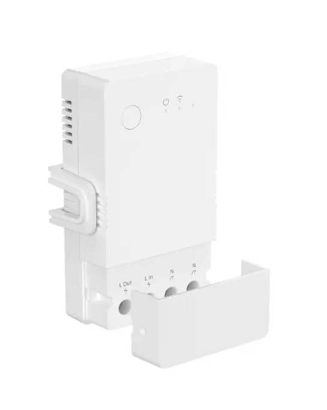
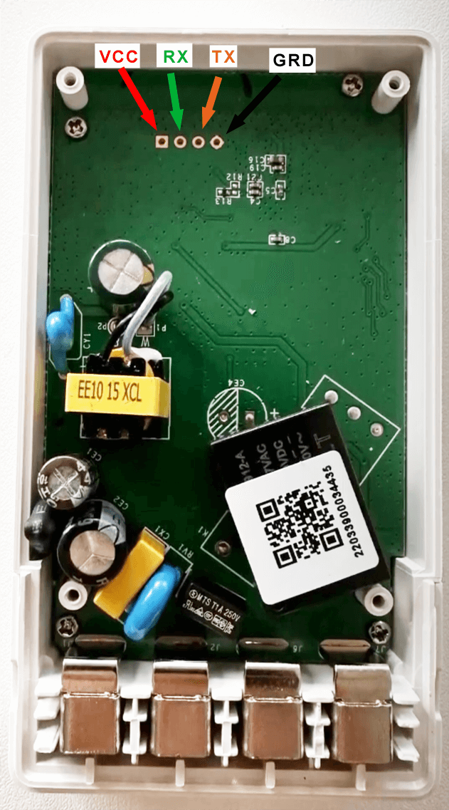

## GPIO Pinout

| Pin    | Function                           |
| ------ | ---------------------------------- |
| GPIO00 | Push Button (HIGH = off, LOW = on) |
| GPIO05 | Wifi_LED                           |
| GPIO13 | Relay1                             |
| GPIO16 | CSE7766 Rx                         |
| GPIO18 | Status LED (HIGH = off, LOW = on)  |

## Initial Setup

Remove the 4 screws at the back of the device and expose the board. The board is mounted to the front panel and can be un screwed also to install a permanent 4 pin header to attach jumper cables. Hold down the button while powering on the device to put it into bootloader mode.

## Product Images




## Basic Configuration

```yaml
# Basic Config
substitutions:
  friendly_name: POW Origin 16A
  device_name: pow-origin-16a

esphome:
  name: ${device_name}
  friendly_name: ${friendly_name}
  # optional
  on_boot:
    then:
      - switch.turn_on: relay
  
esp32:
  board: nodemcu-32s

wifi:
  ssid: !secret wifi_ssid
  password: !secret wifi_password
  ap:
    ssid: ${device_name}
    password: !secret wifi_failover
  on_connect:
    then:
      - light.turn_on: wifi_status_led
  on_disconnect:
    then:
      - light.turn_off: wifi_status_led

captive_portal:

logger:

api:

ota:
  password: !secret ota_pwd

#optional
web_server:
  port: 80

uart:
  rx_pin: GPIO16
  baud_rate: 4800
  parity: EVEN
  
sensor:
  - platform: cse7766
    current:
      name: ${friendly_name} Current
      id: a_sensor
      filters:
        - throttle_average: 30s
    voltage:
      name: ${friendly_name} Voltage
      id: v_sensor
      filters:
        - throttle: 30s
    power:
      name: ${friendly_name} Power
      id: w_sensor
      filters:
        - throttle_average: 30s
    energy:
      name: ${friendly_name} Energy
      id: wh_sensor
      filters:
        - throttle_average: 30s

  - platform: template
    name: $friendly_name ESP32 Internal Temp
    device_class: temperature
    unit_of_measurement: °C
    id: esp32_temp
    lambda: return temperatureRead();
    update_interval: 600s

  - platform: wifi_signal
    name: "WiFi Signal"
    update_interval: 600s

text_sensor:
  - platform: wifi_info
    ip_address:
      name: "IP Address"

output:
  - platform: ledc
    id: led
    pin:
      number: GPIO18
      inverted: True

light:
  - platform: monochromatic
    id: switch_led
    output: led
    internal: True
    default_transition_length: 0s
  - platform: status_led
    id: wifi_status_led
    internal: True
    pin:
      number: GPIO05
      inverted: True

binary_sensor:
  - platform: gpio
    pin:
      number: GPIO0
      mode:
        input: true
        pullup: true
      inverted: true
    name: "${friendly_name} - Button"
    on_press:
      - switch.toggle: relay

switch:
  - platform: gpio
    name: "${friendly_name} - Relay Switch"
    pin: GPIO13
    id: relay
    on_turn_on:
      then:
        - light.turn_on: switch_led
    on_turn_off:
      then:
        - light.turn_off: switch_led
```
